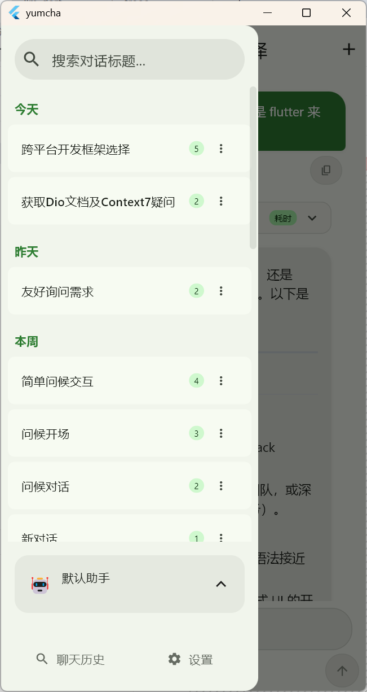

# YumCha

[](https://www.gnu.org/licenses/agpl-3.0)
[](https://dart.dev)
[](https://flutter.dev)

A cross-platform AI chat application built with Flutter, supporting multiple AI providers and real-time streaming conversations.

## Screenshots

| Chat Interface | Navigation Drawer |
|---|---|
|  |  |

## Features

- **Multi-Provider Support**: OpenAI, DeepSeek, Anthropic, Google, Ollama, Phind, and more
- **AI Assistants**: Create personalized AI assistants with custom prompts and parameters
- **Real-time Streaming**: Support for both streaming and non-streaming responses
- **Reasoning Models**: Support for advanced reasoning models like OpenAI o1 and DeepSeek R1
- **Model Favorites**: Bookmark frequently used models for quick access
- **Chat History**: Complete conversation management and search functionality
- **Cross-Platform**: Runs on Android, iOS, Windows, macOS, Linux, and Web
- **Material Design 3**: Modern UI with dynamic color support

## Tech Stack

- **Flutter 3.8.0+** - Cross-platform UI framework
- **Dart 3.5.0+** - Programming language
- **Material Design 3** - Modern design system with dynamic colors
- **Riverpod 2.6+** - State management
- **Drift 2.16+** - SQLite database ORM
- **[llm_dart](https://pub.dev/packages/llm_dart)** - Open-source AI interface library supporting multiple LLM providers (MIT License)

## Getting Started

### Prerequisites

- Flutter SDK 3.8.0 or higher
- Dart SDK 3.5.0 or higher

### Installation

1. Clone the repository:
```bash
git clone https://github.com/Latias94/yumcha.git
cd yumcha
```

2. Install dependencies:
```bash
flutter pub get
```

3. Run the application:
```bash
flutter run
```

## Configuration

1. **Add AI Providers**: Configure your AI service providers with API keys
2. **Create Assistants**: Set up AI assistants with custom prompts and parameters
3. **Start Chatting**: Create conversations and switch between different models

## Development Status

⚠️ **This project is under active development** - Features and APIs may change frequently.

## License

This project is licensed under the [AGPL v3 License](LICENSE).

## Related Projects

- [llm_dart](https://pub.dev/packages/llm_dart) - A standalone open-source AI interface library supporting multiple LLM providers (MIT License). Originally developed as part of YumCha, now independently published on pub.dev.

## Acknowledgments

The UI design of this application is primarily inspired by [rikkahub](https://github.com/rikkahub/rikkahub) - A native Android LLM chat client that supports switching between different providers for conversations. We appreciate their excellent design and user experience contributions to the AI chat client community.
