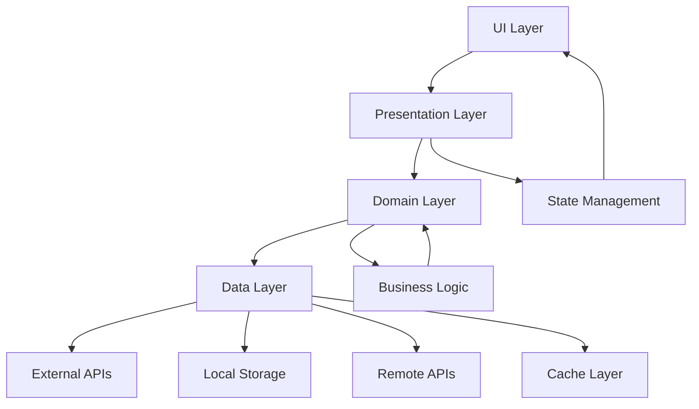

# 🏗️ YumCha 未来架构规划

为 YumCha 项目设计的长期架构规划，支持大型项目发展和未来功能扩展。

## 🎯 架构愿景

### 核心目标
- 🏗️ **模块化架构**: 支持功能模块的独立开发和部署
- 🔌 **插件化系统**: 支持第三方插件和扩展
- 🌐 **多平台支持**: 统一代码库支持移动端、桌面端、Web
- 🚀 **高性能**: 优化用户体验和系统性能
- 🔒 **安全可靠**: 企业级安全和数据保护

### 设计原则
- **单一职责**: 每个模块只负责一个明确的功能
- **开放封闭**: 对扩展开放，对修改封闭
- **依赖倒置**: 高层模块不依赖低层模块
- **接口隔离**: 客户端不应依赖它不需要的接口

## 🏛️ 目标架构

### 整体架构图
```
┌─────────────────────────────────────────────────────────────┐
│                        App Layer                            │
│  ┌─────────────────┐ ┌─────────────────┐ ┌─────────────────┐ │
│  │   Mobile App    │ │   Desktop App   │ │     Web App     │ │
│  └─────────────────┘ └─────────────────┘ └─────────────────┘ │
└─────────────────────────────────────────────────────────────┘
┌─────────────────────────────────────────────────────────────┐
│                     Features Layer                          │
│  ┌─────────┐ ┌─────────┐ ┌─────────┐ ┌─────────┐ ┌─────────┐ │
│  │  Chat   │ │   AI    │ │Settings │ │ Search  │ │ Plugins │ │
│  │ Module  │ │ Mgmt    │ │ Module  │ │ Module  │ │ System  │ │
│  └─────────┘ └─────────┘ └─────────┘ └─────────┘ └─────────┘ │
└─────────────────────────────────────────────────────────────┘
┌─────────────────────────────────────────────────────────────┐
│                      Shared Layer                           │
│  ┌─────────────────┐ ┌─────────────────┐ ┌─────────────────┐ │
│  │  Domain Layer   │ │   Data Layer    │ │Infrastructure   │ │
│  │  (Business)     │ │   (Storage)     │ │   (Services)    │ │
│  └─────────────────┘ └─────────────────┘ └─────────────────┘ │
└─────────────────────────────────────────────────────────────┘
┌─────────────────────────────────────────────────────────────┐
│                       Core Layer                            │
│  ┌─────────────────┐ ┌─────────────────┐ ┌─────────────────┐ │
│  │   Foundation    │ │    Platform     │ │   Extensions    │ │
│  │   (Utils/Base)  │ │   (Adapters)    │ │   (Helpers)     │ │
│  └─────────────────┘ └─────────────────┘ └─────────────────┘ │
└─────────────────────────────────────────────────────────────┘
```

### 详细目录结构
```
lib/
├── app/                           # 🎯 应用层
│   ├── mobile/                   # 移动端应用
│   ├── desktop/                  # 桌面端应用
│   ├── web/                      # Web 应用
│   └── shared/                   # 共享应用逻辑
│       ├── navigation/           # 导航配置
│       ├── theme/               # 主题配置
│       ├── config/              # 应用配置
│       └── bootstrap/           # 应用启动
├── features/                      # 🎯 功能模块层
│   ├── chat/                     # 基础聊天功能模块
│   │   ├── data/                # 数据层
│   │   ├── domain/              # 领域层
│   │   ├── presentation/        # 表现层
│   │   └── chat_module.dart     # 模块导出
│   ├── roleplay/                # 🎭 角色扮演模块（酒馆对话）
│   │   ├── data/                # 角色数据、世界设定数据
│   │   ├── domain/              # 角色扮演业务逻辑
│   │   ├── presentation/        # 角色管理、世界设定界面
│   │   └── roleplay_module.dart # 模块导出
│   ├── world_info/              # 🌍 世界设定模块
│   │   ├── data/                # 世界信息数据层
│   │   ├── domain/              # 世界信息业务逻辑
│   │   ├── presentation/        # 世界信息管理界面
│   │   └── world_info_module.dart # 模块导出
│   ├── character_management/    # 👤 角色管理模块
│   │   ├── data/                # 角色数据层
│   │   ├── domain/              # 角色业务逻辑
│   │   ├── presentation/        # 角色编辑界面
│   │   └── character_module.dart # 模块导出
│   ├── ai_management/           # AI 管理模块
│   ├── settings/                # 设置模块
│   ├── search/                  # 搜索模块
│   ├── analytics/               # 分析模块
│   └── plugins/                 # 插件系统
├── shared/                       # 🎯 共享层
│   ├── domain/                  # 领域层
│   │   ├── entities/           # 业务实体
│   │   ├── repositories/       # 仓库接口
│   │   ├── usecases/           # 用例
│   │   └── value_objects/      # 值对象
│   ├── data/                    # 数据层
│   │   ├── models/             # 数据模型
│   │   ├── repositories/       # 仓库实现
│   │   ├── datasources/        # 数据源
│   │   └── database/           # 数据库
│   ├── presentation/            # 表现层
│   │   ├── widgets/            # 共享组件
│   │   ├── providers/          # 状态管理
│   │   └── themes/             # 主题
│   └── infrastructure/          # 基础设施层
│       ├── services/           # 服务实现
│       ├── network/            # 网络层
│       ├── storage/            # 存储层
│       └── external/           # 外部服务
├── core/                         # 🎯 核心层
│   ├── foundation/              # 基础设施
│   │   ├── constants/          # 常量
│   │   ├── exceptions/         # 异常
│   │   ├── types/              # 类型定义
│   │   └── base/               # 基类
│   ├── platform/               # 平台适配
│   │   ├── mobile/             # 移动端适配
│   │   ├── desktop/            # 桌面端适配
│   │   └── web/                # Web 适配
│   └── extensions/             # 扩展方法
│       ├── dart/               # Dart 扩展
│       ├── flutter/            # Flutter 扩展
│       └── third_party/        # 第三方扩展
├── l10n/                        # 🌐 国际化
│   ├── app_localizations.dart
│   ├── app_en.arb
│   ├── app_zh.arb
│   └── app_ja.arb
└── plugins/                     # 🔌 插件系统
    ├── ai_providers/           # AI 提供商插件
    ├── storage/                # 存储插件
    ├── themes/                 # 主题插件
    └── integrations/           # 集成插件
```

## 🎯 功能模块设计

### 🎭 Roleplay 模块（酒馆对话核心）
```
features/roleplay/
├── data/
│   ├── models/
│   │   ├── character_card_model.dart      # 角色卡片数据模型
│   │   ├── roleplay_session_model.dart    # 角色扮演会话模型
│   │   ├── character_persona_model.dart   # 角色人格模型
│   │   └── roleplay_config_model.dart     # 角色扮演配置
│   ├── repositories/
│   │   ├── character_repository_impl.dart
│   │   ├── roleplay_repository_impl.dart
│   │   └── persona_repository_impl.dart
│   └── datasources/
│       ├── character_local_datasource.dart
│       ├── character_remote_datasource.dart # 支持从URL导入角色
│       └── tavern_import_datasource.dart   # SillyTavern格式导入
├── domain/
│   ├── entities/
│   │   ├── character_card.dart            # 角色卡片实体
│   │   ├── character_persona.dart         # 角色人格实体
│   │   ├── roleplay_session.dart          # 角色扮演会话
│   │   ├── character_greeting.dart        # 角色问候语
│   │   └── character_example.dart         # 角色示例对话
│   ├── repositories/
│   │   ├── character_repository.dart
│   │   ├── roleplay_repository.dart
│   │   └── persona_repository.dart
│   └── usecases/
│       ├── create_character.dart
│       ├── import_character_card.dart
│       ├── start_roleplay_session.dart
│       ├── switch_character_persona.dart
│       └── export_character_card.dart
├── presentation/
│   ├── screens/
│   │   ├── character_gallery_screen.dart  # 角色画廊
│   │   ├── character_editor_screen.dart   # 角色编辑器
│   │   ├── roleplay_chat_screen.dart      # 角色扮演聊天
│   │   ├── character_import_screen.dart   # 角色导入
│   │   └── persona_manager_screen.dart    # 人格管理
│   ├── widgets/
│   │   ├── character_card_widget.dart     # 角色卡片组件
│   │   ├── character_avatar_widget.dart   # 角色头像组件
│   │   ├── persona_selector_widget.dart   # 人格选择器
│   │   ├── greeting_selector_widget.dart  # 问候语选择器
│   │   └── roleplay_message_bubble.dart   # 角色扮演消息气泡
│   ├── providers/
│   │   ├── character_provider.dart
│   │   ├── roleplay_session_provider.dart
│   │   ├── persona_provider.dart
│   │   └── character_import_provider.dart
│   └── controllers/
│       ├── character_controller.dart
│       ├── roleplay_controller.dart
│       └── persona_controller.dart
└── roleplay_module.dart

### 🌍 World Info 模块（世界设定系统）
```
features/world_info/
├── data/
│   ├── models/
│   │   ├── world_info_entry_model.dart    # 世界信息条目
│   │   ├── world_info_book_model.dart     # 世界信息书籍
│   │   ├── lorebook_model.dart            # Lorebook模型
│   │   ├── keyword_trigger_model.dart     # 关键词触发器
│   │   └── vector_embedding_model.dart    # 向量嵌入模型
│   ├── repositories/
│   │   ├── world_info_repository_impl.dart
│   │   ├── lorebook_repository_impl.dart
│   │   └── vector_store_repository_impl.dart
│   └── datasources/
│       ├── world_info_local_datasource.dart
│       ├── vector_embedding_datasource.dart
│       └── lorebook_import_datasource.dart
├── domain/
│   ├── entities/
│   │   ├── world_info_entry.dart          # 世界信息条目实体
│   │   ├── world_info_book.dart           # 世界信息书籍实体
│   │   ├── keyword_trigger.dart           # 关键词触发器
│   │   ├── activation_rule.dart           # 激活规则
│   │   ├── insertion_strategy.dart        # 插入策略
│   │   ├── timed_effect.dart              # 时间效果
│   │   └── vector_similarity.dart         # 向量相似度
│   ├── repositories/
│   │   ├── world_info_repository.dart
│   │   ├── lorebook_repository.dart
│   │   └── vector_store_repository.dart
│   └── usecases/
│       ├── create_world_info_entry.dart
│       ├── activate_world_info.dart       # 根据关键词激活世界信息
│       ├── process_recursive_activation.dart # 递归激活处理
│       ├── manage_timed_effects.dart      # 时间效果管理
│       ├── vector_similarity_search.dart # 向量相似度搜索
│       └── export_import_lorebook.dart
├── presentation/
│   ├── screens/
│   │   ├── world_info_manager_screen.dart # 世界信息管理器
│   │   ├── lorebook_editor_screen.dart    # Lorebook编辑器
│   │   ├── world_info_entry_editor.dart   # 条目编辑器
│   │   ├── keyword_manager_screen.dart    # 关键词管理
│   │   └── activation_debugger_screen.dart # 激活调试器
│   ├── widgets/
│   │   ├── world_info_entry_widget.dart   # 世界信息条目组件
│   │   ├── keyword_chip_widget.dart       # 关键词标签组件
│   │   ├── activation_indicator_widget.dart # 激活指示器
│   │   ├── insertion_order_widget.dart    # 插入顺序组件
│   │   └── timed_effect_widget.dart       # 时间效果组件
│   ├── providers/
│   │   ├── world_info_provider.dart
│   │   ├── lorebook_provider.dart
│   │   ├── activation_provider.dart
│   │   └── vector_search_provider.dart
│   └── controllers/
│       ├── world_info_controller.dart
│       ├── activation_controller.dart
│       └── vector_controller.dart
└── world_info_module.dart

### 💬 Enhanced Chat 模块（增强聊天）
```
features/chat/
├── data/
│   ├── models/
│   │   ├── enhanced_message_model.dart    # 增强消息模型
│   │   ├── conversation_context_model.dart # 对话上下文
│   │   ├── prompt_template_model.dart     # 提示模板
│   │   └── chat_memory_model.dart         # 聊天记忆
│   ├── repositories/
│   │   ├── enhanced_chat_repository_impl.dart
│   │   ├── context_repository_impl.dart
│   │   └── memory_repository_impl.dart
│   └── datasources/
│       ├── chat_context_datasource.dart
│       ├── prompt_template_datasource.dart
│       └── memory_datasource.dart
├── domain/
│   ├── entities/
│   │   ├── enhanced_message.dart          # 增强消息实体
│   │   ├── conversation_context.dart      # 对话上下文
│   │   ├── prompt_injection.dart          # 提示注入
│   │   ├── chat_memory.dart               # 聊天记忆
│   │   └── context_window.dart            # 上下文窗口
│   ├── repositories/
│   │   ├── enhanced_chat_repository.dart
│   │   ├── context_repository.dart
│   │   └── memory_repository.dart
│   └── usecases/
│       ├── build_enhanced_prompt.dart     # 构建增强提示
│       ├── inject_world_info.dart         # 注入世界信息
│       ├── manage_context_window.dart     # 管理上下文窗口
│       ├── process_character_memory.dart  # 处理角色记忆
│       └── handle_prompt_templates.dart   # 处理提示模板
├── presentation/
│   ├── screens/
│   │   ├── enhanced_chat_screen.dart      # 增强聊天界面
│   │   ├── context_debugger_screen.dart   # 上下文调试器
│   │   ├── prompt_builder_screen.dart     # 提示构建器
│   │   └── memory_viewer_screen.dart      # 记忆查看器
│   ├── widgets/
│   │   ├── enhanced_message_bubble.dart   # 增强消息气泡
│   │   ├── context_indicator_widget.dart  # 上下文指示器
│   │   ├── world_info_injection_widget.dart # 世界信息注入组件
│   │   ├── memory_summary_widget.dart     # 记忆摘要组件
│   │   └── prompt_preview_widget.dart     # 提示预览组件
│   ├── providers/
│   │   ├── enhanced_chat_provider.dart
│   │   ├── context_provider.dart
│   │   ├── prompt_provider.dart
│   │   └── memory_provider.dart
│   └── controllers/
│       ├── enhanced_chat_controller.dart
│       ├── context_controller.dart
│       └── prompt_controller.dart
└── enhanced_chat_module.dart
```

## 🎭 酒馆对话核心架构

### 角色卡片系统
```dart
// shared/domain/entities/character_card.dart
class CharacterCard {
  final String id;
  final String name;
  final String description;
  final String personality;
  final String scenario;
  final String firstMessage;
  final List<String> alternativeGreetings;
  final List<ExampleMessage> exampleMessages;
  final Map<String, dynamic> advancedDefinitions;
  final String? avatarUrl;
  final Map<String, String> metadata; // creator, version, etc.
  final List<String> tags;

  // SillyTavern 兼容字段
  final String? creatorNotes;
  final String? characterNote;
  final int? talkativeness; // 0-100, for group chats
  final Map<String, dynamic>? extensions; // 扩展数据
}

// 角色示例对话
class ExampleMessage {
  final String speaker; // {{char}} or {{user}}
  final String content;
  final MessageRole role; // system, user, assistant
}
```

### 世界信息系统
```dart
// shared/domain/entities/world_info_entry.dart
class WorldInfoEntry {
  final String id;
  final String title;
  final String content;
  final List<String> keys; // 触发关键词
  final List<String>? secondaryKeys; // 可选过滤器
  final SecondaryKeyLogic? secondaryLogic; // AND_ANY, AND_ALL, NOT_ANY, NOT_ALL
  final bool isConstant; // 蓝圈：总是激活
  final bool isEnabled; // 绿圈：关键词激活
  final bool allowVectorActivation; // 链接：向量激活
  final int insertionOrder; // 插入顺序
  final InsertionPosition insertionPosition;
  final int triggerPercentage; // 触发概率 0-100
  final String? inclusionGroup; // 包含组
  final int groupWeight; // 组权重
  final bool prioritizeInclusion; // 优先包含
  final bool useGroupScoring; // 使用组评分
  final String? automationId; // 自动化ID
  final TimedEffects? timedEffects; // 时间效果
  final bool caseSensitive; // 大小写敏感
  final bool matchWholeWords; // 匹配整词
  final Set<MatchingSource> additionalSources; // 额外匹配源
}

// 时间效果
class TimedEffects {
  final int sticky; // 粘性持续消息数
  final int cooldown; // 冷却消息数
  final int delay; // 延迟消息数
}

// 插入位置
enum InsertionPosition {
  beforeCharDefs,
  afterCharDefs,
  beforeExampleMessages,
  afterExampleMessages,
  topOfAuthorNote,
  bottomOfAuthorNote,
  atDepth, // @ D: 特定深度
}

// 匹配源
enum MatchingSource {
  characterDescription,
  characterPersonality,
  scenario,
  personaDescription,
  characterNote,
  creatorNotes,
}
```

### 世界信息激活引擎
```dart
// features/world_info/domain/usecases/activate_world_info.dart
class ActivateWorldInfoUseCase {
  Future<List<ActivatedEntry>> activateEntries({
    required List<WorldInfoEntry> entries,
    required String scanText,
    required int scanDepth,
    required int maxTokens,
    required bool includeNames,
    required CharacterCard? character,
    required String? persona,
  }) async {
    final activatedEntries = <ActivatedEntry>[];

    // 1. 处理常量条目（蓝圈）
    final constantEntries = entries.where((e) => e.isConstant).toList();
    activatedEntries.addAll(constantEntries.map((e) => ActivatedEntry(e, ActivationType.constant)));

    // 2. 关键词匹配激活
    final keywordActivated = await _processKeywordActivation(entries, scanText);
    activatedEntries.addAll(keywordActivated);

    // 3. 向量相似度激活
    final vectorActivated = await _processVectorActivation(entries, scanText);
    activatedEntries.addAll(vectorActivated);

    // 4. 递归激活处理
    final recursiveActivated = await _processRecursiveActivation(activatedEntries, entries);
    activatedEntries.addAll(recursiveActivated);

    // 5. 应用时间效果
    final timedFiltered = await _applyTimedEffects(activatedEntries);

    // 6. 应用包含组规则
    final groupFiltered = await _applyInclusionGroups(timedFiltered);

    // 7. 应用触发概率
    final probabilityFiltered = await _applyTriggerProbability(groupFiltered);

    // 8. 按插入顺序排序并应用token预算
    return _applyTokenBudget(probabilityFiltered, maxTokens);
  }
}
```

### 提示构建引擎
```dart
// features/chat/domain/usecases/build_enhanced_prompt.dart
class BuildEnhancedPromptUseCase {
  Future<EnhancedPrompt> buildPrompt({
    required CharacterCard character,
    required List<Message> chatHistory,
    required List<ActivatedEntry> worldInfoEntries,
    required String? authorNote,
    required PromptTemplate template,
  }) async {
    final promptBuilder = PromptBuilder(template);

    // 1. 构建系统提示
    final systemPrompt = await _buildSystemPrompt(character);
    promptBuilder.setSystemPrompt(systemPrompt);

    // 2. 注入角色定义
    await _injectCharacterDefinitions(promptBuilder, character);

    // 3. 注入世界信息（按插入位置）
    await _injectWorldInfo(promptBuilder, worldInfoEntries);

    // 4. 注入示例对话
    await _injectExampleMessages(promptBuilder, character.exampleMessages);

    // 5. 注入作者注释
    if (authorNote != null) {
      await _injectAuthorNote(promptBuilder, authorNote);
    }

    // 6. 注入聊天历史
    await _injectChatHistory(promptBuilder, chatHistory);

    // 7. 应用上下文窗口限制
    return await _applyContextWindow(promptBuilder);
  }
}
```

## 🔌 插件系统设计

### 酒馆对话插件接口
```dart
// core/foundation/base/plugin_base.dart
abstract class PluginBase {
  String get id;
  String get name;
  String get version;
  List<String> get dependencies;

  Future<void> initialize();
  Future<void> dispose();
}

// 角色卡片插件接口
abstract class CharacterCardPlugin extends PluginBase {
  Future<CharacterCard?> importFromUrl(String url);
  Future<CharacterCard?> importFromFile(String filePath);
  Future<void> exportToFile(CharacterCard character, String filePath);
  bool supportsFormat(String format); // v1, v2, tavern, etc.
}

// 世界信息插件接口
abstract class WorldInfoPlugin extends PluginBase {
  Future<List<WorldInfoEntry>> importLorebook(String filePath);
  Future<void> exportLorebook(List<WorldInfoEntry> entries, String filePath);
  Future<List<ActivatedEntry>> processCustomActivation(
    List<WorldInfoEntry> entries,
    String context,
  );
}

// 向量存储插件接口
abstract class VectorStoragePlugin extends PluginBase {
  Future<void> indexEntry(String id, String content);
  Future<List<SimilarityMatch>> searchSimilar(String query, int maxResults);
  Future<void> deleteIndex(String id);
}
```

### 插件注册系统
```dart
// plugins/plugin_registry.dart
class PluginRegistry {
  static final Map<Type, List<PluginBase>> _plugins = {};

  static void register<T extends PluginBase>(T plugin) {
    _plugins.putIfAbsent(T, () => []).add(plugin);
  }

  static List<T> getPlugins<T extends PluginBase>() {
    return _plugins[T]?.cast<T>() ?? [];
  }

  // 酒馆对话特定注册
  static void registerTavernPlugins() {
    register(SillyTavernImportPlugin());
    register(CharacterHubPlugin());
    register(OpenAIEmbeddingPlugin());
    register(LocalVectorStorePlugin());
  }
}
```

## 🌐 多平台支持

### 平台适配层
```dart
// core/platform/platform_adapter.dart
abstract class PlatformAdapter {
  bool get isMobile;
  bool get isDesktop;
  bool get isWeb;
  
  Future<void> initializePlatform();
  Widget buildPlatformSpecificWidget(Widget child);
}

// 移动端适配
class MobilePlatformAdapter extends PlatformAdapter {
  @override
  bool get isMobile => true;
  
  @override
  Widget buildPlatformSpecificWidget(Widget child) {
    return SafeArea(child: child);
  }
}

// 桌面端适配
class DesktopPlatformAdapter extends PlatformAdapter {
  @override
  bool get isDesktop => true;
  
  @override
  Widget buildPlatformSpecificWidget(Widget child) {
    return Container(
      constraints: BoxConstraints(maxWidth: 1200),
      child: child,
    );
  }
}
```

## 🔄 状态管理架构

### 统一状态管理
```dart
// shared/presentation/providers/app_state.dart
class AppState {
  final UserState user;
  final ChatState chat;
  final SettingsState settings;
  final ThemeState theme;
  
  AppState({
    required this.user,
    required this.chat,
    required this.settings,
    required this.theme,
  });
}

// 功能模块状态
class ChatState {
  final List<Conversation> conversations;
  final Conversation? currentConversation;
  final bool isLoading;
  final String? error;
  
  ChatState({
    required this.conversations,
    this.currentConversation,
    this.isLoading = false,
    this.error,
  });
}
```

## 📊 数据流架构

### 数据流图


## 🚀 性能优化策略

### 1. 代码分割和懒加载
```dart
// 功能模块懒加载
class FeatureLoader {
  static Future<Widget> loadChatModule() async {
    await ChatModule.initialize();
    return ChatScreen();
  }
  
  static Future<Widget> loadSettingsModule() async {
    await SettingsModule.initialize();
    return SettingsScreen();
  }
}
```

### 2. 缓存策略
```dart
// 多层缓存系统
class CacheManager {
  final MemoryCache memoryCache;
  final DiskCache diskCache;
  final NetworkCache networkCache;
  
  Future<T?> get<T>(String key) async {
    // 1. 内存缓存
    var result = await memoryCache.get<T>(key);
    if (result != null) return result;
    
    // 2. 磁盘缓存
    result = await diskCache.get<T>(key);
    if (result != null) {
      await memoryCache.set(key, result);
      return result;
    }
    
    // 3. 网络缓存
    result = await networkCache.get<T>(key);
    if (result != null) {
      await diskCache.set(key, result);
      await memoryCache.set(key, result);
    }
    
    return result;
  }
}
```

## 🔒 安全架构

### 数据加密
```dart
// core/foundation/security/encryption.dart
class EncryptionService {
  Future<String> encrypt(String data);
  Future<String> decrypt(String encryptedData);
  Future<void> rotateKeys();
}
```

### 权限管理
```dart
// shared/domain/entities/permission.dart
enum Permission {
  readMessages,
  writeMessages,
  manageSettings,
  accessDebugTools,
}

class PermissionManager {
  bool hasPermission(Permission permission);
  Future<void> requestPermission(Permission permission);
}
```

## 🎭 酒馆对话功能实施路线图

### 阶段一：基础角色系统（3-4周）

#### 1.1 角色卡片核心功能
- [ ] **角色卡片数据模型**：支持 SillyTavern v1/v2 格式
- [ ] **角色创建和编辑**：完整的角色编辑器界面
- [ ] **角色导入导出**：支持 .json, .png (embedded), .webp 格式
- [ ] **角色画廊**：角色列表、搜索、分类、收藏
- [ ] **多问候语支持**：可选择不同的开场白

#### 1.2 基础角色扮演聊天
- [ ] **角色扮演聊天界面**：专门的角色扮演聊天UI
- [ ] **角色人格注入**：将角色信息注入到提示中
- [ ] **示例对话处理**：支持角色示例对话格式
- [ ] **角色记忆管理**：基础的角色记忆功能

### 阶段二：世界信息系统（4-5周）

#### 2.1 世界信息核心引擎
- [ ] **世界信息条目管理**：创建、编辑、删除世界信息
- [ ] **关键词触发系统**：基础关键词匹配和激活
- [ ] **插入位置控制**：支持不同的插入位置策略
- [ ] **递归激活**：世界信息条目间的递归触发
- [ ] **激活调试器**：可视化世界信息激活过程

#### 2.2 高级激活规则
- [ ] **可选过滤器**：AND ANY, AND ALL, NOT ANY, NOT ALL 逻辑
- [ ] **触发概率**：随机事件支持
- [ ] **包含组**：互斥组和权重选择
- [ ] **时间效果**：Sticky, Cooldown, Delay 效果
- [ ] **大小写敏感**：可配置的匹配规则

#### 2.3 向量存储集成
- [ ] **向量嵌入服务**：集成 OpenAI Embeddings 或本地模型
- [ ] **相似度搜索**：基于语义相似度的世界信息激活
- [ ] **向量索引管理**：自动索引和更新世界信息
- [ ] **混合激活**：关键词 + 向量的混合激活策略

### 阶段三：高级提示管理（3-4周）

#### 3.1 提示构建引擎
- [ ] **动态提示构建**：根据角色和世界信息动态构建提示
- [ ] **上下文窗口管理**：智能的上下文长度控制
- [ ] **提示模板系统**：可自定义的提示模板
- [ ] **作者注释支持**：Author's Note 功能
- [ ] **提示预览器**：实时预览最终发送的提示

#### 3.2 高级聊天功能
- [ ] **群组聊天支持**：多角色群组对话
- [ ] **角色切换**：在对话中切换不同角色
- [ ] **分支对话**：支持对话分支和回滚
- [ ] **聊天导出导入**：完整的聊天记录管理

### 阶段四：生态系统集成（2-3周）

#### 4.1 外部资源集成
- [ ] **CharacterHub 集成**：从 CharacterHub 导入角色
- [ ] **社区资源支持**：支持社区角色和世界信息分享
- [ ] **云同步**：角色和世界信息的云端同步
- [ ] **备份恢复**：完整的数据备份和恢复

#### 4.2 插件生态
- [ ] **角色卡片插件**：支持第三方角色格式
- [ ] **世界信息插件**：自定义激活逻辑
- [ ] **主题插件**：角色扮演专用主题
- [ ] **工具集成**：与外部工具的集成

## 🎯 酒馆对话功能特性对比

| 功能特性 | SillyTavern | YumCha 目标 | 实施优先级 |
|---------|-------------|-------------|-----------|
| **角色管理** |
| 角色卡片 v1/v2 | ✅ | 🎯 阶段一 | 高 |
| 角色导入导出 | ✅ | 🎯 阶段一 | 高 |
| 多问候语 | ✅ | 🎯 阶段一 | 中 |
| 角色分组标签 | ✅ | 🎯 阶段一 | 中 |
| **世界信息** |
| 关键词激活 | ✅ | 🎯 阶段二 | 高 |
| 递归激活 | ✅ | 🎯 阶段二 | 高 |
| 向量激活 | ✅ | 🎯 阶段二 | 中 |
| 时间效果 | ✅ | 🎯 阶段二 | 低 |
| 包含组 | ✅ | 🎯 阶段二 | 中 |
| **聊天功能** |
| 群组聊天 | ✅ | 🎯 阶段三 | 中 |
| 分支对话 | ✅ | 🎯 阶段三 | 低 |
| 作者注释 | ✅ | 🎯 阶段三 | 中 |
| 提示预览 | ✅ | 🎯 阶段三 | 高 |
| **生态集成** |
| CharacterHub | ✅ | 🎯 阶段四 | 低 |
| 云同步 | ❌ | 🎯 阶段四 | 中 |
| 移动端优化 | ❌ | ✅ 原生支持 | 高 |
| 多语言支持 | 部分 | ✅ 完整支持 | 中 |

## 🔧 技术实现要点

### 性能优化策略
```dart
// 世界信息激活优化
class WorldInfoOptimizer {
  // 1. 关键词索引优化
  final Map<String, Set<String>> _keywordIndex = {};

  // 2. 向量缓存
  final LRUCache<String, List<double>> _embeddingCache = LRUCache(1000);

  // 3. 激活结果缓存
  final Map<String, List<ActivatedEntry>> _activationCache = {};

  // 4. 异步激活处理
  Future<List<ActivatedEntry>> optimizedActivation(String context) async {
    // 使用索引快速筛选候选条目
    final candidates = await _getCandidateEntries(context);

    // 并行处理向量搜索和关键词匹配
    final results = await Future.wait([
      _processKeywordMatching(candidates, context),
      _processVectorMatching(candidates, context),
    ]);

    return _mergeResults(results);
  }
}
```

### 数据存储策略
```dart
// 分层存储架构
class TavernDataStorage {
  // 1. 角色卡片存储（SQLite + 文件）
  final CharacterStorage characterStorage;

  // 2. 世界信息存储（SQLite + 向量数据库）
  final WorldInfoStorage worldInfoStorage;

  // 3. 聊天记录存储（SQLite + 压缩）
  final ChatStorage chatStorage;

  // 4. 媒体文件存储（本地文件系统）
  final MediaStorage mediaStorage;

  // 5. 云同步存储（可选）
  final CloudStorage? cloudStorage;
}
```

---

> 💡 **实施建议**: 酒馆对话功能是一个复杂的系统，建议分阶段实施。先完成基础的角色系统，然后逐步添加世界信息和高级功能。

> � **酒馆对话优势**:
> 1. **移动端原生体验**: 专为移动设备优化的角色扮演界面
> 2. **完整的 SillyTavern 兼容**: 支持现有的角色卡片和世界信息
> 3. **云端同步**: 跨设备的角色和聊天记录同步
> 4. **性能优化**: 针对移动设备的性能优化
> 5. **中文本地化**: 完整的中文界面和文档支持

> 🚀 **市场定位**: YumCha 将成为首个专业的移动端酒馆对话应用，填补移动端角色扮演聊天的市场空白！
