# 🗣️ YumCha聊天服务最佳实践指南

## 📋 目录
- [架构概览](#架构概览)
- [聊天状态管理](#聊天状态管理)
- [消息处理链路](#消息处理链路)
- [流式消息处理](#流式消息处理)
- [错误处理策略](#错误处理策略)
- [性能优化指南](#性能优化指南)
- [测试最佳实践](#测试最佳实践)

## 🏛️ 架构概览

### 🎯 聊天系统核心架构

YumCha聊天系统采用事件驱动的分层架构，遵循Riverpod最佳实践：

```
┌─────────────────────────────────────────────────────────────┐
│                    UI Layer (Chat Widgets)                 │
├─────────────────────────────────────────────────────────────┤
│              Provider Layer (Chat State Management)        │
│  ┌─────────────┬─────────────┬─────────────┬─────────────┐  │
│  │ Unified     │ Message     │ Streaming   │ Chat        │  │
│  │ Chat State  │ Management  │ Service     │ Orchestrator│  │
│  │   (18个)    │   (8个)     │   (5个)     │   (3个)     │  │
│  └─────────────┴─────────────┴─────────────┴─────────────┘  │
├─────────────────────────────────────────────────────────────┤
│                Service Layer (Chat Services)               │
│              (ChatOrchestratorService + BlockChatService)  │
├─────────────────────────────────────────────────────────────┤
│                Repository Layer (Message Storage)          │
│                     (MessageRepository)                    │
└─────────────────────────────────────────────────────────────┘
```

### 🔗 核心Provider依赖关系



## 🔄 聊天状态管理

### 1. **统一聊天状态Provider** ⭐ **核心架构**

```dart
// ✅ 正确：使用统一聊天状态管理
class ChatScreen extends ConsumerWidget {
  @override
  Widget build(BuildContext context, WidgetRef ref) {
    // 使用便捷的Provider访问状态
    final messages = ref.watch(chatMessagesProvider);
    final isLoading = ref.watch(chatLoadingStateProvider);
    final isReady = ref.watch(chatReadyStateProvider);
    final streamingMessages = ref.watch(streamingMessagesProvider);
    
    // 监听聊天事件进行响应式处理
    ref.listen(chatEventProvider, (previous, next) {
      next.whenData((event) {
        switch (event.runtimeType) {
          case MessageAddedEvent:
            _handleMessageAdded(event as MessageAddedEvent);
            break;
          case StreamingStartedEvent:
            _handleStreamingStarted(event as StreamingStartedEvent);
            break;
          case StreamingCompletedEvent:
            _handleStreamingCompleted(event as StreamingCompletedEvent);
            break;
          case ErrorOccurredEvent:
            _handleError(event as ErrorOccurredEvent);
            break;
        }
      });
    });

    if (!isReady) {
      return const ChatLoadingWidget();
    }

    return Column(
      children: [
        // 消息列表
        Expanded(
          child: ChatMessageList(
            messages: messages,
            streamingMessages: streamingMessages,
          ),
        ),
        // 输入框
        ChatInputWidget(
          isLoading: isLoading,
          onSendMessage: (content) => _sendMessage(ref, content),
        ),
      ],
    );
  }

  Future<void> _sendMessage(WidgetRef ref, String content) async {
    final chatNotifier = ref.read(unifiedChatProvider.notifier);
    await chatNotifier.sendMessage(content);
  }
}

// ❌ 错误：直接使用底层Provider
class ChatScreen extends ConsumerWidget {
  @override
  Widget build(BuildContext context, WidgetRef ref) {
    // ❌ 错误：直接监听底层状态，容易遗漏状态变化
    final chatState = ref.watch(unifiedChatProvider);
    
    // ❌ 错误：手动提取状态，容易出错
    final messages = chatState.messageState.messages;
    final isLoading = chatState.isLoading;
    
    // ❌ 错误：没有监听事件，无法响应状态变化
    return ChatWidget(messages: messages);
  }
}
```

### 2. **消息状态监听最佳实践**

```dart
// ✅ 正确：使用select优化性能
class MessageCountWidget extends ConsumerWidget {
  @override
  Widget build(BuildContext context, WidgetRef ref) {
    // 只监听消息数量变化，避免不必要的重建
    final messageCount = ref.watch(
      unifiedChatProvider.select((state) => state.messageState.messages.length)
    );
    
    return Text('消息数量: $messageCount');
  }
}

// ✅ 正确：使用family Provider处理特定对话
final conversationMessagesProvider = Provider.autoDispose.family<List<Message>, String>(
  (ref, conversationId) {
    final chatState = ref.watch(unifiedChatProvider);
    if (chatState.conversationState.currentConversation?.id != conversationId) {
      return [];
    }
    return chatState.messageState.messages;
  },
);

// ✅ 正确：监听流式消息状态
class StreamingIndicator extends ConsumerWidget {
  @override
  Widget build(BuildContext context, WidgetRef ref) {
    final hasStreamingMessages = ref.watch(hasStreamingMessagesProvider);
    final streamingCount = ref.watch(
      streamingMessagesProvider.select((messages) => messages.length)
    );
    
    if (!hasStreamingMessages) {
      return const SizedBox.shrink();
    }
    
    return Row(
      children: [
        const CircularProgressIndicator(strokeWidth: 2),
        const SizedBox(width: 8),
        Text('正在生成回复... ($streamingCount)'),
      ],
    );
  }
}
```

## 📨 消息处理链路

### 1. **消息发送链路** ⭐ **完整流程**

```dart
// ✅ 正确：完整的消息发送链路
class ChatInputHandler {
  static Future<void> sendMessage(WidgetRef ref, String content) async {
    try {
      // 1. 验证输入
      if (content.trim().isEmpty) {
        throw ArgumentError('消息内容不能为空');
      }
      
      // 2. 检查聊天状态
      final chatState = ref.read(unifiedChatProvider);
      if (!chatState.isReady) {
        throw StateError('聊天系统未准备就绪');
      }
      
      // 3. 发送消息（自动处理用户消息创建和AI响应）
      final chatNotifier = ref.read(unifiedChatProvider.notifier);
      await chatNotifier.sendMessage(content);
      
      // 4. 消息发送成功，UI会通过事件自动更新
      
    } catch (error) {
      // 5. 错误处理
      _handleSendError(ref, error);
    }
  }
  
  static void _handleSendError(WidgetRef ref, dynamic error) {
    final chatNotifier = ref.read(unifiedChatProvider.notifier);
    chatNotifier.setError('发送消息失败: ${error.toString()}');
  }
}

// ✅ 正确：消息处理参数封装
@freezed
class SendMessageParams with _$SendMessageParams {
  const factory SendMessageParams({
    required String content,
    required String conversationId,
    required AiAssistant assistant,
    required AiProvider provider,
    required AiModel model,
    @Default(true) bool useStreaming,
    Map<String, dynamic>? metadata,
  }) = _SendMessageParams;
  
  const SendMessageParams._();
  
  // 参数验证
  bool get isValid {
    return content.trim().isNotEmpty &&
           conversationId.isNotEmpty &&
           assistant.id.isNotEmpty &&
           provider.id.isNotEmpty &&
           model.name.isNotEmpty;
  }
}
```

### 2. **消息ID管理最佳实践**

```dart
// ✅ 正确：使用MessageIdManager统一管理ID
class MessageCreationService {
  final MessageIdManager _idManager;
  final MessageRepository _repository;
  
  MessageCreationService(this._idManager, this._repository);
  
  Future<Message> createUserMessage({
    required String content,
    required String conversationId,
    required String assistantId,
  }) async {
    // 1. 生成用户消息ID并记录状态
    final messageId = _idManager.generateUserMessageId(
      conversationId: conversationId,
      metadata: {'contentLength': content.length},
    );
    
    // 2. 创建消息对象
    final message = Message(
      id: messageId,
      conversationId: conversationId,
      role: 'user',
      assistantId: assistantId,
      content: content,
      status: MessageStatus.userSuccess,
      createdAt: DateTime.now(),
      updatedAt: DateTime.now(),
    );
    
    // 3. 保存到数据库
    await _repository.saveMessage(message);
    
    return message;
  }
  
  Future<Message> createAiMessage({
    required String conversationId,
    required String assistantId,
    required String modelId,
  }) async {
    // 1. 生成AI消息ID并记录状态
    final messageId = _idManager.generateAiMessageId(
      conversationId: conversationId,
      assistantId: assistantId,
      modelId: modelId,
    );
    
    // 2. 创建占位符消息
    final message = Message(
      id: messageId,
      conversationId: conversationId,
      role: 'assistant',
      assistantId: assistantId,
      content: '',
      status: MessageStatus.aiPending,
      createdAt: DateTime.now(),
      updatedAt: DateTime.now(),
    );
    
    return message;
  }
}

// ✅ 正确：消息块ID管理
class MessageBlockService {
  final MessageIdManager _idManager;
  
  String generateTextBlockId(String messageId, int index) {
    return _idManager.generateMessageBlockId(
      messageId: messageId,
      blockType: 'text',
      index: index,
    );
  }
  
  String generateImageBlockId(String messageId, int index) {
    return _idManager.generateMessageBlockId(
      messageId: messageId,
      blockType: 'image',
      index: index,
    );
  }
}
```

## 🌊 流式消息处理

### 1. **流式消息生命周期管理**

```dart
// ✅ 正确：完整的流式消息处理
class StreamingMessageHandler {
  final MessageIdManager _idManager;
  final StreamingMessageService _streamingService;
  
  StreamingMessageHandler(this._idManager, this._streamingService);
  
  Future<void> handleStreamingMessage({
    required String messageId,
    required String conversationId,
    required String assistantId,
    required String modelId,
  }) async {
    try {
      // 1. 开始流式处理
      _idManager.startStreamingMessage(messageId);
      
      // 2. 初始化流式服务
      await _streamingService.initializeStreaming(
        messageId: messageId,
        conversationId: conversationId,
        assistantId: assistantId,
        modelId: modelId,
      );
      
      // 3. 监听流式更新
      _streamingService.updateStream.listen(
        (update) => _handleStreamingUpdate(update),
        onError: (error) => _handleStreamingError(messageId, error),
        onDone: () => _handleStreamingComplete(messageId),
      );
      
    } catch (error) {
      // 4. 错误处理
      await _handleStreamingError(messageId, error);
    }
  }
  
  void _handleStreamingUpdate(StreamingMessageUpdate update) {
    // 处理流式内容更新
    if (update.contentDelta != null) {
      // 更新UI显示增量内容
    }
    
    if (update.fullContent != null) {
      // 更新完整内容
    }
  }
  
  Future<void> _handleStreamingComplete(String messageId) async {
    // 1. 完成流式处理
    await _streamingService.completeStreaming(messageId: messageId);
    
    // 2. 更新ID状态
    _idManager.completeStreamingMessage(messageId);
  }
  
  Future<void> _handleStreamingError(String messageId, dynamic error) async {
    // 1. 取消流式处理
    await _streamingService.cancelStreaming(messageId);
    
    // 2. 更新ID状态
    _idManager.cancelStreamingMessage(messageId);
  }
}

// ✅ 正确：流式消息UI组件
class StreamingMessageWidget extends ConsumerWidget {
  final String messageId;
  
  const StreamingMessageWidget({required this.messageId});
  
  @override
  Widget build(BuildContext context, WidgetRef ref) {
    // 检查是否为流式消息
    final isStreaming = ref.watch(isStreamingMessageProvider(messageId));
    
    if (!isStreaming) {
      return const SizedBox.shrink();
    }
    
    return Row(
      children: [
        const SizedBox(
          width: 16,
          height: 16,
          child: CircularProgressIndicator(strokeWidth: 2),
        ),
        const SizedBox(width: 8),
        Text(
          '正在生成回复...',
          style: Theme.of(context).textTheme.bodySmall?.copyWith(
            color: Theme.of(context).colorScheme.primary,
          ),
        ),
      ],
    );
  }
}
```

### 2. **流式消息状态同步**

```dart
// ✅ 正确：流式消息状态同步
class StreamingStateSynchronizer {
  final Ref _ref;
  
  StreamingStateSynchronizer(this._ref);
  
  void setupStreamingSync() {
    // 监听流式消息更新
    _ref.listen(streamingMessageUpdateProvider, (previous, next) {
      next.whenData((update) {
        _syncStreamingState(update);
      });
    });
  }
  
  void _syncStreamingState(StreamingMessageUpdate update) {
    final chatNotifier = _ref.read(unifiedChatProvider.notifier);
    
    switch (update.type) {
      case StreamingUpdateType.started:
        chatNotifier.addStreamingMessage(update.messageId);
        break;
        
      case StreamingUpdateType.content:
        chatNotifier.updateStreamingContent(
          update.messageId,
          update.fullContent ?? '',
        );
        break;
        
      case StreamingUpdateType.completed:
        chatNotifier.completeStreamingMessage(update.messageId);
        break;
        
      case StreamingUpdateType.error:
        chatNotifier.handleStreamingError(
          update.messageId,
          update.error ?? '未知错误',
        );
        break;
    }
  }
}

// ✅ 正确：流式消息Provider
final streamingMessageUpdateProvider = StreamProvider<StreamingMessageUpdate>((ref) {
  final streamingService = ref.read(streamingMessageServiceProvider);
  return streamingService.updateStream;
});

final isStreamingMessageProvider = Provider.family<bool, String>((ref, messageId) {
  final idManager = ref.read(messageIdManagerProvider);
  return idManager.isStreamingMessage(messageId);
});
```

## ⚠️ 错误处理策略

### 1. **分层错误处理架构**

```dart
// ✅ 正确：统一错误处理模型
@freezed
class ChatError with _$ChatError {
  const factory ChatError({
    required String id,
    required String message,
    required ChatErrorType type,
    required DateTime timestamp,
    String? code,
    String? details,
    Map<String, dynamic>? context,
    StackTrace? stackTrace,
  }) = _ChatError;

  const ChatError._();

  // 错误严重程度
  ErrorSeverity get severity {
    switch (type) {
      case ChatErrorType.network:
        return ErrorSeverity.warning;
      case ChatErrorType.authentication:
        return ErrorSeverity.error;
      case ChatErrorType.rateLimit:
        return ErrorSeverity.warning;
      case ChatErrorType.modelUnavailable:
        return ErrorSeverity.error;
      case ChatErrorType.invalidInput:
        return ErrorSeverity.info;
      case ChatErrorType.systemError:
        return ErrorSeverity.critical;
    }
  }

  // 是否可重试
  bool get isRetryable {
    switch (type) {
      case ChatErrorType.network:
      case ChatErrorType.rateLimit:
        return true;
      case ChatErrorType.authentication:
      case ChatErrorType.modelUnavailable:
      case ChatErrorType.invalidInput:
      case ChatErrorType.systemError:
        return false;
    }
  }

  // 用户友好的错误消息
  String get userMessage {
    switch (type) {
      case ChatErrorType.network:
        return '网络连接异常，请检查网络设置';
      case ChatErrorType.authentication:
        return 'AI服务认证失败，请检查API密钥';
      case ChatErrorType.rateLimit:
        return '请求过于频繁，请稍后再试';
      case ChatErrorType.modelUnavailable:
        return '当前AI模型不可用，请选择其他模型';
      case ChatErrorType.invalidInput:
        return '输入内容格式不正确';
      case ChatErrorType.systemError:
        return '系统内部错误，请联系技术支持';
    }
  }
}

enum ChatErrorType {
  network,
  authentication,
  rateLimit,
  modelUnavailable,
  invalidInput,
  systemError,
}

enum ErrorSeverity {
  info,
  warning,
  error,
  critical,
}

// ✅ 正确：错误处理服务
class ChatErrorHandler {
  final LoggerService _logger;
  final Ref _ref;

  ChatErrorHandler(this._logger, this._ref);

  Future<void> handleError(dynamic error, {
    String? messageId,
    String? conversationId,
    Map<String, dynamic>? context,
  }) async {
    final chatError = _createChatError(error, context);

    // 1. 记录错误日志
    _logError(chatError);

    // 2. 更新UI状态
    _updateErrorState(chatError);

    // 3. 处理特定错误类型
    await _handleSpecificError(chatError, messageId, conversationId);

    // 4. 发送错误事件
    _emitErrorEvent(chatError);
  }

  ChatError _createChatError(dynamic error, Map<String, dynamic>? context) {
    if (error is ChatError) {
      return error;
    }

    // 根据错误类型创建ChatError
    ChatErrorType type;
    String message;

    if (error is SocketException || error is TimeoutException) {
      type = ChatErrorType.network;
      message = '网络连接失败';
    } else if (error is HttpException && error.message.contains('401')) {
      type = ChatErrorType.authentication;
      message = 'API认证失败';
    } else if (error is HttpException && error.message.contains('429')) {
      type = ChatErrorType.rateLimit;
      message = '请求频率限制';
    } else {
      type = ChatErrorType.systemError;
      message = error.toString();
    }

    return ChatError(
      id: _generateErrorId(),
      message: message,
      type: type,
      timestamp: DateTime.now(),
      context: context,
      stackTrace: StackTrace.current,
    );
  }

  void _logError(ChatError error) {
    switch (error.severity) {
      case ErrorSeverity.info:
        _logger.info('聊天信息', {'error': error.toJson()});
        break;
      case ErrorSeverity.warning:
        _logger.warning('聊天警告', {'error': error.toJson()});
        break;
      case ErrorSeverity.error:
        _logger.error('聊天错误', {'error': error.toJson()});
        break;
      case ErrorSeverity.critical:
        _logger.critical('聊天严重错误', {'error': error.toJson()});
        break;
    }
  }

  void _updateErrorState(ChatError error) {
    final chatNotifier = _ref.read(unifiedChatProvider.notifier);
    chatNotifier.setError(error.userMessage);
  }

  Future<void> _handleSpecificError(
    ChatError error,
    String? messageId,
    String? conversationId,
  ) async {
    switch (error.type) {
      case ChatErrorType.rateLimit:
        // 实现退避重试
        await _handleRateLimitError(error);
        break;
      case ChatErrorType.authentication:
        // 清除认证信息，提示重新配置
        await _handleAuthError(error);
        break;
      case ChatErrorType.modelUnavailable:
        // 切换到备用模型
        await _handleModelUnavailableError(error);
        break;
      default:
        // 默认处理
        break;
    }
  }

  String _generateErrorId() {
    return 'error_${DateTime.now().millisecondsSinceEpoch}';
  }
}

// ✅ 正确：错误恢复策略
class ChatErrorRecovery {
  final Ref _ref;

  ChatErrorRecovery(this._ref);

  Future<bool> attemptRecovery(ChatError error) async {
    if (!error.isRetryable) {
      return false;
    }

    switch (error.type) {
      case ChatErrorType.network:
        return await _retryWithBackoff();
      case ChatErrorType.rateLimit:
        return await _waitAndRetry(error);
      default:
        return false;
    }
  }

  Future<bool> _retryWithBackoff() async {
    // 指数退避重试
    for (int attempt = 1; attempt <= 3; attempt++) {
      await Future.delayed(Duration(seconds: attempt * 2));

      try {
        // 检查网络连接
        final isConnected = await _checkNetworkConnection();
        if (isConnected) {
          return true;
        }
      } catch (e) {
        // 继续重试
      }
    }
    return false;
  }

  Future<bool> _waitAndRetry(ChatError error) async {
    // 等待一段时间后重试
    await Future.delayed(const Duration(seconds: 30));
    return true;
  }

  Future<bool> _checkNetworkConnection() async {
    // 实现网络连接检查
    return true;
  }
}
```

### 2. **错误边界和用户体验**

```dart
// ✅ 正确：错误边界Widget
class ChatErrorBoundary extends ConsumerWidget {
  final Widget child;

  const ChatErrorBoundary({required this.child});

  @override
  Widget build(BuildContext context, WidgetRef ref) {
    final error = ref.watch(chatErrorProvider);

    if (error != null) {
      return ChatErrorWidget(
        error: error,
        onRetry: () => _handleRetry(ref),
        onDismiss: () => _handleDismiss(ref),
      );
    }

    return child;
  }

  void _handleRetry(WidgetRef ref) {
    final chatNotifier = ref.read(unifiedChatProvider.notifier);
    chatNotifier.clearError();
    chatNotifier.retryLastOperation();
  }

  void _handleDismiss(WidgetRef ref) {
    final chatNotifier = ref.read(unifiedChatProvider.notifier);
    chatNotifier.clearError();
  }
}

// ✅ 正确：错误显示Widget
class ChatErrorWidget extends StatelessWidget {
  final String error;
  final VoidCallback? onRetry;
  final VoidCallback? onDismiss;

  const ChatErrorWidget({
    required this.error,
    this.onRetry,
    this.onDismiss,
  });

  @override
  Widget build(BuildContext context) {
    return Container(
      padding: const EdgeInsets.all(16),
      margin: const EdgeInsets.all(8),
      decoration: BoxDecoration(
        color: Theme.of(context).colorScheme.errorContainer,
        borderRadius: BorderRadius.circular(8),
        border: Border.all(
          color: Theme.of(context).colorScheme.error,
          width: 1,
        ),
      ),
      child: Column(
        mainAxisSize: MainAxisSize.min,
        children: [
          Row(
            children: [
              Icon(
                Icons.error_outline,
                color: Theme.of(context).colorScheme.error,
              ),
              const SizedBox(width: 8),
              Expanded(
                child: Text(
                  error,
                  style: TextStyle(
                    color: Theme.of(context).colorScheme.onErrorContainer,
                  ),
                ),
              ),
              if (onDismiss != null)
                IconButton(
                  icon: const Icon(Icons.close),
                  onPressed: onDismiss,
                ),
            ],
          ),
          if (onRetry != null) ...[
            const SizedBox(height: 8),
            Row(
              mainAxisAlignment: MainAxisAlignment.end,
              children: [
                TextButton(
                  onPressed: onRetry,
                  child: const Text('重试'),
                ),
              ],
            ),
          ],
        ],
      ),
    );
  }
}
```

## ⚡ 性能优化指南

### 1. **消息列表性能优化**

```dart
// ✅ 正确：使用ListView.builder优化大量消息
class OptimizedMessageList extends ConsumerWidget {
  final String conversationId;

  const OptimizedMessageList({required this.conversationId});

  @override
  Widget build(BuildContext context, WidgetRef ref) {
    // 使用分页加载消息
    final messages = ref.watch(paginatedMessagesProvider(conversationId));
    final isLoadingMore = ref.watch(isLoadingMoreMessagesProvider(conversationId));

    return messages.when(
      data: (messageList) => ListView.builder(
        reverse: true, // 从底部开始显示
        itemCount: messageList.length + (isLoadingMore ? 1 : 0),
        itemBuilder: (context, index) {
          // 加载更多指示器
          if (index == messageList.length) {
            return const LoadingMoreWidget();
          }

          final message = messageList[index];

          // 使用AutomaticKeepAliveClientMixin保持状态
          return MessageTile(
            key: ValueKey(message.id),
            message: message,
          );
        },
        // 监听滚动，实现自动加载更多
        controller: _createScrollController(ref, conversationId),
      ),
      loading: () => const MessageListSkeleton(),
      error: (error, stack) => MessageListError(error: error.toString()),
    );
  }

  ScrollController _createScrollController(WidgetRef ref, String conversationId) {
    final controller = ScrollController();

    controller.addListener(() {
      // 滚动到顶部时加载更多历史消息
      if (controller.position.pixels >= controller.position.maxScrollExtent - 200) {
        ref.read(paginatedMessagesProvider(conversationId).notifier).loadMore();
      }
    });

    return controller;
  }
}

// ✅ 正确：分页消息Provider
final paginatedMessagesProvider = StateNotifierProvider.autoDispose
    .family<PaginatedMessagesNotifier, AsyncValue<List<Message>>, String>(
  (ref, conversationId) {
    return PaginatedMessagesNotifier(
      ref.read(messageRepositoryProvider),
      conversationId,
    );
  },
);

class PaginatedMessagesNotifier extends StateNotifier<AsyncValue<List<Message>>> {
  final MessageRepository _repository;
  final String _conversationId;

  static const int _pageSize = 20;
  int _currentPage = 0;
  bool _hasMore = true;

  PaginatedMessagesNotifier(this._repository, this._conversationId)
      : super(const AsyncValue.loading()) {
    _loadInitialMessages();
  }

  Future<void> _loadInitialMessages() async {
    try {
      final messages = await _repository.getMessagesByConversation(
        _conversationId,
        limit: _pageSize,
        offset: 0,
      );

      state = AsyncValue.data(messages);
      _hasMore = messages.length == _pageSize;
    } catch (error, stack) {
      state = AsyncValue.error(error, stack);
    }
  }

  Future<void> loadMore() async {
    if (!_hasMore || state.isLoading) return;

    final currentMessages = state.value ?? [];
    _currentPage++;

    try {
      final newMessages = await _repository.getMessagesByConversation(
        _conversationId,
        limit: _pageSize,
        offset: _currentPage * _pageSize,
      );

      state = AsyncValue.data([...currentMessages, ...newMessages]);
      _hasMore = newMessages.length == _pageSize;
    } catch (error, stack) {
      _currentPage--; // 回滚页码
      // 保持当前消息，只显示错误
      state = AsyncValue.error(error, stack);
    }
  }
}
```

### 2. **内存管理和缓存策略**

```dart
// ✅ 正确：消息缓存管理
class MessageCacheManager {
  static const int _maxCacheSize = 1000;
  static const Duration _cacheExpiry = Duration(hours: 1);

  final Map<String, CachedMessage> _cache = {};
  final Map<String, Timer> _expiryTimers = {};

  void cacheMessage(Message message) {
    // 检查缓存大小
    if (_cache.length >= _maxCacheSize) {
      _evictOldestMessage();
    }

    // 缓存消息
    _cache[message.id] = CachedMessage(
      message: message,
      cachedAt: DateTime.now(),
    );

    // 设置过期定时器
    _setExpiryTimer(message.id);
  }

  Message? getCachedMessage(String messageId) {
    final cached = _cache[messageId];
    if (cached == null) return null;

    // 检查是否过期
    if (DateTime.now().difference(cached.cachedAt) > _cacheExpiry) {
      _removeFromCache(messageId);
      return null;
    }

    return cached.message;
  }

  void _evictOldestMessage() {
    if (_cache.isEmpty) return;

    final oldestEntry = _cache.entries.reduce((a, b) =>
        a.value.cachedAt.isBefore(b.value.cachedAt) ? a : b);

    _removeFromCache(oldestEntry.key);
  }

  void _setExpiryTimer(String messageId) {
    _expiryTimers[messageId]?.cancel();
    _expiryTimers[messageId] = Timer(_cacheExpiry, () {
      _removeFromCache(messageId);
    });
  }

  void _removeFromCache(String messageId) {
    _cache.remove(messageId);
    _expiryTimers[messageId]?.cancel();
    _expiryTimers.remove(messageId);
  }

  void clearCache() {
    _cache.clear();
    for (final timer in _expiryTimers.values) {
      timer.cancel();
    }
    _expiryTimers.clear();
  }
}

@freezed
class CachedMessage with _$CachedMessage {
  const factory CachedMessage({
    required Message message,
    required DateTime cachedAt,
  }) = _CachedMessage;
}

// ✅ 正确：内存监控Provider
final memoryUsageProvider = Provider<MemoryUsageInfo>((ref) {
  final chatState = ref.watch(unifiedChatProvider);
  final messageCount = chatState.messageState.messages.length;
  final streamingCount = chatState.messageState.streamingMessages.length;

  return MemoryUsageInfo(
    totalMessages: messageCount,
    streamingMessages: streamingCount,
    estimatedMemoryUsage: _calculateMemoryUsage(messageCount, streamingCount),
  );
});

@freezed
class MemoryUsageInfo with _$MemoryUsageInfo {
  const factory MemoryUsageInfo({
    required int totalMessages,
    required int streamingMessages,
    required double estimatedMemoryUsage, // MB
  }) = _MemoryUsageInfo;

  const MemoryUsageInfo._();

  bool get isHighMemoryUsage => estimatedMemoryUsage > 100; // 100MB
  String get formattedUsage => '${estimatedMemoryUsage.toStringAsFixed(1)} MB';
}

double _calculateMemoryUsage(int messageCount, int streamingCount) {
  // 估算内存使用量（简化计算）
  const double avgMessageSize = 0.5; // KB per message
  const double streamingOverhead = 2.0; // KB per streaming message

  return (messageCount * avgMessageSize + streamingCount * streamingOverhead) / 1024;
}
```

## 🧪 测试最佳实践

### 1. **聊天服务单元测试**

```dart
// ✅ 正确：聊天服务测试
class ChatServiceTest {
  late MockMessageRepository mockRepository;
  late MockMessageIdManager mockIdManager;
  late MockStreamingService mockStreamingService;
  late ProviderContainer container;

  @setUp
  void setUp() {
    mockRepository = MockMessageRepository();
    mockIdManager = MockMessageIdManager();
    mockStreamingService = MockStreamingService();

    container = ProviderContainer(
      overrides: [
        messageRepositoryProvider.overrideWithValue(mockRepository),
        messageIdManagerProvider.overrideWithValue(mockIdManager),
        streamingMessageServiceProvider.overrideWithValue(mockStreamingService),
      ],
    );
  }

  @tearDown
  void tearDown() {
    container.dispose();
  }

  @test
  void testSendMessage_Success() async {
    // Arrange
    const messageContent = 'Hello, AI!';
    const conversationId = 'conv_123';
    const messageId = 'msg_456';

    when(mockIdManager.generateUserMessageId(
      conversationId: conversationId,
      metadata: anyNamed('metadata'),
    )).thenReturn(messageId);

    when(mockRepository.saveMessage(any)).thenAnswer((_) async {});

    // Act
    final chatNotifier = container.read(unifiedChatProvider.notifier);
    await chatNotifier.sendMessage(messageContent);

    // Assert
    verify(mockIdManager.generateUserMessageId(
      conversationId: conversationId,
      metadata: anyNamed('metadata'),
    )).called(1);

    verify(mockRepository.saveMessage(any)).called(1);

    final chatState = container.read(unifiedChatProvider);
    expect(chatState.messageState.messages.length, equals(1));
    expect(chatState.messageState.messages.first.content, equals(messageContent));
  }

  @test
  void testStreamingMessage_Success() async {
    // Arrange
    const messageId = 'msg_streaming_123';
    const conversationId = 'conv_123';

    when(mockIdManager.generateAiMessageId(
      conversationId: conversationId,
      assistantId: anyNamed('assistantId'),
      modelId: anyNamed('modelId'),
    )).thenReturn(messageId);

    when(mockIdManager.isStreamingMessage(messageId)).thenReturn(true);

    final streamController = StreamController<StreamingMessageUpdate>();
    when(mockStreamingService.updateStream).thenAnswer((_) => streamController.stream);

    // Act
    final chatNotifier = container.read(unifiedChatProvider.notifier);
    chatNotifier.startStreamingMessage(messageId);

    // 模拟流式更新
    streamController.add(StreamingMessageUpdate(
      messageId: messageId,
      type: StreamingUpdateType.content,
      fullContent: 'Hello',
    ));

    await Future.delayed(Duration.zero); // 等待状态更新

    // Assert
    verify(mockIdManager.startStreamingMessage(messageId)).called(1);

    final chatState = container.read(unifiedChatProvider);
    expect(chatState.messageState.streamingMessages.length, equals(1));

    // Cleanup
    streamController.close();
  }

  @test
  void testErrorHandling() async {
    // Arrange
    const errorMessage = 'Network error';
    when(mockRepository.saveMessage(any)).thenThrow(Exception(errorMessage));

    // Act
    final chatNotifier = container.read(unifiedChatProvider.notifier);
    await chatNotifier.sendMessage('Test message');

    // Assert
    final chatState = container.read(unifiedChatProvider);
    expect(chatState.error, isNotNull);
    expect(chatState.error, contains(errorMessage));
  }
}

// ✅ 正确：Mock类定义
class MockMessageRepository extends Mock implements MessageRepository {}
class MockMessageIdManager extends Mock implements MessageIdManager {}
class MockStreamingService extends Mock implements StreamingMessageService {}
```

### 2. **Widget测试最佳实践**

```dart
// ✅ 正确：聊天Widget测试
class ChatWidgetTest {
  @testWidgets('ChatScreen displays messages correctly', (tester) async {
    // Arrange
    final mockMessages = [
      Message(
        id: 'msg_1',
        conversationId: 'conv_1',
        role: 'user',
        content: 'Hello',
        status: MessageStatus.userSuccess,
        createdAt: DateTime.now(),
        updatedAt: DateTime.now(),
      ),
      Message(
        id: 'msg_2',
        conversationId: 'conv_1',
        role: 'assistant',
        content: 'Hi there!',
        status: MessageStatus.aiSuccess,
        createdAt: DateTime.now(),
        updatedAt: DateTime.now(),
      ),
    ];

    final container = ProviderContainer(
      overrides: [
        chatMessagesProvider.overrideWith((ref) => mockMessages),
        chatLoadingStateProvider.overrideWith((ref) => false),
        chatReadyStateProvider.overrideWith((ref) => true),
        streamingMessagesProvider.overrideWith((ref) => []),
      ],
    );

    // Act
    await tester.pumpWidget(
      UncontrolledProviderScope(
        container: container,
        child: MaterialApp(
          home: ChatScreen(),
        ),
      ),
    );

    // Assert
    expect(find.text('Hello'), findsOneWidget);
    expect(find.text('Hi there!'), findsOneWidget);
    expect(find.byType(ChatInputWidget), findsOneWidget);
  });

  @testWidgets('ChatScreen shows loading state', (tester) async {
    // Arrange
    final container = ProviderContainer(
      overrides: [
        chatReadyStateProvider.overrideWith((ref) => false),
      ],
    );

    // Act
    await tester.pumpWidget(
      UncontrolledProviderScope(
        container: container,
        child: MaterialApp(
          home: ChatScreen(),
        ),
      ),
    );

    // Assert
    expect(find.byType(ChatLoadingWidget), findsOneWidget);
  });

  @testWidgets('ChatScreen handles error state', (tester) async {
    // Arrange
    const errorMessage = 'Test error';
    final container = ProviderContainer(
      overrides: [
        chatErrorProvider.overrideWith((ref) => errorMessage),
        chatReadyStateProvider.overrideWith((ref) => true),
      ],
    );

    // Act
    await tester.pumpWidget(
      UncontrolledProviderScope(
        container: container,
        child: MaterialApp(
          home: ChatErrorBoundary(
            child: ChatScreen(),
          ),
        ),
      ),
    );

    // Assert
    expect(find.byType(ChatErrorWidget), findsOneWidget);
    expect(find.text(errorMessage), findsOneWidget);
  });
}
```

### 3. **集成测试策略**

```dart
// ✅ 正确：端到端聊天测试
class ChatIntegrationTest {
  @testWidgets('Complete chat flow test', (tester) async {
    // Arrange - 设置真实的Provider容器
    final container = ProviderContainer();

    await tester.pumpWidget(
      UncontrolledProviderScope(
        container: container,
        child: MaterialApp(
          home: ChatScreen(),
        ),
      ),
    );

    // 等待初始化完成
    await tester.pumpAndSettle();

    // Act 1: 发送消息
    const testMessage = 'Hello, AI assistant!';
    await tester.enterText(find.byType(TextField), testMessage);
    await tester.tap(find.byIcon(Icons.send));
    await tester.pumpAndSettle();

    // Assert 1: 用户消息显示
    expect(find.text(testMessage), findsOneWidget);

    // Act 2: 等待AI响应
    await tester.pump(Duration(seconds: 2));

    // Assert 2: AI响应显示
    expect(find.byType(StreamingIndicator), findsOneWidget);

    // Act 3: 等待流式完成
    await tester.pump(Duration(seconds: 5));

    // Assert 3: 完整对话显示
    final chatState = container.read(unifiedChatProvider);
    expect(chatState.messageState.messages.length, greaterThan(1));
    expect(chatState.messageState.streamingMessages.length, equals(0));
  });
}
```

## 📊 性能监控和指标

### 1. **聊天性能指标**

```dart
// ✅ 正确：性能指标收集
@freezed
class ChatPerformanceMetrics with _$ChatPerformanceMetrics {
  const factory ChatPerformanceMetrics({
    required Duration averageResponseTime,
    required Duration lastResponseTime,
    required int totalMessages,
    required int successfulMessages,
    required int failedMessages,
    required double successRate,
    required int activeStreamingConnections,
    required double memoryUsage,
    required DateTime lastUpdated,
  }) = _ChatPerformanceMetrics;

  const ChatPerformanceMetrics._();

  bool get isPerformanceGood =>
      averageResponseTime.inSeconds < 10 &&
      successRate > 0.95 &&
      memoryUsage < 100;

  String get performanceGrade {
    if (successRate > 0.98 && averageResponseTime.inSeconds < 5) return 'A';
    if (successRate > 0.95 && averageResponseTime.inSeconds < 10) return 'B';
    if (successRate > 0.90 && averageResponseTime.inSeconds < 15) return 'C';
    return 'D';
  }
}

// ✅ 正确：性能监控Provider
final chatPerformanceProvider = Provider<ChatPerformanceMetrics>((ref) {
  final chatState = ref.watch(unifiedChatProvider);
  final memoryInfo = ref.watch(memoryUsageProvider);

  return ChatPerformanceMetrics(
    averageResponseTime: _calculateAverageResponseTime(chatState),
    lastResponseTime: _getLastResponseTime(chatState),
    totalMessages: chatState.messageState.messages.length,
    successfulMessages: _countSuccessfulMessages(chatState),
    failedMessages: _countFailedMessages(chatState),
    successRate: _calculateSuccessRate(chatState),
    activeStreamingConnections: chatState.messageState.streamingMessages.length,
    memoryUsage: memoryInfo.estimatedMemoryUsage,
    lastUpdated: DateTime.now(),
  );
});
```

## 🐛 流式消息丢字问题诊断

### 🔍 问题分析：AI流式聊天最后少字的原因

根据代码分析，AI流式聊天出现最后少字的问题可能由以下几个原因导致：

#### 1. **流式完成检测时序问题** ⚠️ **高风险**

<augment_code_snippet path="lib/features/chat/domain/services/chat_orchestrator_service.dart" mode="EXCERPT">
````dart
onDone: () async {
  if (!completer.isCompleted && lastMessage != null) {
    // 🚀 修复：正确计算流式传输持续时间
    final streamContext = _activeStreams[messageId];
    final duration = streamContext?.duration ?? Duration.zero;

    await _streamingMessageService.completeStreaming(
      messageId: messageId, // 使用统一的messageId
      metadata: {
        'duration': duration.inMilliseconds,
      },
    );
    _messageIdManager.completeStreamingMessage(messageId);
    completer.complete(ChatOperationSuccess(lastMessage!));
  }
},
````
</augment_code_snippet>

**问题**：`onDone`回调可能在最后一个内容块还未完全处理时就被触发，导致流式消息提前完成。

#### 2. **内容缓存与持久化时序不一致** ⚠️ **高风险**

<augment_code_snippet path="lib/features/chat/data/repositories/message_repository_impl.dart" mode="EXCERPT">
````dart
@override
Future<void> updateStreamingContent({
  required String messageId,
  required String content,
  String? thinkingContent,
}) async {
  // 🚀 优化：流式过程中只更新内存缓存，不写入数据库
  // 这样可以避免频繁的数据库写入操作

  // 更新内存中的内容缓存
  final contentCache = _streamingContentCache[messageId] ?? {};
  contentCache['mainText'] = content;
  if (thinkingContent != null && thinkingContent.isNotEmpty) {
    contentCache['thinking'] = thinkingContent;
  }
  _streamingContentCache[messageId] = contentCache;
````
</augment_code_snippet>

**问题**：如果最后一次`updateStreamingContent`调用和`finishStreamingMessage`调用之间存在竞态条件，可能导致最后的内容更新丢失。

#### 3. **StringBuffer内容累积问题** ⚠️ **中风险**

<augment_code_snippet path="lib/features/chat/domain/services/streaming_message_service.dart" mode="EXCERPT">
````dart
class _StreamingContext {
  // 内容累积
  final StringBuffer _contentBuffer = StringBuffer();
  final StringBuffer _thinkingBuffer = StringBuffer();

  void appendContent(String delta) {
    _contentBuffer.write(delta);
  }

  String get fullContent => _contentBuffer.toString();
}
````
</augment_code_snippet>

**问题**：如果在流式传输过程中发生异常或提前完成，StringBuffer中的最后部分内容可能未被正确提取。

#### 4. **流式事件处理的异步竞态** ⚠️ **高风险**

<augment_code_snippet path="lib/shared/infrastructure/services/ai/block_based_chat_service.dart" mode="EXCERPT">
````dart
} else if (event.isCompleted) {
  // 流式完成，更新文本块状态
  textBlock = textBlock.copyWith(
    status: MessageBlockStatus.success,
    updatedAt: DateTime.now(),
  );

  // 发送最终消息
  currentMessage = currentMessage.copyWith(
    status: MessageStatus.aiSuccess,
    blocks: finalBlocks,
    updatedAt: DateTime.now(),
  );

  yield currentMessage;
}
````
</augment_code_snippet>

**问题**：`event.isCompleted`可能在最后一个`event.isContent`还未处理完成时就被触发。

### 🔧 解决方案

#### 1. **添加流式完成延迟确认机制**

```dart
// ✅ 建议：在ChatOrchestratorService中添加延迟确认
class ChatOrchestratorService {
  static const Duration _streamCompletionDelay = Duration(milliseconds: 100);

  Future<void> _handleStreamCompletion(String messageId) async {
    // 等待一小段时间确保所有内容都已处理
    await Future.delayed(_streamCompletionDelay);

    // 再次检查是否有待处理的内容更新
    final hasUpdates = await _streamingMessageService.hasPendingUpdates(messageId);
    if (hasUpdates) {
      // 等待更长时间
      await Future.delayed(_streamCompletionDelay * 2);
    }

    await _streamingMessageService.completeStreaming(messageId: messageId);
  }
}
```

#### 2. **改进内容缓存同步机制**

```dart
// ✅ 建议：在MessageRepository中添加内容同步验证
@override
Future<void> finishStreamingMessage({
  required String messageId,
  Map<String, dynamic>? metadata,
}) async {
  // 🚀 修复：确保所有内容更新都已完成
  await _ensureContentSynchronized(messageId);

  final cachedBlocks = _streamingBlocksCache[messageId];
  // ... 现有逻辑
}

Future<void> _ensureContentSynchronized(String messageId) async {
  // 等待所有异步内容更新完成
  await Future.delayed(Duration(milliseconds: 50));

  // 验证内容缓存是否与最新状态一致
  final contentCache = _streamingContentCache[messageId];
  final blocksCache = _streamingBlocksCache[messageId];

  if (contentCache != null && blocksCache != null) {
    // 确保块缓存包含最新的内容缓存
    final latestContent = contentCache['mainText'] ?? '';
    final textBlock = blocksCache.firstWhere(
      (b) => b.type == MessageBlockType.mainText,
      orElse: () => throw Exception('文本块不存在'),
    );

    if (textBlock.content != latestContent) {
      _logger.warning('检测到内容不同步，正在修复', {
        'messageId': messageId,
        'blockContent': textBlock.content?.length ?? 0,
        'cacheContent': latestContent.length,
      });

      // 强制同步最新内容
      final index = blocksCache.indexWhere((b) => b.id == textBlock.id);
      if (index != -1) {
        blocksCache[index] = textBlock.copyWith(content: latestContent);
      }
    }
  }
}
```

#### 3. **增强流式事件处理的原子性**

```dart
// ✅ 建议：在BlockBasedChatService中改进事件处理
class BlockBasedChatService {
  final Map<String, String> _pendingContent = {};
  final Map<String, bool> _streamCompleted = {};

  Stream<Message> sendMessageStream(...) async* {
    // ... 现有逻辑

    await for (final event in _serviceManager.sendMessageStream(...)) {
      if (event.isContent) {
        accumulatedContent += event.contentDelta ?? '';
        _pendingContent[finalMessageId] = accumulatedContent;

        // 更新并发送消息
        yield _updateMessageWithContent(currentMessage, accumulatedContent);

      } else if (event.isCompleted) {
        // 🚀 修复：确保最后的内容已被处理
        _streamCompleted[finalMessageId] = true;

        // 等待确保所有内容更新完成
        await Future.delayed(Duration(milliseconds: 50));

        // 使用最终的累积内容
        final finalContent = _pendingContent[finalMessageId] ?? accumulatedContent;

        yield _createFinalMessage(currentMessage, finalContent);

        // 清理
        _pendingContent.remove(finalMessageId);
        _streamCompleted.remove(finalMessageId);
      }
    }
  }
}
```

#### 4. **添加内容完整性验证**

```dart
// ✅ 建议：在StreamingMessageService中添加验证
class StreamingMessageService {
  Future<void> completeStreaming({
    required String messageId,
    Map<String, dynamic>? metadata,
  }) async {
    final context = _activeContexts[messageId];
    if (context == null) return;

    // 🚀 新增：验证内容完整性
    await _validateContentIntegrity(messageId, context);

    // ... 现有完成逻辑
  }

  Future<void> _validateContentIntegrity(String messageId, _StreamingContext context) async {
    // 检查Repository缓存中的内容是否与Context中的一致
    final repositoryContent = await _messageRepository.getStreamingContent(messageId);
    final contextContent = context.fullContent;

    if (repositoryContent != null && repositoryContent != contextContent) {
      _logger.warning('检测到流式内容不一致', {
        'messageId': messageId,
        'contextLength': contextContent.length,
        'repositoryLength': repositoryContent.length,
        'difference': contextContent.length - repositoryContent.length,
      });

      // 使用较长的内容作为最终内容
      final finalContent = contextContent.length > repositoryContent.length
          ? contextContent
          : repositoryContent;

      // 强制更新Repository缓存
      await _messageRepository.updateStreamingContent(
        messageId: messageId,
        content: finalContent,
      );
    }
  }
}
```

### 📊 监控和调试建议

#### 1. **添加流式消息完整性监控**

```dart
// ✅ 建议：添加监控指标
final streamingIntegrityProvider = Provider<StreamingIntegrityMetrics>((ref) {
  return StreamingIntegrityMetrics(
    totalStreamingMessages: _totalStreaming,
    completedMessages: _completedStreaming,
    contentMismatchCount: _contentMismatches,
    averageContentLength: _averageContentLength,
    lastMismatchTime: _lastMismatchTime,
  );
});
```

#### 2. **增强日志记录**

```dart
// ✅ 建议：在关键点添加详细日志
_logger.debug('流式内容更新', {
  'messageId': messageId,
  'contentDelta': contentDelta?.length ?? 0,
  'fullContentLength': context.fullContent.length,
  'timestamp': DateTime.now().toIso8601String(),
});

_logger.info('流式消息完成', {
  'messageId': messageId,
  'finalContentLength': context.fullContent.length,
  'duration': context.duration.inMilliseconds,
  'updateCount': context.updateCount,
});
```

## 🎯 总结和建议

### 📋 核心原则

1. **统一状态管理**: 使用 `unifiedChatProvider` 作为聊天状态的单一来源
2. **事件驱动架构**: 通过 `chatEventProvider` 实现组件间的松耦合通信
3. **流式消息优化**: 使用 `MessageIdManager` 统一管理消息ID和状态
4. **错误处理分层**: 实现完整的错误处理和恢复机制
5. **性能优先**: 使用分页、缓存和内存管理优化性能
6. **内容完整性**: 确保流式消息的内容完整性和一致性

### 🚀 最佳实践清单

- ✅ 使用便捷Provider访问聊天状态
- ✅ 监听聊天事件处理UI更新
- ✅ 实现完整的错误处理和恢复
- ✅ 使用分页优化大量消息显示
- ✅ 实现流式消息的生命周期管理
- ✅ 编写全面的单元测试和集成测试
- ✅ 监控性能指标和内存使用
- ✅ 遵循Riverpod最佳实践
- ✅ 添加流式完成延迟确认机制
- ✅ 实现内容缓存同步验证
- ✅ 增强流式事件处理原子性
- ✅ 添加内容完整性验证和监控

### 🔧 常见陷阱避免

- ❌ 不要直接使用底层Provider
- ❌ 不要忽略错误处理
- ❌ 不要在UI中进行复杂的状态计算
- ❌ 不要忘记使用autoDispose防止内存泄漏
- ❌ 不要在Provider中使用DateTime.now()
- ❌ 不要忽略流式消息的状态同步
- ❌ 不要假设流式完成事件总是在最后触发
- ❌ 不要忽略内容缓存与持久化的时序问题
- ❌ 不要跳过流式消息的完整性验证
