# 🏗️ YumCha应用 Provider & Repository 最佳实践指南

## 📋 目录
- [架构概览](#架构概览)
- [Provider清单](#provider清单)
- [Repository清单](#repository清单)
- [依赖关系图](#依赖关系图)
- [编码最佳实践](#编码最佳实践)
- [跨模块状态同步](#跨模块状态同步)
- [常见问题和解决方案](#常见问题和解决方案)
- [性能优化指南](#性能优化指南)
- [测试策略](#测试策略)

## 🏛️ 架构概览

YumCha应用采用分层架构，经过聊天状态管理重构后，共5层60+个Provider，遵循依赖注入和单一职责原则：

```
┌─────────────────────────────────────────────────────────────┐
│                    UI Layer (Widgets)                      │
├─────────────────────────────────────────────────────────────┤
│              Provider Layer (State Management)             │
│  ┌─────────────┬─────────────┬─────────────┬─────────────┐  │
│  │ Unified     │   Notifier  │   Derived   │   Service   │  │
│  │ Chat State  │    Layer    │   Provider  │   Provider  │  │
│  │    (1个)    │    (8个)    │    (35个)   │    (16个)   │  │
│  └─────────────┴─────────────┴─────────────┴─────────────┘  │
├─────────────────────────────────────────────────────────────┤
│                Repository Layer (Data Access)              │
│                        (5个Repository)                     │
├─────────────────────────────────────────────────────────────┤
│               Service Layer (Infrastructure)               │
│                   (Database + Preference)                  │
└─────────────────────────────────────────────────────────────┘
```

### 🚀 **重构亮点**
- **统一聊天状态管理**: 新增UnifiedChatNotifier，整合所有聊天相关状态
- **事件驱动架构**: 完整的ChatEvent事件系统，解耦组件间通信
- **性能优化**: 智能内存管理、并发控制、状态缓存
- **类型安全**: 强类型定义，编译时错误检查
- **可测试性**: 依赖注入和Mock友好的设计

## 📊 Provider清单

### 🏗️ **基础服务层** (2个)

| Provider | 文件位置 | 职责 | 注意事项 |
|----------|----------|------|----------|
| `databaseProvider` | dependency_providers.dart | 数据库实例提供 | ⚠️ 单例模式，确保数据库已初始化 |
| `preferenceServiceProvider` | dependency_providers.dart | 偏好设置服务 | ⚠️ 需要异步初始化，使用前检查 |

**编码注意事项**：
```dart
// ✅ 正确：通过Provider获取
final database = ref.read(databaseProvider);

// ❌ 错误：直接访问单例
final database = DatabaseService.instance.database;
```

### 🗄️ **Repository层** (5个)

| Repository Provider | 依赖 | 职责 | 注意事项 |
|-------------------|------|------|----------|
| `providerRepositoryProvider` | databaseProvider | AI提供商数据访问 | ⚠️ 异步操作需要错误处理 |
| `assistantRepositoryProvider` | databaseProvider | AI助手数据访问 | ⚠️ 查询结果可能为空 |
| `favoriteModelRepositoryProvider` | databaseProvider | 收藏模型数据访问 | ⚠️ 用户可能没有收藏 |
| `conversationRepositoryProvider` | databaseProvider | 对话数据访问 | ⚠️ 大量数据需要分页 |
| `settingRepositoryProvider` | databaseProvider | 设置数据访问 | ⚠️ 默认值处理 |

**编码注意事项**：
```dart
// ✅ 正确：使用统一的Repository Provider
final repository = ref.read(conversationRepositoryProvider);

// ❌ 错误：重复定义Repository
final repository = ConversationRepository(DatabaseService.instance.database);
```

### 🎯 **核心Notifier层** (9个)

| Notifier Provider | 依赖 | 状态类型 | 注意事项 |
|------------------|------|----------|----------|
| `aiProviderNotifierProvider` | providerRepositoryProvider | `AsyncValue<List<AiProvider>>` | ⚠️ 加载状态处理，空列表处理 |
| `aiAssistantNotifierProvider` | assistantRepositoryProvider | `AsyncValue<List<AiAssistant>>` | ⚠️ 启用状态检查 |
| `favoriteModelNotifierProvider` | favoriteModelRepositoryProvider | `AsyncValue<List<FavoriteModel>>` | ⚠️ 用户可能没有收藏 |
| `settingsNotifierProvider` | settingRepositoryProvider | `Settings` | ⚠️ 默认值和验证 |
| `conversationStateNotifierProvider` | conversationRepositoryProvider | `ConversationState` | ⚠️ 防抖处理，状态同步 |
| `conversationTitleNotifierProvider` | 多个Provider | `Map<String, String>` | ⚠️ 标题生成条件检查 |
| `configurationPersistenceNotifierProvider` | preferenceServiceProvider | `PersistedConfiguration` | ⚠️ 异步初始化，错误恢复 |
| `chatConfigurationProvider` | 多个Provider | `ChatConfigurationState` | ⚠️ 配置验证和默认值 |
| **`unifiedChatProvider`** ⭐ | 多个Provider | `UnifiedChatState` | ⚠️ **新增**：统一聊天状态管理，事件驱动架构 |

**编码注意事项**：
```dart
// ✅ 正确：使用 getter 方法获取依赖（推荐）
class MyNotifier extends StateNotifier<MyState> {
  MyNotifier(this._ref) : super(initialState);
  final Ref _ref;

  /// 获取Repository实例 - 避免late final重复初始化问题
  MyRepository get _repository => _ref.read(myRepositoryProvider);

  void someMethod() {
    final data = await _repository.getData(); // 安全使用
  }
}

// ✅ 可接受：在构造函数中初始化late final（但不推荐）
class MyNotifier extends StateNotifier<MyState> {
  MyNotifier(this._ref) : super(initialState) {
    _repository = _ref.read(myRepositoryProvider); // 只在构造函数中初始化
  }
  final Ref _ref;
  late final MyRepository _repository;
}

// ❌ 错误：在方法中初始化late final字段
class MyNotifier extends StateNotifier<MyState> {
  MyNotifier(this._ref) : super(initialState);
  final Ref _ref;
  late final MyRepository _repository;

  void _initialize() {
    _repository = _ref.read(myRepositoryProvider); // 危险！可能重复初始化
  }
}

// ❌ 错误：直接实例化依赖
class MyNotifier extends StateNotifier<MyState> {
  final repository = MyRepository(DatabaseService.instance.database);
}
```

### 🔄 **协调器层** (3个)

| Coordinator Provider | 职责 | 注意事项 |
|---------------------|------|----------|
| `conversationCoordinatorProvider` | 协调对话相关Provider | ⚠️ 错误传播，状态一致性 |
| `currentConversationProvider` | 兼容性适配器 | ⚠️ 状态映射，类型转换 |
| `conversationActionsProvider` | 便捷操作接口 | ⚠️ 操作原子性，错误处理 |

### 🤖 **AI服务层** (15个)

#### 核心AI服务 (4个)
| Service Provider | 类型 | 注意事项 |
|-----------------|------|----------|
| `aiChatServiceProvider` | Provider | ⚠️ 服务可用性检查 |
| `sendChatMessageProvider` | FutureProvider.autoDispose.family | ⚠️ 超时处理，错误重试 |
| `sendChatMessageStreamProvider` | StreamProvider.autoDispose.family | ⚠️ 流取消，内存清理 |
| `smartChatProvider` | FutureProvider.autoDispose.family | ⚠️ 参数验证，结果缓存 |

#### 增强AI功能服务 (11个)
| Service Provider | 类型 | 注意事项 |
|-----------------|------|----------|
| `imageGenerationServiceProvider` | Provider | ⚠️ 提供商支持检查 |
| `webSearchServiceProvider` | Provider | ⚠️ 搜索权限验证 |
| `multimodalServiceProvider` | Provider | ⚠️ 多模态能力检查 |
| `httpConfigurationServiceProvider` | Provider | ⚠️ 代理配置验证 |
| `enhancedChatConfigurationServiceProvider` | Provider | ⚠️ 配置完整性检查 |
| `generateImageProvider` | FutureProvider.autoDispose.family | ⚠️ 图像生成超时，结果缓存 |
| `webSearchProvider` | FutureProvider.autoDispose.family | ⚠️ 搜索限流，结果过滤 |
| `textToSpeechProvider` | FutureProvider.autoDispose.family | ⚠️ 音频流处理，内存管理 |
| `speechToTextProvider` | FutureProvider.autoDispose.family | ⚠️ 音频格式验证，转录精度 |
| `analyzeImageProvider` | FutureProvider.autoDispose.family | ⚠️ 图像大小限制，分析超时 |
| `createEnhancedConfigProvider` | FutureProvider.autoDispose.family | ⚠️ 配置验证，依赖检查 |

**编码注意事项**：
```dart
// ✅ 正确：使用autoDispose防止内存泄漏
final sendMessageProvider = FutureProvider.autoDispose.family<Response, Params>((ref, params) async {
  // 实现逻辑
});

// ❌ 错误：临时Provider不使用autoDispose
final sendMessageProvider = FutureProvider.family<Response, Params>((ref, params) async {
  // 可能导致内存泄漏
});

// ✅ 正确：增强AI功能Provider的参数验证
final generateImageProvider = FutureProvider.autoDispose.family<ImageGenerationResponse, ImageGenerationParams>((
  ref,
  params,
) async {
  // 验证参数
  if (params.prompt.trim().isEmpty) {
    throw ArgumentError('图像生成提示词不能为空');
  }

  // 检查提供商支持
  final imageService = ref.read(imageGenerationServiceProvider);
  if (!imageService.supportsImageGeneration(params.provider)) {
    throw UnsupportedError('提供商 ${params.provider.name} 不支持图像生成');
  }

  return await imageService.generateImage(
    provider: params.provider,
    prompt: params.prompt,
    size: params.size,
    quality: params.quality,
    style: params.style,
    count: params.count,
  );
});

// ✅ 正确：HTTP配置Provider的安全验证
final createHttpConfigProvider = Provider.family<HttpConfig, HttpConfigParams>((ref, params) {
  final httpService = ref.read(httpConfigurationServiceProvider);

  // 创建配置
  final config = httpService.createHttpConfig(
    provider: params.provider,
    proxyUrl: params.proxyUrl,
    connectionTimeout: params.connectionTimeout,
    receiveTimeout: params.receiveTimeout,
    sendTimeout: params.sendTimeout,
    customHeaders: params.customHeaders,
    enableLogging: params.enableLogging,
    bypassSSLVerification: params.bypassSSLVerification,
    sslCertificatePath: params.sslCertificatePath,
  );

  // 验证配置
  if (!httpService.validateHttpConfig(config)) {
    throw ArgumentError('HTTP配置验证失败');
  }

  return config;
});
```

### 📊 **衍生Provider层** (35个)

| 类别 | Provider数量 | 注意事项 |
|------|-------------|----------|
| AI提供商相关 | 2个 | ⚠️ 空列表处理，启用状态检查 |
| AI助手相关 | 2个 | ⚠️ 默认助手选择，权限检查 |
| 设置相关 | 4个 | ⚠️ 默认值，类型转换，验证 |
| 配置持久化相关 | 4个 | ⚠️ 空值处理，配置完整性检查 |
| 对话相关 | 5个 | ⚠️ 状态同步，错误传播 |
| 搜索功能 | 3个 | ⚠️ 搜索条件验证，结果分页 |
| **聊天状态相关** ⭐ | **15个** | ⚠️ **新增**：统一聊天状态的便捷访问Provider |

### 🚀 **新增：统一聊天状态Provider体系** ⭐

#### 核心聊天状态Provider (1个)
| Provider | 类型 | 职责 | 注意事项 |
|----------|------|------|----------|
| `unifiedChatProvider` | StateNotifierProvider | 统一聊天状态管理 | ⚠️ 事件驱动，初始化锁，内存管理 |

#### 聊天服务Provider (1个)
| Provider | 类型 | 职责 | 注意事项 |
|----------|------|------|----------|
| `chatOrchestratorProvider` | Provider | 聊天业务逻辑编排 | ⚠️ 并发控制，流式处理，性能监控 |

#### 便捷访问Provider (13个)
| Provider | 返回类型 | 职责 | 注意事项 |
|----------|----------|------|----------|
| `currentConversationProvider` | ConversationUiState? | 当前对话 | ⚠️ 可能为空 |
| `chatMessagesProvider` | List<Message> | 聊天消息列表 | ⚠️ 内存优化 |
| `chatConfigurationProvider` | ChatConfiguration | 聊天配置 | ⚠️ 配置验证 |
| `chatLoadingStateProvider` | bool | 加载状态 | ⚠️ 多层加载状态合并 |
| `chatErrorProvider` | String? | 错误信息 | ⚠️ 主要错误优先 |
| `chatReadyStateProvider` | bool | 准备状态 | ⚠️ 多条件检查 |
| `streamingMessagesProvider` | List<Message> | 流式消息 | ⚠️ 实时更新 |
| `chatEventProvider` | Stream<ChatEvent> | 聊天事件流 | ⚠️ 事件驱动通信 |
| `selectedAssistantProvider` | AiAssistant? | 选中助手 | ⚠️ 可能为空 |
| `selectedProviderProvider` | AiProvider? | 选中提供商 | ⚠️ 可能为空 |
| `selectedModelProvider` | AiModel? | 选中模型 | ⚠️ 可能为空 |
| `hasStreamingMessagesProvider` | bool | 是否有流式消息 | ⚠️ 性能优化 |
| `messageCountProvider` | int | 消息数量 | ⚠️ 内存监控 |

#### 统计和性能Provider (2个)
| Provider | 返回类型 | 职责 | 注意事项 |
|----------|----------|------|----------|
| `chatStatisticsProvider` | ChatStatistics | 聊天统计信息 | ⚠️ 性能指标 |
| `chatPerformanceProvider` | ChatPerformanceMetrics | 性能指标 | ⚠️ 内存和并发监控 |

## 🗄️ Repository清单

### 📋 Repository接口规范

每个Repository都应该遵循以下接口规范：

```dart
abstract class BaseRepository<T, ID> {
  // 基础CRUD操作
  Future<T?> getById(ID id);
  Future<List<T>> getAll();
  Future<T> create(T entity);
  Future<T> update(T entity);
  Future<void> delete(ID id);
  
  // 查询操作
  Future<List<T>> findBy(Map<String, dynamic> criteria);
  Future<int> count();
  
  // 批量操作
  Future<List<T>> createBatch(List<T> entities);
  Future<void> deleteBatch(List<ID> ids);
}
```

### 🎯 **具体Repository实现**

| Repository | 特殊方法 | 注意事项 |
|------------|----------|----------|
| `ProviderRepository` | `getEnabledProviders()`, `updateProviderStatus()` | ⚠️ 状态更新需要通知UI |
| `AssistantRepository` | `getEnabledAssistants()`, `getDefaultAssistant()` | ⚠️ 默认助手逻辑 |
| `FavoriteModelRepository` | `addToFavorites()`, `removeFromFavorites()` | ⚠️ 重复添加检查 |
| `ConversationRepository` | `getRecentConversations()`, `searchConversations()` | ⚠️ 分页和性能优化 |
| `SettingRepository` | `getSettingValue()`, `updateSetting()` | ⚠️ 类型安全和默认值 |

**编码注意事项**：
```dart
// ✅ 正确：Repository错误处理
class ConversationRepository {
  Future<List<Conversation>> getAll() async {
    try {
      final result = await _database.conversations.select().get();
      return result.map((row) => Conversation.fromRow(row)).toList();
    } catch (e) {
      _logger.error('获取对话列表失败', {'error': e.toString()});
      throw RepositoryException('获取对话列表失败: $e');
    }
  }
}

// ❌ 错误：没有错误处理
class ConversationRepository {
  Future<List<Conversation>> getAll() async {
    final result = await _database.conversations.select().get();
    return result.map((row) => Conversation.fromRow(row)).toList();
  }
}
```

## 🔗 依赖关系图

### 📊 完整依赖关系图



### 🎯 依赖关系原则

1. **单向依赖** - 避免循环依赖
2. **分层依赖** - 上层依赖下层，下层不依赖上层
3. **接口依赖** - 依赖抽象而不是具体实现
4. **最小依赖** - 只依赖必要的Provider

## 📝 编码最佳实践

### 1. **统一聊天状态管理最佳实践** ⭐ **新增**

#### 🎯 使用统一聊天Provider

```dart
// ✅ 正确：使用统一聊天状态管理
class ChatView extends ConsumerWidget {
  @override
  Widget build(BuildContext context, WidgetRef ref) {
    // 使用便捷的Provider访问状态
    final messages = ref.watch(chatMessagesProvider);
    final isLoading = ref.watch(chatLoadingStateProvider);
    final error = ref.watch(chatErrorProvider);
    final isReady = ref.watch(chatReadyStateProvider);

    // 监听聊天事件
    ref.listen(chatEventProvider, (previous, next) {
      next.when(
        data: (event) {
          if (event is MessageAddedEvent) {
            // 处理消息添加事件
            _scrollToBottom();
          } else if (event is ErrorOccurredEvent) {
            // 显示错误提示
            _showErrorSnackBar(event.error);
          }
        },
        loading: () {},
        error: (error, stack) {},
      );
    });

    if (error != null) {
      return ErrorWidget(
        error: error,
        onRetry: () => ref.read(unifiedChatProvider.notifier).clearError(),
      );
    }

    if (!isReady) {
      return const LoadingWidget();
    }

    return ChatMessagesWidget(messages: messages);
  }
}

// ❌ 错误：使用旧的分散Provider
class ChatView extends ConsumerWidget {
  @override
  Widget build(BuildContext context, WidgetRef ref) {
    // 需要监听多个Provider，容易遗漏
    final chatState = ref.watch(chatMessageNotifierProvider(conversationId));
    final configState = ref.watch(chatConfigurationProvider);
    final conversationState = ref.watch(conversationStateNotifierProvider);

    // 状态检查复杂，容易出错
    if (chatState.isLoading || configState.isLoading || conversationState.isLoading) {
      return const LoadingWidget();
    }

    // 错误处理分散，难以维护
    final error = chatState.error ?? configState.error ?? conversationState.error;
    // ...
  }
}
```

#### 🚀 发送消息的最佳实践

```dart
// ✅ 正确：使用统一API发送消息
class ChatInputWidget extends ConsumerWidget {
  final TextEditingController _controller = TextEditingController();

  @override
  Widget build(BuildContext context, WidgetRef ref) {
    return TextField(
      controller: _controller,
      onSubmitted: (text) async {
        if (text.trim().isEmpty) return;

        // 简单的API调用
        await ref.read(unifiedChatProvider.notifier).sendMessage(text);
        _controller.clear();
      },
    );
  }
}

// ❌ 错误：使用旧的复杂API
class ChatInputWidget extends ConsumerWidget {
  @override
  Widget build(BuildContext context, WidgetRef ref) {
    return TextField(
      onSubmitted: (text) async {
        // 需要手动获取配置
        final config = ref.read(chatConfigurationProvider);
        final conversation = ref.read(currentConversationProvider);

        if (config.selectedAssistant == null ||
            config.selectedProvider == null ||
            config.selectedModel == null ||
            conversation == null) {
          // 复杂的错误处理
          return;
        }

        // 复杂的参数传递
        await ref.read(chatMessageNotifierProvider(conversation.id).notifier)
            .sendMessage(
              content: text,
              assistantId: config.selectedAssistant!.id,
              providerId: config.selectedProvider!.id,
              modelName: config.selectedModel!.name,
            );
      },
    );
  }
}
```

#### 🔄 事件驱动通信最佳实践

```dart
// ✅ 正确：使用事件监听处理跨组件通信
class ChatPageController extends ConsumerStatefulWidget {
  @override
  ConsumerState<ChatPageController> createState() => _ChatPageControllerState();
}

class _ChatPageControllerState extends ConsumerState<ChatPageController> {
  final ScrollController _scrollController = ScrollController();

  @override
  void initState() {
    super.initState();

    // 设置事件监听
    WidgetsBinding.instance.addPostFrameCallback((_) {
      _setupEventListeners();
    });
  }

  void _setupEventListeners() {
    // 监听聊天事件
    ref.listen(chatEventProvider, (previous, next) {
      next.whenData((event) {
        if (event is MessageAddedEvent) {
          // 新消息添加时滚动到底部
          _scrollToBottom();
        } else if (event is StreamingStartedEvent) {
          // 流式开始时显示指示器
          _showStreamingIndicator();
        } else if (event is StreamingCompletedEvent) {
          // 流式完成时隐藏指示器
          _hideStreamingIndicator();
        } else if (event is ErrorOccurredEvent) {
          // 错误发生时显示提示
          _showErrorSnackBar(event.error);
        }
      });
    });
  }

  void _scrollToBottom() {
    if (_scrollController.hasClients) {
      _scrollController.animateTo(
        _scrollController.position.maxScrollExtent,
        duration: const Duration(milliseconds: 300),
        curve: Curves.easeOut,
      );
    }
  }

  void _showErrorSnackBar(String error) {
    ScaffoldMessenger.of(context).showSnackBar(
      SnackBar(
        content: Text(error),
        action: SnackBarAction(
          label: '重试',
          onPressed: () => ref.read(unifiedChatProvider.notifier).clearError(),
        ),
      ),
    );
  }
}

// ❌ 错误：直接调用其他组件方法
class ChatMessageWidget extends ConsumerWidget {
  @override
  Widget build(BuildContext context, WidgetRef ref) {
    return GestureDetector(
      onTap: () {
        // ❌ 直接调用其他组件 - 紧耦合
        final chatPage = context.findAncestorStateOfType<ChatPageState>();
        chatPage?.scrollToBottom(); // 违反解耦原则
      },
      child: MessageBubble(),
    );
  }
}
```

#### 🛡️ 状态管理最佳实践

```dart
// ✅ 正确：使用统一状态管理器的内部实现
class UnifiedChatNotifier extends StateNotifier<UnifiedChatState> {
  UnifiedChatNotifier(this._ref) : super(const UnifiedChatState()) {
    _initialize();
  }

  final Ref _ref;

  /// 使用getter避免late final重复初始化问题
  ChatOrchestratorService get _orchestrator => _ref.read(chatOrchestratorProvider);
  PreferenceService get _preferenceService => _ref.read(preferenceServiceProvider);

  /// 设置监听器 - 响应式状态同步
  void _setupListeners() {
    // 监听助手变化
    _ref.listen(aiAssistantNotifierProvider, (previous, next) {
      _handleAssistantsChanged(previous, next);
    });

    // 监听提供商变化
    _ref.listen(aiProviderNotifierProvider, (previous, next) {
      _handleProvidersChanged(previous, next);
    });
  }

  /// 处理助手变化 - 自动验证和更新状态
  void _handleAssistantsChanged(
    AsyncValue<List<AiAssistant>>? previous,
    AsyncValue<List<AiAssistant>> next,
  ) {
    // 只在数据真正变化时处理
    if (previous?.valueOrNull != next.valueOrNull) {
      _validateCurrentAssistant();
    }
  }

  /// 验证当前选择的助手是否仍然有效
  void _validateCurrentAssistant() {
    final currentAssistant = state.configuration.selectedAssistant;
    if (currentAssistant == null) return;

    final assistantsAsync = _ref.read(aiAssistantNotifierProvider);
    assistantsAsync.whenData((assistants) {
      final updatedAssistant = assistants
          .where((a) => a.id == currentAssistant.id && a.isEnabled)
          .firstOrNull;

      if (updatedAssistant == null) {
        // 助手不再可用，选择新的助手
        final enabledAssistants = assistants.where((a) => a.isEnabled).toList();
        final newAssistant = enabledAssistants.isNotEmpty ? enabledAssistants.first : null;

        state = state.copyWith(
          configuration: state.configuration.copyWith(selectedAssistant: newAssistant),
        );

        _logger.info('助手已自动切换', {
          'oldAssistant': currentAssistant.name,
          'newAssistant': newAssistant?.name,
        });
      }
    });
  }

  /// 发送消息 - 统一入口
  Future<void> sendMessage(String content, {bool useStreaming = true}) async {
    if (!state.isReady) {
      _setError('聊天未准备就绪，无法发送消息');
      return;
    }

    // 清除之前的错误
    _clearError();

    try {
      // 创建参数
      final params = SendMessageParams(
        content: content,
        conversationId: state.conversationState.currentConversation!.id,
        assistant: state.configuration.selectedAssistant!,
        provider: state.configuration.selectedProvider!,
        model: state.configuration.selectedModel!,
        useStreaming: useStreaming,
      );

      // 添加用户消息
      final userMessage = _createUserMessage(content);
      _addMessage(userMessage);
      _emitEvent(MessageAddedEvent(userMessage));

      // 发送消息
      final result = await _orchestrator.sendMessage(params);

      // 处理结果
      result.when(
        success: (aiMessage) {
          _addMessage(aiMessage);
          _emitEvent(MessageAddedEvent(aiMessage));
        },
        failure: (error, code, originalError) {
          _setError('发送消息失败: $error');
          _emitEvent(ErrorOccurredEvent(error, 'sendMessage'));
        },
        loading: () {
          // 流式消息正在处理中
        },
      );

    } catch (error) {
      _setError('发送消息失败: $error');
      _emitEvent(ErrorOccurredEvent(error.toString(), 'sendMessage'));
    }
  }
}
```

### 2. **增强AI功能Provider最佳实践** ⭐ **新增**

#### 🎨 图像生成功能
```dart
// ✅ 正确：图像生成Provider实现
final generateImageProvider = FutureProvider.autoDispose.family<ImageGenerationResponse, ImageGenerationParams>((
  ref,
  params,
) async {
  // 1. 参数验证
  if (params.prompt.trim().isEmpty) {
    throw ArgumentError('图像生成提示词不能为空');
  }

  if (params.count <= 0 || params.count > 10) {
    throw ArgumentError('图像数量必须在1-10之间');
  }

  // 2. 服务可用性检查
  final imageService = ref.read(imageGenerationServiceProvider);
  if (!imageService.supportsImageGeneration(params.provider)) {
    throw UnsupportedError('提供商 ${params.provider.name} 不支持图像生成');
  }

  // 3. 尺寸验证
  final supportedSizes = imageService.getSupportedSizes(params.provider);
  if (params.size != null && !supportedSizes.contains(params.size)) {
    throw ArgumentError('不支持的图像尺寸: ${params.size}');
  }

  // 4. 执行生成
  return await imageService.generateImage(
    provider: params.provider,
    prompt: params.prompt,
    size: params.size,
    quality: params.quality,
    style: params.style,
    count: params.count,
  );
});

// ❌ 错误：缺少验证的实现
final generateImageProvider = FutureProvider.autoDispose.family<ImageGenerationResponse, ImageGenerationParams>((
  ref,
  params,
) async {
  final imageService = ref.read(imageGenerationServiceProvider);
  return await imageService.generateImage(/* 直接调用，没有验证 */);
});
```

#### 🔍 Web搜索功能
```dart
// ✅ 正确：Web搜索Provider实现
final webSearchProvider = FutureProvider.autoDispose.family<WebSearchResponse, WebSearchParams>((
  ref,
  params,
) async {
  // 1. 查询验证
  final query = params.query.trim();
  if (query.isEmpty) {
    throw ArgumentError('搜索查询不能为空');
  }

  if (query.length > 500) {
    throw ArgumentError('搜索查询过长，最多500字符');
  }

  // 2. 搜索权限检查
  final webSearchService = ref.read(webSearchServiceProvider);
  if (!webSearchService.supportsWebSearch(params.provider)) {
    throw UnsupportedError('提供商 ${params.provider.name} 不支持Web搜索');
  }

  // 3. 结果数量限制
  final maxResults = params.maxResults.clamp(1, 20); // 限制在1-20之间

  // 4. 执行搜索
  return await webSearchService.searchWeb(
    provider: params.provider,
    assistant: params.assistant,
    query: query,
    maxResults: maxResults,
    language: params.language,
    allowedDomains: params.allowedDomains,
    blockedDomains: params.blockedDomains,
  );
});
```

#### 🎵 语音处理功能
```dart
// ✅ 正确：TTS Provider实现
final textToSpeechProvider = FutureProvider.autoDispose.family<TextToSpeechResponse, TextToSpeechParams>((
  ref,
  params,
) async {
  // 1. 文本验证
  final text = params.text.trim();
  if (text.isEmpty) {
    throw ArgumentError('TTS文本不能为空');
  }

  if (text.length > 4000) {
    throw ArgumentError('TTS文本过长，最多4000字符');
  }

  // 2. 服务支持检查
  final speechService = ref.read(aiSpeechServiceProvider);
  if (!speechService.supportsTts(params.provider)) {
    throw UnsupportedError('提供商 ${params.provider.name} 不支持TTS');
  }

  // 3. 语音验证
  if (params.voice != null) {
    final supportedVoices = speechService.getSupportedVoices(params.provider);
    if (!supportedVoices.contains(params.voice)) {
      throw ArgumentError('不支持的语音: ${params.voice}');
    }
  }

  // 4. 执行TTS
  final multimodalService = ref.read(multimodalServiceProvider);
  return await multimodalService.textToSpeech(
    provider: params.provider,
    text: text,
    voice: params.voice,
    model: params.model,
  );
});

// ✅ 正确：STT Provider实现
final speechToTextProvider = FutureProvider.autoDispose.family<SpeechToTextResponse, SpeechToTextParams>((
  ref,
  params,
) async {
  // 1. 音频数据验证
  if (params.audioData.isEmpty) {
    throw ArgumentError('音频数据不能为空');
  }

  // 音频大小限制 (25MB)
  if (params.audioData.length > 25 * 1024 * 1024) {
    throw ArgumentError('音频文件过大，最大25MB');
  }

  // 2. 服务支持检查
  final speechService = ref.read(aiSpeechServiceProvider);
  if (!speechService.supportsStt(params.provider)) {
    throw UnsupportedError('提供商 ${params.provider.name} 不支持STT');
  }

  // 3. 执行STT
  final multimodalService = ref.read(multimodalServiceProvider);
  return await multimodalService.speechToText(
    provider: params.provider,
    audioData: params.audioData,
    language: params.language,
    model: params.model,
  );
});
```

#### ⚙️ 增强配置管理
```dart
// ✅ 正确：增强配置Provider实现
final createEnhancedConfigProvider = FutureProvider.autoDispose.family<EnhancedChatConfig, EnhancedConfigParams>((
  ref,
  params,
) async {
  // 1. 基础参数验证
  if (params.modelName.trim().isEmpty) {
    throw ArgumentError('模型名称不能为空');
  }

  // 2. HTTP配置验证
  if (params.proxyUrl != null) {
    final uri = Uri.tryParse(params.proxyUrl!);
    if (uri == null || !uri.scheme.startsWith('http')) {
      throw ArgumentError('无效的代理URL格式');
    }
  }

  // 3. 功能支持检查
  if (params.enableWebSearch) {
    final webSearchService = ref.read(webSearchServiceProvider);
    if (!webSearchService.supportsWebSearch(params.provider)) {
      throw UnsupportedError('提供商不支持Web搜索功能');
    }
  }

  if (params.enableImageGeneration) {
    final imageService = ref.read(imageGenerationServiceProvider);
    if (!imageService.supportsImageGeneration(params.provider)) {
      throw UnsupportedError('提供商不支持图像生成功能');
    }
  }

  // 4. 创建配置
  final configService = ref.read(enhancedChatConfigurationServiceProvider);
  final config = await configService.createEnhancedConfig(
    provider: params.provider,
    assistant: params.assistant,
    modelName: params.modelName,
    proxyUrl: params.proxyUrl,
    connectionTimeout: params.connectionTimeout,
    receiveTimeout: params.receiveTimeout,
    customHeaders: params.customHeaders,
    enableHttpLogging: params.enableHttpLogging,
    enableWebSearch: params.enableWebSearch,
    enableImageGeneration: params.enableImageGeneration,
    enableTTS: params.enableTTS,
    enableSTT: params.enableSTT,
    maxSearchResults: params.maxSearchResults,
    allowedDomains: params.allowedDomains,
    searchLanguage: params.searchLanguage,
    imageSize: params.imageSize,
    imageQuality: params.imageQuality,
    ttsVoice: params.ttsVoice,
    sttLanguage: params.sttLanguage,
  );

  // 5. 配置验证
  if (!configService.validateEnhancedConfig(config)) {
    throw StateError('增强配置验证失败');
  }

  return config;
});
```

### 2. **Provider定义规范**

```dart
// ✅ 正确：Provider命名和文档
/// AI提供商状态管理Provider
///
/// 管理AI提供商的加载、启用/禁用状态。
/// 提供商数据来源于数据库，支持实时更新。
final aiProviderNotifierProvider =
    StateNotifierProvider<AiProviderNotifier, AsyncValue<List<AiProvider>>>(
  (ref) => AiProviderNotifier(ref),
);

// ❌ 错误：缺少文档和类型信息
final aiProviders = StateNotifierProvider((ref) => AiProviderNotifier());
```

### 2. **StateNotifier实现规范**

```dart
// ✅ 正确：完整的StateNotifier实现
class AiProviderNotifier extends StateNotifier<AsyncValue<List<AiProvider>>> {
  AiProviderNotifier(this._ref) : super(const AsyncValue.loading()) {
    _loadProviders();
  }

  final Ref _ref;
  final LoggerService _logger = LoggerService();

  /// 获取Repository实例 - 使用getter避免late final重复初始化问题
  ProviderRepository get _repository => _ref.read(providerRepositoryProvider);

  /// 加载AI提供商列表
  Future<void> _loadProviders() async {
    try {
      state = const AsyncValue.loading();
      final providers = await _repository.getAllProviders();
      state = AsyncValue.data(providers);

      _logger.info('AI提供商加载成功', {'count': providers.length});
    } catch (error, stackTrace) {
      state = AsyncValue.error(error, stackTrace);
      _logger.error('AI提供商加载失败', {'error': error.toString()});
    }
  }

  /// 刷新提供商列表
  Future<void> refresh() async {
    await _loadProviders();
  }

  /// 更新提供商状态
  Future<void> updateProviderStatus(String providerId, bool isEnabled) async {
    try {
      await _repository.updateProviderStatus(providerId, isEnabled);
      await refresh(); // 刷新列表

      _logger.info('提供商状态更新成功', {
        'providerId': providerId,
        'isEnabled': isEnabled,
      });
    } catch (error) {
      _logger.error('提供商状态更新失败', {
        'providerId': providerId,
        'error': error.toString(),
      });
      rethrow;
    }
  }
}
```

### 3. **Repository实现规范**

```dart
// ✅ 正确：Repository实现
class ProviderRepository {
  ProviderRepository(this._database);

  final AppDatabase _database;
  final LoggerService _logger = LoggerService();

  /// 获取所有AI提供商
  Future<List<AiProvider>> getAllProviders() async {
    try {
      final result = await _database.aiProviders.select().get();
      return result.map((row) => AiProvider.fromRow(row)).toList();
    } catch (e) {
      _logger.error('获取AI提供商失败', {'error': e.toString()});
      throw RepositoryException('获取AI提供商失败: $e');
    }
  }

  /// 获取启用的提供商
  Future<List<AiProvider>> getEnabledProviders() async {
    try {
      final result = await (_database.aiProviders.select()
        ..where((tbl) => tbl.isEnabled.equals(true))).get();
      return result.map((row) => AiProvider.fromRow(row)).toList();
    } catch (e) {
      _logger.error('获取启用的AI提供商失败', {'error': e.toString()});
      throw RepositoryException('获取启用的AI提供商失败: $e');
    }
  }

  /// 更新提供商状态
  Future<void> updateProviderStatus(String providerId, bool isEnabled) async {
    try {
      await (_database.aiProviders.update()
        ..where((tbl) => tbl.id.equals(providerId)))
        .write(AiProvidersCompanion(isEnabled: Value(isEnabled)));

      _logger.info('提供商状态更新成功', {
        'providerId': providerId,
        'isEnabled': isEnabled,
      });
    } catch (e) {
      _logger.error('提供商状态更新失败', {
        'providerId': providerId,
        'error': e.toString(),
      });
      throw RepositoryException('提供商状态更新失败: $e');
    }
  }
}
```

### 4. **autoDispose使用规范**

```dart
// ✅ 正确：临时数据使用autoDispose
final searchResultsProvider = FutureProvider.autoDispose.family<List<SearchResult>, String>(
  (ref, query) async {
    if (query.isEmpty) return [];

    final repository = ref.read(conversationRepositoryProvider);
    return await repository.searchConversations(query);
  },
);

// ✅ 正确：长期状态不使用autoDispose
final userSettingsProvider = StateNotifierProvider<SettingsNotifier, Settings>(
  (ref) => SettingsNotifier(ref),
);

// ❌ 错误：长期状态使用autoDispose
final userSettingsProvider = StateNotifierProvider.autoDispose<SettingsNotifier, Settings>(
  (ref) => SettingsNotifier(ref), // 用户设置会被意外清理
);
```

### 5. **错误处理规范**

```dart
// ✅ 正确：完整的错误处理
Future<void> saveConfiguration() async {
  try {
    state = state.copyWith(isLoading: true, error: null);

    final preferenceService = _ref.read(preferenceServiceProvider);
    await preferenceService.saveLastUsedModel(providerId, modelName);

    state = state.copyWith(
      isLoading: false,
      lastSaved: DateTime.now(),
    );

    _logger.info('配置保存成功');
  } on PreferenceException catch (e) {
    // 特定异常处理
    state = state.copyWith(
      isLoading: false,
      error: '配置保存失败: ${e.message}',
    );
    _logger.error('配置保存失败', {'error': e.toString()});
  } catch (e) {
    // 通用异常处理
    state = state.copyWith(
      isLoading: false,
      error: '未知错误: $e',
    );
    _logger.error('配置保存失败', {'error': e.toString()});
  }
}
```

## 🔄 跨模块状态同步

### 📋 问题背景

在复杂的应用中，经常会遇到跨模块状态同步的问题：

1. **配置更新不及时**：修改AI提供商或助手后，聊天配置没有及时刷新
2. **状态残留**：页面切换后某些状态没有正确清理
3. **数据不一致**：不同模块显示的数据不同步

### 🚫 错误做法：直接调用其他模块

```dart
// ❌ 错误：直接调用其他模块的方法
class AiProviderNotifier extends StateNotifier<AsyncValue<List<AiProvider>>> {
  Future<void> updateProvider(AiProvider provider) async {
    try {
      await _repository.updateProvider(provider);
      await refresh();

      // ❌ 直接调用其他模块 - 违反解耦原则
      _ref.read(chatConfigurationProvider.notifier).forceRefresh();
    } catch (error, stackTrace) {
      state = AsyncValue.error(error, stackTrace);
    }
  }
}
```

**问题**：
- 模块间紧耦合
- 难以测试
- 容易产生循环依赖
- 违反单一职责原则

### ✅ 正确做法：响应式监听

```dart
// ✅ 正确：使用 Riverpod 监听机制
class ChatConfigurationNotifier extends StateNotifier<ChatConfigurationState> {
  ChatConfigurationNotifier(this._ref) : super(const ChatConfigurationState()) {
    _initialize();
    _setupListeners(); // 设置监听器
  }

  final Ref _ref;

  /// 设置监听器 - 监听其他模块的状态变化
  void _setupListeners() {
    // 监听提供商变化
    _ref.listen(aiProviderNotifierProvider, (previous, next) {
      _handleProvidersChanged(previous, next);
    });

    // 监听助手变化
    _ref.listen(aiAssistantNotifierProvider, (previous, next) {
      _handleAssistantsChanged(previous, next);
    });
  }

  /// 处理提供商变化
  void _handleProvidersChanged(
    AsyncValue<List<AiProvider>>? previous,
    AsyncValue<List<AiProvider>> next,
  ) {
    // 只在数据真正变化时处理
    if (previous?.valueOrNull != next.valueOrNull) {
      _validateCurrentProviderAndModel();
    }
  }

  /// 处理助手变化
  void _handleAssistantsChanged(
    AsyncValue<List<AiAssistant>>? previous,
    AsyncValue<List<AiAssistant>> next,
  ) {
    // 只在数据真正变化时处理
    if (previous?.valueOrNull != next.valueOrNull) {
      _validateCurrentAssistant();
    }
  }

  /// 验证当前选择的提供商和模型是否仍然有效
  void _validateCurrentProviderAndModel() {
    final currentProvider = state.selectedProvider;
    final currentModel = state.selectedModel;

    if (currentProvider == null || currentModel == null) return;

    // 获取最新的提供商列表
    final providersAsync = _ref.read(aiProviderNotifierProvider);
    providersAsync.whenData((providers) {
      // 检查当前提供商是否仍然存在且启用
      final updatedProvider = providers
          .where((p) => p.id == currentProvider.id && p.isEnabled)
          .firstOrNull;

      if (updatedProvider == null) {
        // 提供商不存在或被禁用，重新选择
        _selectFallbackProviderAndModel(providers);
        return;
      }

      // 检查当前模型是否仍然存在
      final updatedModel = updatedProvider.models
          .where((m) => m.name == currentModel.name)
          .firstOrNull;

      if (updatedModel == null) {
        // 模型不存在，选择该提供商的第一个模型
        if (updatedProvider.models.isNotEmpty) {
          state = state.copyWith(
            selectedProvider: updatedProvider,
            selectedModel: updatedProvider.models.first,
          );
        } else {
          // 提供商没有模型，重新选择
          _selectFallbackProviderAndModel(providers);
        }
        return;
      }

      // 更新为最新的提供商和模型数据
      state = state.copyWith(
        selectedProvider: updatedProvider,
        selectedModel: updatedModel,
      );
    });
  }

  /// 选择备用的提供商和模型
  void _selectFallbackProviderAndModel(List<AiProvider> providers) {
    final enabledProviders = providers.where((p) => p.isEnabled).toList();
    if (enabledProviders.isNotEmpty) {
      final fallbackProvider = enabledProviders.first;
      if (fallbackProvider.models.isNotEmpty) {
        state = state.copyWith(
          selectedProvider: fallbackProvider,
          selectedModel: fallbackProvider.models.first,
        );
      } else {
        state = state.copyWith(
          selectedProvider: null,
          selectedModel: null,
        );
      }
    } else {
      state = state.copyWith(
        selectedProvider: null,
        selectedModel: null,
      );
    }
  }
}
```

### 🎯 监听模式的优势

1. **解耦合**：各模块不需要知道其他模块的存在
2. **响应式**：状态变化自动触发更新
3. **可测试**：更容易进行单元测试
4. **可维护**：代码更清晰，职责分离
5. **扩展性**：添加新的监听器很容易

### 🛡️ 状态清理最佳实践

```dart
// ✅ 正确：页面恢复时检查和清理异常状态
class ChatView extends ConsumerStatefulWidget {
  @override
  void initState() {
    super.initState();

    // 初始化消息列表
    WidgetsBinding.instance.addPostFrameCallback((_) {
      _initializeMessagesIfNeeded();

      // 检查并清理可能残留的流式状态
      ref
          .read(chatMessageNotifierProvider(widget.conversationId).notifier)
          .checkAndCleanupStreamingState();
    });
  }
}

// ✅ 正确：在 Notifier 中添加状态清理方法
class ChatMessageNotifier extends StateNotifier<ChatMessageState> {
  /// 检查并清理异常的流式状态
  /// 用于页面恢复时清理可能残留的流式状态
  void checkAndCleanupStreamingState() {
    if (state.streamingMessageIds.isNotEmpty) {
      _logger.info('检测到残留的流式状态，进行清理', {
        'conversationId': _conversationId,
        'streamingCount': state.streamingMessageIds.length,
      });

      // 清理所有流式状态
      cancelStreaming();
    }
  }

  /// 处理错误时确保清理流式状态
  void _handleError(Object error, StackTrace stackTrace) {
    _logger.error('消息处理失败', {
      'conversationId': _conversationId,
      'error': error.toString(),
      'stackTrace': stackTrace.toString(),
    });

    // 清理流式状态
    cancelStreaming();

    state = state.copyWith(
      isLoading: false,
      error: '消息发送失败: $error',
    );
  }
}
```

### 📊 监听模式的实现模板

```dart
// 通用监听模式模板
class MyNotifier extends StateNotifier<MyState> {
  MyNotifier(this._ref) : super(initialState) {
    _initialize();
    _setupListeners();
  }

  final Ref _ref;

  void _setupListeners() {
    // 监听依赖的 Provider
    _ref.listen(dependencyProvider, (previous, next) {
      _handleDependencyChanged(previous, next);
    });
  }

  void _handleDependencyChanged(
    AsyncValue<DependencyType>? previous,
    AsyncValue<DependencyType> next,
  ) {
    // 只在数据真正变化时处理
    if (previous?.valueOrNull != next.valueOrNull) {
      _updateStateBasedOnDependency(next.valueOrNull);
    }
  }

  void _updateStateBasedOnDependency(DependencyType? dependency) {
    if (dependency == null) return;

    // 根据依赖变化更新状态
    state = state.copyWith(
      // 更新相关字段
    );
  }
}
```

### 🔍 监听时机的选择

```dart
// ✅ 正确：在构造函数中设置监听
class MyNotifier extends StateNotifier<MyState> {
  MyNotifier(this._ref) : super(initialState) {
    _setupListeners(); // 在构造函数中设置
  }
}

// ❌ 错误：在方法中设置监听
class MyNotifier extends StateNotifier<MyState> {
  void someMethod() {
    _ref.listen(someProvider, (prev, next) {
      // 这会导致重复监听
    });
  }
}
```

### 🎯 监听的性能优化

```dart
// ✅ 正确：使用条件判断避免不必要的处理
void _handleProvidersChanged(
  AsyncValue<List<AiProvider>>? previous,
  AsyncValue<List<AiProvider>> next,
) {
  // 只在数据真正变化时处理
  if (previous?.valueOrNull != next.valueOrNull) {
    _validateCurrentProviderAndModel();
  }
}

// ❌ 错误：每次都处理
void _handleProvidersChanged(
  AsyncValue<List<AiProvider>>? previous,
  AsyncValue<List<AiProvider>> next,
) {
  _validateCurrentProviderAndModel(); // 即使数据没变化也会执行
}
```

## ⚠️ 常见问题和解决方案

### 1. **late final 重复初始化问题** ⚠️ **重要**

这是 StateNotifier 中最常见的错误，会导致 `LateInitializationError: Field 'repository@xxxxx' has already been initialized.`

```dart
// ❌ 错误：late final 字段重复初始化
class AiProviderNotifier extends StateNotifier<AsyncValue<List<AiProvider>>> {
  AiProviderNotifier(this._ref) : super(const AsyncValue.loading()) {
    _loadProviders();
  }

  final Ref _ref;
  late final ProviderRepository _repository; // 问题所在！

  Future<void> _loadProviders() async {
    _repository = _ref.read(providerRepositoryProvider); // 第一次初始化
    // ...
  }

  Future<void> refresh() async {
    await _loadProviders(); // 再次调用会导致重复初始化错误！
  }
}

// ✅ 解决方案1：使用 getter 方法（推荐）
class AiProviderNotifier extends StateNotifier<AsyncValue<List<AiProvider>>> {
  AiProviderNotifier(this._ref) : super(const AsyncValue.loading()) {
    _loadProviders();
  }

  final Ref _ref;

  /// 获取Repository实例 - 每次都从Provider获取新实例
  ProviderRepository get _repository => _ref.read(providerRepositoryProvider);

  Future<void> _loadProviders() async {
    final providers = await _repository.getAllProviders(); // 安全使用
    // ...
  }

  Future<void> refresh() async {
    await _loadProviders(); // 不会有重复初始化问题
  }
}

// ✅ 解决方案2：只在构造函数中初始化（不推荐）
class AiProviderNotifier extends StateNotifier<AsyncValue<List<AiProvider>>> {
  AiProviderNotifier(this._ref) : super(const AsyncValue.loading()) {
    _repository = _ref.read(providerRepositoryProvider); // 只在这里初始化
    _loadProviders();
  }

  final Ref _ref;
  late final ProviderRepository _repository;

  Future<void> _loadProviders() async {
    final providers = await _repository.getAllProviders(); // 直接使用
    // ...
  }
}
```

**为什么推荐使用 getter 方法？**
1. **避免重复初始化**：每次都从 Provider 获取实例，不会有重复初始化问题
2. **符合 Riverpod 最佳实践**：使用依赖注入而不是缓存实例
3. **更好的可测试性**：便于在测试时 Mock 依赖
4. **更好的解耦**：减少组件间的直接依赖
5. **动态配置支持**：当配置变化时能获取到最新的实例

### 2. **Provider循环依赖**

```dart
// ❌ 问题：循环依赖
final providerA = Provider((ref) {
  final b = ref.read(providerB); // A依赖B
  return ServiceA(b);
});

final providerB = Provider((ref) {
  final a = ref.read(providerA); // B依赖A - 循环依赖！
  return ServiceB(a);
});

// ✅ 解决方案：引入中间层
final sharedServiceProvider = Provider((ref) => SharedService());

final providerA = Provider((ref) {
  final shared = ref.read(sharedServiceProvider);
  return ServiceA(shared);
});

final providerB = Provider((ref) {
  final shared = ref.read(sharedServiceProvider);
  return ServiceB(shared);
});
```

### 2. **AsyncValue状态处理**

```dart
// ✅ 正确：完整的AsyncValue处理
Widget build(BuildContext context, WidgetRef ref) {
  final providersAsync = ref.watch(aiProviderNotifierProvider);

  return providersAsync.when(
    data: (providers) {
      if (providers.isEmpty) {
        return const EmptyProvidersWidget();
      }
      return ProvidersListWidget(providers: providers);
    },
    loading: () => const LoadingWidget(),
    error: (error, stackTrace) => ErrorWidget(
      error: error,
      onRetry: () => ref.refresh(aiProviderNotifierProvider),
    ),
  );
}

// ❌ 错误：不处理loading和error状态
Widget build(BuildContext context, WidgetRef ref) {
  final providers = ref.watch(aiProviderNotifierProvider).value ?? [];
  return ProvidersListWidget(providers: providers); // 可能显示空列表
}
```

### 3. **内存泄漏防护**

```dart
// ✅ 正确：使用autoDispose防止内存泄漏
final chatMessageProvider = StreamProvider.autoDispose.family<Message, String>(
  (ref, conversationId) {
    final controller = StreamController<Message>();

    // 设置清理逻辑
    ref.onDispose(() {
      controller.close();
    });

    return controller.stream;
  },
);

// ❌ 错误：没有清理资源
final chatMessageProvider = StreamProvider.family<Message, String>(
  (ref, conversationId) {
    final controller = StreamController<Message>();
    return controller.stream; // controller永远不会被关闭
  },
);
```

### 4. **Repository事务处理**

```dart
// ✅ 正确：使用事务确保数据一致性
Future<void> createConversationWithMessages(
  Conversation conversation,
  List<Message> messages,
) async {
  await _database.transaction(() async {
    try {
      // 创建对话
      await _database.conversations.insertOne(conversation.toCompanion());

      // 批量创建消息
      await _database.messages.insertAll(
        messages.map((m) => m.toCompanion()).toList(),
      );

      _logger.info('对话和消息创建成功', {
        'conversationId': conversation.id,
        'messageCount': messages.length,
      });
    } catch (e) {
      _logger.error('对话创建失败', {'error': e.toString()});
      rethrow; // 事务会自动回滚
    }
  });
}
```

## 🚀 性能优化指南

### 1. **Provider选择器优化**

```dart
// ✅ 正确：使用select减少重建
final userName = ref.watch(
  userProvider.select((user) => user.name),
);

// ❌ 错误：监听整个对象
final user = ref.watch(userProvider);
final userName = user.name; // 用户任何属性变化都会重建
```

### 2. **批量操作优化**

```dart
// ✅ 正确：批量操作
Future<void> updateMultipleProviders(List<ProviderUpdate> updates) async {
  await _database.batch((batch) {
    for (final update in updates) {
      batch.update(
        _database.aiProviders,
        update.toCompanion(),
        where: (tbl) => tbl.id.equals(update.id),
      );
    }
  });
}

// ❌ 错误：逐个操作
Future<void> updateMultipleProviders(List<ProviderUpdate> updates) async {
  for (final update in updates) {
    await _database.aiProviders.update()
      .replace(update.toCompanion()); // 每次都是一个数据库事务
  }
}
```

### 3. **缓存策略**

```dart
// ✅ 正确：实现缓存
class ProviderRepository {
  final Map<String, AiProvider> _cache = {};
  DateTime? _lastCacheTime;
  static const _cacheTimeout = Duration(minutes: 5);

  Future<AiProvider?> getProvider(String id) async {
    // 检查缓存
    if (_cache.containsKey(id) && _isCacheValid()) {
      return _cache[id];
    }

    // 从数据库获取
    final provider = await _getProviderFromDatabase(id);
    if (provider != null) {
      _cache[id] = provider;
      _lastCacheTime = DateTime.now();
    }

    return provider;
  }

  bool _isCacheValid() {
    return _lastCacheTime != null &&
           DateTime.now().difference(_lastCacheTime!) < _cacheTimeout;
  }
}
```

## 🧪 测试策略

### 1. **Provider单元测试**

```dart
void main() {
  group('AiProviderNotifier', () {
    late ProviderContainer container;
    late MockProviderRepository mockRepository;

    setUp(() {
      mockRepository = MockProviderRepository();
      container = ProviderContainer(
        overrides: [
          providerRepositoryProvider.overrideWithValue(mockRepository),
        ],
      );
    });

    tearDown(() {
      container.dispose();
    });

    test('should load providers successfully', () async {
      // Arrange
      final testProviders = [
        AiProvider(id: '1', name: 'Test Provider', isEnabled: true),
      ];
      when(() => mockRepository.getAllProviders())
          .thenAnswer((_) async => testProviders);

      // Act
      final notifier = container.read(aiProviderNotifierProvider.notifier);
      await notifier.refresh();

      // Assert
      final state = container.read(aiProviderNotifierProvider);
      expect(state.hasValue, true);
      expect(state.value, equals(testProviders));
    });

    test('should handle errors gracefully', () async {
      // Arrange
      when(() => mockRepository.getAllProviders())
          .thenThrow(Exception('Database error'));

      // Act
      final notifier = container.read(aiProviderNotifierProvider.notifier);
      await notifier.refresh();

      // Assert
      final state = container.read(aiProviderNotifierProvider);
      expect(state.hasError, true);
      expect(state.error, isA<Exception>());
    });
  });
}
```

### 2. **Repository集成测试**

```dart
void main() {
  group('ProviderRepository Integration Tests', () {
    late AppDatabase database;
    late ProviderRepository repository;

    setUp(() async {
      database = AppDatabase.memory(); // 使用内存数据库
      repository = ProviderRepository(database);
    });

    tearDown(() async {
      await database.close();
    });

    test('should create and retrieve provider', () async {
      // Arrange
      final provider = AiProvider(
        id: 'test-1',
        name: 'Test Provider',
        isEnabled: true,
      );

      // Act
      await repository.createProvider(provider);
      final retrieved = await repository.getProvider('test-1');

      // Assert
      expect(retrieved, isNotNull);
      expect(retrieved!.name, equals('Test Provider'));
      expect(retrieved.isEnabled, true);
    });
  });
}
```

### 3. **Widget测试**

```dart
void main() {
  group('ProvidersListWidget', () {
    testWidgets('should display providers correctly', (tester) async {
      // Arrange
      final testProviders = [
        AiProvider(id: '1', name: 'Provider 1', isEnabled: true),
        AiProvider(id: '2', name: 'Provider 2', isEnabled: false),
      ];

      await tester.pumpWidget(
        ProviderScope(
          overrides: [
            aiProviderNotifierProvider.overrideWith(
              (ref) => MockAiProviderNotifier(testProviders),
            ),
          ],
          child: MaterialApp(
            home: ProvidersListWidget(),
          ),
        ),
      );

      // Act & Assert
      expect(find.text('Provider 1'), findsOneWidget);
      expect(find.text('Provider 2'), findsOneWidget);
      expect(find.byType(Switch), findsNWidgets(2));
    });
  });
}
```

## 🔍 当前Provider问题分析报告

### 📊 Provider总览统计

根据代码分析，当前项目共有 **60+个Provider**，分布如下：

| 类别 | 数量 | 状态 | 主要问题 |
|------|------|------|----------|
| **基础服务层** | 5个 | ✅ 良好 | 无重大问题 |
| **Repository层** | 5个 | ✅ 良好 | 依赖注入规范 |
| **核心Notifier层** | 9个 | ⚠️ 部分问题 | 依赖获取方式、监听模式 |
| **AI服务层** | 15个 | ⚠️ 部分问题 | autoDispose使用、参数验证 |
| **衍生Provider层** | 35个 | ✅ 良好 | 性能优化空间 |
| **设置管理层** | 3个 | ⚠️ 部分问题 | 状态同步、错误处理 |

### 🚨 发现的主要问题

#### 1. **依赖获取方式不一致** ⚠️ **高优先级**

**问题描述**：部分Provider混用了getter和late final方式获取依赖

**影响的Provider**：
- `AiProviderNotifier` ✅ **已修复** - 使用getter方式
- `AiAssistantNotifier` ✅ **已修复** - 使用getter方式
- `SettingsNotifier` ✅ **已修复** - 使用getter方式
- `MultimediaSettingsNotifier` ✅ **已修复** - 使用getter方式

**最佳实践**：
```dart
// ✅ 正确：使用getter方式
ProviderRepository get _repository => _ref.read(providerRepositoryProvider);

// ❌ 错误：使用late final（可能导致重复初始化）
late final ProviderRepository _repository;
```

#### 2. **跨模块状态同步实现不完整** ⚠️ **中优先级**

**问题描述**：部分Provider缺少响应式监听机制

**影响的Provider**：
- `ChatConfigurationNotifier` ✅ **已实现** - 监听providers和assistants变化
- `UnifiedChatNotifier` ✅ **已实现** - 完整的监听机制
- `MultimediaSettingsNotifier` ✅ **已实现** - 监听基础设置变化

**已实现的监听模式**：
```dart
void _setupListeners() {
  _ref.listen(aiProviderNotifierProvider, (previous, next) {
    _handleProvidersChanged(previous, next);
  });
}
```

#### 3. **autoDispose使用不规范** ⚠️ **中优先级**

**问题描述**：部分临时Provider未使用autoDispose

**需要检查的Provider**：
- `searchQueryProvider` ❌ **未使用autoDispose** - 应该使用StateProvider.autoDispose
- `searchTypeProvider` ❌ **未使用autoDispose** - 应该使用StateProvider.autoDispose
- `settingValueProvider` ✅ **已使用autoDispose**
- `mcpServerStatusProvider` ✅ **已使用autoDispose**

**修复建议**：
```dart
// ❌ 当前实现
final searchQueryProvider = StateProvider<String>((ref) => '');

// ✅ 应该修复为
final searchQueryProvider = StateProvider.autoDispose<String>((ref) => '');
```

#### 4. **Provider命名冲突风险** ⚠️ **低优先级**

**问题描述**：存在潜在的命名冲突

**冲突Provider**：
- `currentConversationProvider` - 在多个文件中定义
  - `unified_chat_notifier.dart`
  - `unified_chat_state_notifier.dart`
  - `conversation_notifier.dart`

**解决方案**：通过export/hide机制已解决

#### 5. **未使用的Provider** ⚠️ **低优先级**

**可能未使用的Provider**：
- `conversationListRefreshNotifierProvider` - 可能已被新架构替代
- 部分旧的兼容性Provider

### 🔧 具体修复建议

#### 修复1：搜索Provider的autoDispose
```dart
// 文件：lib/features/chat/presentation/providers/chat_search_providers.dart

// 修复前
final searchQueryProvider = StateProvider<String>((ref) => '');
final searchTypeProvider = StateProvider<SearchType>((ref) => SearchType.all);

// 修复后
final searchQueryProvider = StateProvider.autoDispose<String>((ref) => '');
final searchTypeProvider = StateProvider.autoDispose<SearchType>((ref) => SearchType.all);
```

#### 修复2：增强错误处理
```dart
// 在所有StateNotifier中添加统一的错误处理模式
try {
  // 业务逻辑
} catch (error, stackTrace) {
  _logger.error('操作失败', {'error': error.toString()});
  state = state.copyWith(error: '操作失败: $error');
}
```

### ✅ 已经做得很好的方面

#### 1. **依赖注入架构** ✅ **优秀**
- 所有Repository都通过dependency_providers.dart统一注入
- 避免了直接访问单例的问题
- 便于测试和Mock

#### 2. **状态管理架构** ✅ **优秀**
- 使用AsyncValue正确处理异步状态
- 统一的错误处理模式
- 清晰的状态分层

#### 3. **新的统一聊天架构** ✅ **优秀**
- UnifiedChatNotifier提供了单一数据源
- 事件驱动的通信机制
- 完整的性能监控和内存管理

#### 4. **文档和注释** ✅ **优秀**
- Provider都有清晰的文档注释
- 业务逻辑说明完整
- 使用示例丰富

### 📋 检查清单

#### 基础Provider检查清单
- [x] Provider有清晰的命名和文档注释
- [x] StateNotifier构造函数接受Ref参数
- [x] **避免 late final 重复初始化问题**：使用 getter 方法获取依赖
- [x] 使用依赖注入而不是直接访问单例
- [ ] **需修复**：临时Provider使用autoDispose修饰符
- [x] 异步操作有完整的错误处理
- [x] 状态更新有适当的日志记录
- [x] 避免循环依赖
- [x] 使用select优化性能
- [x] **依赖获取方式**：优先使用 `get _repository => _ref.read(provider)` 而不是 `late final`
- [x] **跨模块状态同步**：使用 `_ref.listen()` 监听依赖的 Provider 变化
- [x] **状态验证**：在依赖变化时验证当前状态的有效性
- [x] **状态清理**：在页面恢复时检查并清理异常状态
- [x] **避免直接调用**：不直接调用其他模块的方法，使用响应式监听

#### 统一聊天状态Provider检查清单 ⭐ **新增**
- [ ] **使用统一Provider**：优先使用 `unifiedChatProvider` 而不是分散的Provider
- [ ] **事件驱动通信**：使用 `chatEventProvider` 监听聊天事件
- [ ] **便捷访问**：使用专门的便捷Provider（如 `chatMessagesProvider`）简化UI代码
- [ ] **状态检查**：使用 `chatReadyStateProvider` 检查聊天准备状态
- [ ] **错误处理**：使用 `chatErrorProvider` 统一处理错误
- [ ] **性能监控**：使用 `chatStatisticsProvider` 和 `chatPerformanceProvider` 监控性能
- [ ] **内存管理**：确保消息列表不会无限增长，利用内置的内存优化
- [ ] **并发控制**：依赖内置的流式消息并发控制，不要手动管理
- [ ] **初始化处理**：等待 `isReady` 状态为true再进行操作
- [ ] **事件响应**：正确处理各种ChatEvent事件类型
- [ ] **状态同步**：利用内置的响应式监听，不要手动同步状态
- [ ] **API简化**：使用简化的API（如 `sendMessage(content)`）而不是复杂的参数传递

#### 增强AI功能Provider检查清单 ⭐ **新增**
- [ ] **参数验证**：所有输入参数都有适当的验证（空值、长度、格式等）
- [ ] **提供商支持检查**：在执行功能前检查提供商是否支持该功能
- [ ] **资源限制**：实施适当的资源限制（文件大小、文本长度、请求频率等）
- [ ] **错误分类**：区分不同类型的错误（参数错误、不支持错误、网络错误等）
- [ ] **超时处理**：为长时间运行的操作设置合理的超时时间
- [ ] **内存管理**：及时清理大型资源（音频数据、图像数据等）
- [ ] **配置验证**：HTTP代理、SSL证书等配置的格式和有效性验证
- [ ] **功能组合验证**：检查多个功能组合使用时的兼容性
- [ ] **统计信息**：记录功能使用统计，便于监控和优化
- [ ] **降级策略**：当某个功能不可用时的备用方案

### ✅ Repository实现检查清单

- [ ] Repository通过Provider注入数据库实例
- [ ] 所有异步方法有错误处理
- [ ] 使用事务确保数据一致性
- [ ] 实现适当的缓存策略
- [ ] 批量操作优化性能
- [ ] 有完整的日志记录
- [ ] 抛出具体的异常类型

### ✅ 测试覆盖检查清单

- [ ] Provider有单元测试
- [ ] Repository有集成测试
- [ ] Widget有UI测试
- [ ] 错误场景有测试覆盖
- [ ] 性能关键路径有基准测试
- [ ] Mock对象正确配置

## 🎯 总结

遵循这些最佳实践，你的YumCha应用将具有：

### 🏗️ 核心架构优势
- **🏗️ 清晰的架构** - 分层明确，职责分离
- **🔧 高可维护性** - 代码规范，易于理解
- **🚀 优秀性能** - 内存管理，缓存优化
- **🧪 高可测试性** - 依赖注入，Mock友好
- **🛡️ 强健壮性** - 错误处理，异常恢复
- **📈 可扩展性** - 模块化设计，易于扩展
- **⚡ 运行稳定性** - 避免 late final 重复初始化等常见错误

---

## 🔍 当前Provider问题分析报告 ⭐ **新增**

### 📊 Provider总览统计

根据代码分析，当前项目共有 **60+个Provider**，分布如下：

| 类别 | 数量 | 状态 | 主要问题 |
|------|------|------|----------|
| **基础服务层** | 5个 | ✅ 良好 | 无重大问题 |
| **Repository层** | 5个 | ✅ 良好 | 依赖注入规范 |
| **核心Notifier层** | 9个 | ⚠️ 部分问题 | 依赖获取方式、监听模式 |
| **AI服务层** | 15个 | ⚠️ 部分问题 | autoDispose使用、参数验证 |
| **衍生Provider层** | 35个 | ✅ 良好 | 性能优化空间 |
| **设置管理层** | 3个 | ⚠️ 部分问题 | 状态同步、错误处理 |

### 🚨 发现的主要问题

#### 1. **依赖获取方式不一致** ⚠️ **高优先级**

**问题描述**：部分Provider混用了getter和late final方式获取依赖

**影响的Provider**：
- `AiProviderNotifier` ✅ **已修复** - 使用getter方式
- `AiAssistantNotifier` ✅ **已修复** - 使用getter方式
- `SettingsNotifier` ✅ **已修复** - 使用getter方式
- `MultimediaSettingsNotifier` ✅ **已修复** - 使用getter方式

**最佳实践**：
```dart
// ✅ 正确：使用getter方式
ProviderRepository get _repository => _ref.read(providerRepositoryProvider);

// ❌ 错误：使用late final（可能导致重复初始化）
late final ProviderRepository _repository;
```

#### 2. **autoDispose使用不规范** ⚠️ **中优先级**

**问题描述**：部分临时Provider未使用autoDispose

**需要检查的Provider**：
- `searchQueryProvider` ❌ **未使用autoDispose** - 应该使用StateProvider.autoDispose
- `searchTypeProvider` ❌ **未使用autoDispose** - 应该使用StateProvider.autoDispose
- `settingValueProvider` ✅ **已使用autoDispose**
- `mcpServerStatusProvider` ✅ **已使用autoDispose**

**修复建议**：
```dart
// ❌ 当前实现
final searchQueryProvider = StateProvider<String>((ref) => '');

// ✅ 应该修复为
final searchQueryProvider = StateProvider.autoDispose<String>((ref) => '');
```

#### 3. **Provider命名冲突风险** ⚠️ **低优先级**

**问题描述**：存在潜在的命名冲突

**冲突Provider**：
- `currentConversationProvider` - 在多个文件中定义
  - `unified_chat_notifier.dart`
  - `unified_chat_state_notifier.dart`
  - `conversation_notifier.dart`

**解决方案**：通过export/hide机制已解决

### 🛠️ 立即需要修复的问题

#### 修复1：搜索Provider的autoDispose ✅ **已完成**

**文件**：`lib/features/chat/presentation/providers/chat_search_providers.dart`

```dart
// 修复前（有问题）
final searchQueryProvider = StateProvider<String>((ref) => '');
final searchTypeProvider = StateProvider<SearchType>((ref) => SearchType.all);

// ✅ 已修复
final searchQueryProvider = StateProvider.autoDispose<String>((ref) => '');
final searchTypeProvider = StateProvider.autoDispose<SearchType>((ref) => SearchType.all);
```

**修复结果**：搜索状态现在会在不使用时自动清理，避免内存泄漏。

#### 修复2：清理未使用的Provider ✅ **已完成**

**已修复的文件**：
- `conversation_notifier_backup.dart` - ✅ **已删除** 备份文件
- `conversationListRefreshProvider` - ✅ **已修复** 通知机制，确实在使用中

### 📊 Provider健康度评分

| Provider类别 | 健康度 | 主要问题 | 建议优先级 |
|-------------|--------|----------|-----------|
| **基础服务层** | 🟢 95% | 无重大问题 | 维护现状 |
| **Repository层** | 🟢 95% | 无重大问题 | 维护现状 |
| **核心Notifier层** | 🟡 85% | 部分autoDispose问题 | 中优先级修复 |
| **AI服务层** | 🟡 80% | 参数验证可加强 | 低优先级优化 |
| **衍生Provider层** | 🟢 90% | 性能优化空间 | 低优先级优化 |
| **设置管理层** | 🟡 85% | 错误处理可统一 | 中优先级优化 |

**总体健康度：🟢 92%** - 优秀，主要问题已修复

### 🎯 修复优先级建议

#### ✅ 高优先级（已完成）
1. ✅ **搜索Provider的autoDispose问题** - 已修复内存泄漏问题
2. ✅ **清理未使用的Provider** - 已删除备份文件，修复通知机制

#### 🟡 中优先级（近期修复）
1. **统一错误处理模式** - 提高代码一致性
2. **增强参数验证** - 提高系统稳定性

#### 🟢 低优先级（长期优化）
1. **性能监控集成** - 添加Provider性能分析
2. **测试覆盖率提升** - 增加单元测试
3. **文档完善** - 更新架构文档

### 🎉 结论

YumCha应用的Riverpod Provider架构是一个**成功的企业级状态管理实现**，展示了：

- ✅ **最佳实践应用**：正确使用Riverpod的各种特性
- ✅ **架构设计**：清晰的分层和职责分离
- ✅ **性能优化**：智能的内存管理和状态更新
- ✅ **可维护性**：模块化设计和响应式通信
- ✅ **可扩展性**：为未来功能扩展奠定了坚实基础

**总体评价：🟢 92%健康度** - 架构优秀，主要问题已修复，仅剩少量优化空间。

这个架构可以作为Flutter应用状态管理的**参考模板**，特别是在处理复杂业务逻辑和跨模块状态同步方面。

### 🤖 增强AI功能优势 ⭐ **新增**
- **🎨 图像生成能力** - 支持多提供商的AI图像创作功能
- **🔍 Web搜索集成** - 实时网络信息搜索和新闻检索
- **🎵 语音处理功能** - 完整的TTS/STT语音处理能力
- **🖼️ 多模态分析** - 图像理解和跨模态AI交互
- **🌐 HTTP代理支持** - 企业级网络环境适配
- **⚙️ 统一配置管理** - 集成所有高级功能的配置系统
- **📊 功能监控统计** - 完整的使用统计和性能监控
- **🔒 安全验证机制** - 参数验证、权限检查、资源限制
- **🚀 性能优化策略** - 缓存、批处理、资源管理
- **🛡️ 错误处理增强** - 分类错误处理、降级策略、恢复机制

### 🔑 关键要点

#### 核心架构要点
1. **依赖注入模式**：始终使用 `get _repository => _ref.read(provider)` 而不是 `late final` 字段
2. **错误预防**：避免在方法中初始化 `late final` 字段，这会导致重复初始化错误
3. **跨模块状态同步**：使用 `_ref.listen()` 监听其他 Provider 的变化，而不是直接调用其他模块的方法
4. **响应式设计**：让状态变化自动触发相关更新，保持数据一致性
5. **状态清理**：在页面恢复时检查并清理异常状态，确保应用稳定性
6. **架构演进**：从单一巨大的 Notifier 拆分为多个专门的 Provider，提高可维护性
7. **性能优化**：合理使用 autoDispose、select 和缓存策略
8. **测试友好**：依赖注入使得 Mock 和单元测试更容易

#### 统一聊天状态管理要点 ⭐ **新增**
9. **统一状态管理**：使用 `unifiedChatProvider` 作为聊天功能的单一数据源
10. **事件驱动通信**：使用 `ChatEvent` 系统实现组件间解耦通信
11. **便捷访问模式**：提供专门的便捷Provider简化UI代码
12. **智能状态验证**：自动验证配置变化时的状态有效性
13. **内存优化策略**：内置消息列表修剪和流式消息并发控制
14. **初始化锁机制**：防止重复初始化导致的竞态条件
15. **性能监控集成**：内置统计信息和性能指标收集
16. **错误恢复机制**：统一的错误处理和自动恢复策略

#### 增强AI功能要点 ⭐ **新增**
17. **参数验证优先**：所有AI功能Provider都必须进行严格的参数验证
18. **提供商兼容性检查**：在执行功能前检查提供商是否支持该功能
19. **资源管理策略**：对大型资源（音频、图像）实施适当的大小限制和内存管理
20. **错误分类处理**：区分参数错误、不支持错误、网络错误等，提供相应的处理策略
21. **配置验证机制**：HTTP代理、SSL证书等配置的格式和有效性验证
22. **功能组合验证**：检查多个AI功能组合使用时的兼容性
23. **统计监控集成**：记录功能使用统计，便于性能监控和优化
24. **降级策略实施**：当某个AI功能不可用时的备用方案

记住：**好的架构是演进出来的，而不是一开始就完美的**。持续重构和优化是保持代码质量的关键！ 🚀

> **重要提醒**：
>
> 1. **late final 错误**：如果遇到 `LateInitializationError: Field 'repository@xxxxx' has already been initialized.` 错误，请检查是否在 StateNotifier 的方法中初始化了 `late final` 字段。解决方案是使用 getter 方法代替 `late final` 字段。
>
> 2. **跨模块状态同步**：当需要在一个模块的状态变化时更新另一个模块时，不要直接调用其他模块的方法。应该使用 `_ref.listen()` 在目标模块中监听源模块的状态变化，这样可以保持模块间的解耦和响应式设计。
>
> 3. **状态清理**：页面切换或错误发生时，确保清理相关的状态（如流式状态、临时数据等），避免状态残留导致的问题。
>
> 4. **统一聊天状态管理** ⭐ **新增**：优先使用 `unifiedChatProvider` 进行聊天状态管理，它提供了完整的事件驱动架构、内存优化、并发控制等功能。避免直接使用旧的分散Provider。
>
> 5. **事件驱动通信** ⭐ **新增**：使用 `chatEventProvider` 监听聊天事件，实现组件间的解耦通信。不要在组件间直接调用方法。
>
> 6. **性能监控** ⭐ **新增**：利用内置的 `chatStatisticsProvider` 和 `chatPerformanceProvider` 监控聊天功能的性能指标，及时发现和解决性能问题。
>
> 7. **统一AI管理** ⭐ **最新**：使用新的 `unifiedAiManagementProvider` 进行AI提供商和助手管理，支持用户自定义配置、模型能力检查、连接测试等高级功能。

## 🔄 重构进度记录

### ✅ 已完成的重构

#### 1. 聊天模块统一状态管理 (2024-12-14)
- 创建 `UnifiedChatStateNotifier` 统一管理聊天状态
- 实现响应式状态同步机制
- 优化聊天配置管理流程

#### 2. AI管理模块用户自定义重构 (2024-12-14) ✅ **已完成**
- **核心架构完成**：
  - `UnifiedAiManagementNotifier` - 统一AI管理状态管理器
  - `ModelCapabilities` - 可扩展的模型能力系统（支持25+种能力）
  - `UserAiConfiguration` - 用户AI配置状态
  - `UnifiedAiManagementState` - 统一管理状态模型
- **Provider体系完成**：
  - 60+ 个便捷访问Provider
  - 家族Provider支持参数化查询
  - 事件流Provider支持实时监听
  - 操作Provider支持用户交互
- **用户自定义功能**：
  - 支持添加自定义AI提供商（OpenAI、Anthropic、Google等模板）
  - 支持创建自定义AI助手
  - 配置模板和快速设置
  - 连接测试和状态监控
  - 配置偏好管理
- **测试验证系统**：
  - `UnifiedAiManagementTest` - 完整测试套件
  - `UnifiedAiManagementDebugScreen` - 调试界面
  - 系统状态报告功能

#### 3. AI管理模块阶段三无畏重构 (2024-12-14) ✅ **最新完成**
- **配置导入导出系统**：
  - `ConfigurationExportService` - 多格式配置导出服务
  - `ConfigurationImportService` - 智能配置导入服务
  - `ConfigurationImportExportScreen` - 专业导入导出界面
  - 支持JSON、YAML、加密格式
  - 冲突检测和解决机制
  - 导入预览和验证功能
- **配置备份恢复系统**：
  - `ConfigurationBackupService` - 自动化备份服务
  - `ConfigurationBackupScreen` - 备份管理界面
  - 手动备份和自动备份支持
  - 事件触发的智能备份
  - 备份验证和清理机制
- **高级配置管理**：
  - `AdvancedConfigurationService` - 企业级配置管理
  - 内置配置模板系统
  - 配置分析和优化建议
  - 批量操作和配置同步
  - 完整性验证和兼容性检查
- **统一状态管理集成**：
  - `ConfigurationManagementProviders` - 完整Provider体系
  - 响应式状态管理和UI更新
  - 统一错误处理和用户反馈
  - 跨模块状态同步机制

### 🔄 正在进行的重构
1. **AI管理模块渐进式迁移** (进行中)
   - 解决Provider名称冲突问题
   - 逐步迁移现有代码使用新Provider
   - 保持向后兼容性

### ⏳ 计划中的重构
1. **数据库访问模式标准化**
   - 消除直接数据库访问反模式
   - 统一Repository访问方式
2. **UI组件架构统一化**
   - 统一UI状态管理模式
   - 优化组件间通信

---

## 🔍 聊天相关Riverpod状态依赖检查报告

### 📊 检查结果概览

经过全面检查，聊天相关的Riverpod状态管理整体架构良好，但发现以下需要关注的问题：

#### ✅ **正确的依赖关系**
1. **统一聊天状态管理** - `UnifiedChatNotifier` 正确依赖基础服务
2. **应用初始化流程** - `AppInitializationProvider` 按正确顺序初始化
3. **Provider层次结构** - 基础服务 → Repository → Notifier → 衍生Provider
4. **事件驱动架构** - 使用事件系统解耦组件通信

#### ⚠️ **需要优化的问题**

##### 1. **Provider依赖混用问题** 🔴 **高优先级**
```dart
// 问题：在UnifiedChatNotifier中混用新旧Provider
// 文件：lib/features/chat/presentation/providers/unified_chat_notifier.dart

// ❌ 混用新旧Provider
_ref.listen(aiAssistantsProvider, ...);        // 新Provider
final assistantsAsync = _ref.read(aiAssistantNotifierProvider); // 旧Provider
```

**影响**：可能导致状态不一致和重复初始化

##### 2. **初始化依赖竞争** 🟡 **中优先级**
```dart
// 问题：多个Provider同时等待相同的数据源
// 可能导致竞争条件和重复加载

// AppInitializationProvider 等待数据
await _waitForProviderData();

// UnifiedChatNotifier 也在等待相同数据
await _waitForBasicData();
```

##### 3. **错误处理不一致** 🟡 **中优先级**
- 某些Provider使用 `rethrow`，某些使用状态错误
- 错误传播路径不够清晰
- 缺少统一的错误恢复机制

#### 🛠️ **推荐修复方案**

##### 方案1：统一Provider使用 ⭐ **推荐**
```dart
// ✅ 修复：统一使用新的Provider
class UnifiedChatNotifier extends StateNotifier<UnifiedChatState> {
  void _setupListeners() {
    // 统一使用新Provider
    _ref.listen(aiAssistantsProvider, (previous, next) {
      _handleAssistantsChanged(previous, next);
    });

    _ref.listen(aiProvidersProvider, (previous, next) {
      _handleProvidersChanged(previous, next);
    });
  }

  Future<void> _waitForBasicData() async {
    // 统一使用新Provider
    final assistantsAsync = _ref.read(aiAssistantsProvider);
    final providersAsync = _ref.read(aiProvidersProvider);
    // ...
  }
}
```

##### 方案2：优化初始化顺序
```dart
// ✅ 修复：明确初始化依赖关系
class AppInitializationNotifier extends StateNotifier<AppInitializationState> {
  Future<void> _initializeData() async {
    // 1. 先初始化基础数据
    await _ref.read(initializeDefaultDataProvider.future);

    // 2. 等待核心Provider就绪
    await _waitForCoreProvidersReady();

    // 3. 通知其他模块可以开始初始化
    _notifyDataReady();
  }
}
```

##### 方案3：统一错误处理
```dart
// ✅ 修复：统一错误处理策略
abstract class BaseNotifier<T> extends StateNotifier<T> {
  void handleError(Object error, StackTrace stackTrace, String context) {
    _logger.error('$context 失败', {
      'error': error.toString(),
      'stackTrace': stackTrace.toString(),
    });

    // 统一的错误状态更新
    _updateErrorState(error, context);

    // 统一的错误事件发送
    _emitErrorEvent(error, context);
  }
}
```

### 🎯 **修复优先级**

#### 🔴 **立即修复**（影响功能）
1. **Provider依赖混用** - 可能导致状态不一致
2. **初始化竞争条件** - 可能导致应用启动失败

#### 🟡 **计划修复**（优化体验）
1. **错误处理统一** - 提升错误处理体验
2. **性能优化** - 减少重复初始化

#### 🟢 **长期优化**（架构改进）
1. **Provider架构重构** - 进一步简化依赖关系
2. **测试覆盖增强** - 确保状态管理的可靠性

### 🔍 **聊天状态管理健康度评估**

| 检查项目 | 状态 | 评分 | 说明 |
|---------|------|------|------|
| **整体架构** | ✅ 良好 | 8/10 | 采用统一聊天状态管理，架构清晰 |
| **依赖关系** | ⚠️ 需要优化 | 6/10 | 存在新旧Provider混用问题 |
| **初始化流程** | ⚠️ 需要优化 | 7/10 | 存在竞争条件，但有容错机制 |
| **错误处理** | ⚠️ 需要统一 | 6/10 | 错误处理策略不够统一 |
| **性能表现** | ✅ 良好 | 8/10 | 有内存管理和性能监控 |
| **可维护性** | ✅ 良好 | 8/10 | 代码结构清晰，注释完善 |

**总体评分**: 7.2/10 ⚠️ **需要优化**

### 📋 **立即行动清单**

#### 🔴 **高优先级修复**（本周完成）
- [ ] 修复 `UnifiedChatNotifier` 中的Provider混用问题
- [ ] 统一使用新的AI管理Provider
- [ ] 优化应用初始化的依赖等待逻辑

#### 🟡 **中优先级优化**（下周完成）
- [ ] 实现统一的错误处理基类
- [ ] 优化初始化顺序，避免竞争条件
- [ ] 增加Provider状态监控和调试功能

#### 🟢 **低优先级改进**（月内完成）
- [ ] 完善Provider单元测试覆盖
- [ ] 添加性能监控和优化
- [ ] 编写Provider使用最佳实践文档
