# 🏗️ YumCha应用 Provider & Repository 最佳实践指南

## 📋 目录
- [架构概览](#架构概览)
- [Provider清单](#provider清单)
- [Repository清单](#repository清单)
- [依赖关系图](#依赖关系图)
- [编码最佳实践](#编码最佳实践)
- [常见问题和解决方案](#常见问题和解决方案)
- [性能优化指南](#性能优化指南)
- [测试策略](#测试策略)

## 🏛️ 架构概览

YumCha应用采用分层架构，共5层47个Provider，遵循依赖注入和单一职责原则：

```
┌─────────────────────────────────────────────────────────────┐
│                    UI Layer (Widgets)                      │
├─────────────────────────────────────────────────────────────┤
│              Provider Layer (State Management)             │
│  ┌─────────────┬─────────────┬─────────────┬─────────────┐  │
│  │ Coordinator │   Notifier  │   Derived   │   Service   │  │
│  │   Layer     │    Layer    │   Provider  │   Provider  │  │
│  │    (3个)    │    (8个)    │    (20个)   │    (4个)    │  │
│  └─────────────┴─────────────┴─────────────┴─────────────┘  │
├─────────────────────────────────────────────────────────────┤
│                Repository Layer (Data Access)              │
│                        (5个Repository)                     │
├─────────────────────────────────────────────────────────────┤
│               Service Layer (Infrastructure)               │
│                   (Database + Preference)                  │
└─────────────────────────────────────────────────────────────┘
```

## 📊 Provider清单

### 🏗️ **基础服务层** (2个)

| Provider | 文件位置 | 职责 | 注意事项 |
|----------|----------|------|----------|
| `databaseProvider` | dependency_providers.dart | 数据库实例提供 | ⚠️ 单例模式，确保数据库已初始化 |
| `preferenceServiceProvider` | dependency_providers.dart | 偏好设置服务 | ⚠️ 需要异步初始化，使用前检查 |

**编码注意事项**：
```dart
// ✅ 正确：通过Provider获取
final database = ref.read(databaseProvider);

// ❌ 错误：直接访问单例
final database = DatabaseService.instance.database;
```

### 🗄️ **Repository层** (5个)

| Repository Provider | 依赖 | 职责 | 注意事项 |
|-------------------|------|------|----------|
| `providerRepositoryProvider` | databaseProvider | AI提供商数据访问 | ⚠️ 异步操作需要错误处理 |
| `assistantRepositoryProvider` | databaseProvider | AI助手数据访问 | ⚠️ 查询结果可能为空 |
| `favoriteModelRepositoryProvider` | databaseProvider | 收藏模型数据访问 | ⚠️ 用户可能没有收藏 |
| `conversationRepositoryProvider` | databaseProvider | 对话数据访问 | ⚠️ 大量数据需要分页 |
| `settingRepositoryProvider` | databaseProvider | 设置数据访问 | ⚠️ 默认值处理 |

**编码注意事项**：
```dart
// ✅ 正确：使用统一的Repository Provider
final repository = ref.read(conversationRepositoryProvider);

// ❌ 错误：重复定义Repository
final repository = ConversationRepository(DatabaseService.instance.database);
```

### 🎯 **核心Notifier层** (8个)

| Notifier Provider | 依赖 | 状态类型 | 注意事项 |
|------------------|------|----------|----------|
| `aiProviderNotifierProvider` | providerRepositoryProvider | `AsyncValue<List<AiProvider>>` | ⚠️ 加载状态处理，空列表处理 |
| `aiAssistantNotifierProvider` | assistantRepositoryProvider | `AsyncValue<List<AiAssistant>>` | ⚠️ 启用状态检查 |
| `favoriteModelNotifierProvider` | favoriteModelRepositoryProvider | `AsyncValue<List<FavoriteModel>>` | ⚠️ 用户可能没有收藏 |
| `settingsNotifierProvider` | settingRepositoryProvider | `Settings` | ⚠️ 默认值和验证 |
| `conversationStateNotifierProvider` | conversationRepositoryProvider | `ConversationState` | ⚠️ 防抖处理，状态同步 |
| `conversationTitleNotifierProvider` | 多个Provider | `Map<String, String>` | ⚠️ 标题生成条件检查 |
| `configurationPersistenceNotifierProvider` | preferenceServiceProvider | `PersistedConfiguration` | ⚠️ 异步初始化，错误恢复 |
| `chatConfigurationProvider` | 多个Provider | `ChatConfigurationState` | ⚠️ 配置验证和默认值 |

**编码注意事项**：
```dart
// ✅ 正确：构造函数接受Ref参数
class MyNotifier extends StateNotifier<MyState> {
  MyNotifier(this._ref) : super(initialState);
  final Ref _ref;
  
  void someMethod() {
    final repository = _ref.read(myRepositoryProvider);
  }
}

// ❌ 错误：直接实例化依赖
class MyNotifier extends StateNotifier<MyState> {
  final repository = MyRepository(DatabaseService.instance.database);
}
```

### 🔄 **协调器层** (3个)

| Coordinator Provider | 职责 | 注意事项 |
|---------------------|------|----------|
| `conversationCoordinatorProvider` | 协调对话相关Provider | ⚠️ 错误传播，状态一致性 |
| `currentConversationProvider` | 兼容性适配器 | ⚠️ 状态映射，类型转换 |
| `conversationActionsProvider` | 便捷操作接口 | ⚠️ 操作原子性，错误处理 |

### 🤖 **AI服务层** (4个)

| Service Provider | 类型 | 注意事项 |
|-----------------|------|----------|
| `aiChatServiceProvider` | Provider | ⚠️ 服务可用性检查 |
| `sendChatMessageProvider` | FutureProvider.autoDispose.family | ⚠️ 超时处理，错误重试 |
| `sendChatMessageStreamProvider` | StreamProvider.autoDispose.family | ⚠️ 流取消，内存清理 |
| `smartChatProvider` | FutureProvider.autoDispose.family | ⚠️ 参数验证，结果缓存 |

**编码注意事项**：
```dart
// ✅ 正确：使用autoDispose防止内存泄漏
final sendMessageProvider = FutureProvider.autoDispose.family<Response, Params>((ref, params) async {
  // 实现逻辑
});

// ❌ 错误：临时Provider不使用autoDispose
final sendMessageProvider = FutureProvider.family<Response, Params>((ref, params) async {
  // 可能导致内存泄漏
});
```

### 📊 **衍生Provider层** (20个)

| 类别 | Provider数量 | 注意事项 |
|------|-------------|----------|
| AI提供商相关 | 2个 | ⚠️ 空列表处理，启用状态检查 |
| AI助手相关 | 2个 | ⚠️ 默认助手选择，权限检查 |
| 设置相关 | 4个 | ⚠️ 默认值，类型转换，验证 |
| 配置持久化相关 | 4个 | ⚠️ 空值处理，配置完整性检查 |
| 对话相关 | 5个 | ⚠️ 状态同步，错误传播 |
| 搜索功能 | 3个 | ⚠️ 搜索条件验证，结果分页 |

## 🗄️ Repository清单

### 📋 Repository接口规范

每个Repository都应该遵循以下接口规范：

```dart
abstract class BaseRepository<T, ID> {
  // 基础CRUD操作
  Future<T?> getById(ID id);
  Future<List<T>> getAll();
  Future<T> create(T entity);
  Future<T> update(T entity);
  Future<void> delete(ID id);
  
  // 查询操作
  Future<List<T>> findBy(Map<String, dynamic> criteria);
  Future<int> count();
  
  // 批量操作
  Future<List<T>> createBatch(List<T> entities);
  Future<void> deleteBatch(List<ID> ids);
}
```

### 🎯 **具体Repository实现**

| Repository | 特殊方法 | 注意事项 |
|------------|----------|----------|
| `ProviderRepository` | `getEnabledProviders()`, `updateProviderStatus()` | ⚠️ 状态更新需要通知UI |
| `AssistantRepository` | `getEnabledAssistants()`, `getDefaultAssistant()` | ⚠️ 默认助手逻辑 |
| `FavoriteModelRepository` | `addToFavorites()`, `removeFromFavorites()` | ⚠️ 重复添加检查 |
| `ConversationRepository` | `getRecentConversations()`, `searchConversations()` | ⚠️ 分页和性能优化 |
| `SettingRepository` | `getSettingValue()`, `updateSetting()` | ⚠️ 类型安全和默认值 |

**编码注意事项**：
```dart
// ✅ 正确：Repository错误处理
class ConversationRepository {
  Future<List<Conversation>> getAll() async {
    try {
      final result = await _database.conversations.select().get();
      return result.map((row) => Conversation.fromRow(row)).toList();
    } catch (e) {
      _logger.error('获取对话列表失败', {'error': e.toString()});
      throw RepositoryException('获取对话列表失败: $e');
    }
  }
}

// ❌ 错误：没有错误处理
class ConversationRepository {
  Future<List<Conversation>> getAll() async {
    final result = await _database.conversations.select().get();
    return result.map((row) => Conversation.fromRow(row)).toList();
  }
}
```

## 🔗 依赖关系图

### 📊 完整依赖关系图



### 🎯 依赖关系原则

1. **单向依赖** - 避免循环依赖
2. **分层依赖** - 上层依赖下层，下层不依赖上层
3. **接口依赖** - 依赖抽象而不是具体实现
4. **最小依赖** - 只依赖必要的Provider

## 📝 编码最佳实践

### 1. **Provider定义规范**

```dart
// ✅ 正确：Provider命名和文档
/// AI提供商状态管理Provider
///
/// 管理AI提供商的加载、启用/禁用状态。
/// 提供商数据来源于数据库，支持实时更新。
final aiProviderNotifierProvider =
    StateNotifierProvider<AiProviderNotifier, AsyncValue<List<AiProvider>>>(
  (ref) => AiProviderNotifier(ref),
);

// ❌ 错误：缺少文档和类型信息
final aiProviders = StateNotifierProvider((ref) => AiProviderNotifier());
```

### 2. **StateNotifier实现规范**

```dart
// ✅ 正确：完整的StateNotifier实现
class AiProviderNotifier extends StateNotifier<AsyncValue<List<AiProvider>>> {
  AiProviderNotifier(this._ref) : super(const AsyncValue.loading()) {
    _loadProviders();
  }

  final Ref _ref;
  final LoggerService _logger = LoggerService();

  /// 加载AI提供商列表
  Future<void> _loadProviders() async {
    try {
      state = const AsyncValue.loading();
      final repository = _ref.read(providerRepositoryProvider);
      final providers = await repository.getAllProviders();
      state = AsyncValue.data(providers);

      _logger.info('AI提供商加载成功', {'count': providers.length});
    } catch (error, stackTrace) {
      state = AsyncValue.error(error, stackTrace);
      _logger.error('AI提供商加载失败', {'error': error.toString()});
    }
  }

  /// 刷新提供商列表
  Future<void> refresh() async {
    await _loadProviders();
  }

  /// 更新提供商状态
  Future<void> updateProviderStatus(String providerId, bool isEnabled) async {
    try {
      final repository = _ref.read(providerRepositoryProvider);
      await repository.updateProviderStatus(providerId, isEnabled);
      await refresh(); // 刷新列表

      _logger.info('提供商状态更新成功', {
        'providerId': providerId,
        'isEnabled': isEnabled,
      });
    } catch (error) {
      _logger.error('提供商状态更新失败', {
        'providerId': providerId,
        'error': error.toString(),
      });
      rethrow;
    }
  }
}
```

### 3. **Repository实现规范**

```dart
// ✅ 正确：Repository实现
class ProviderRepository {
  ProviderRepository(this._database);

  final AppDatabase _database;
  final LoggerService _logger = LoggerService();

  /// 获取所有AI提供商
  Future<List<AiProvider>> getAllProviders() async {
    try {
      final result = await _database.aiProviders.select().get();
      return result.map((row) => AiProvider.fromRow(row)).toList();
    } catch (e) {
      _logger.error('获取AI提供商失败', {'error': e.toString()});
      throw RepositoryException('获取AI提供商失败: $e');
    }
  }

  /// 获取启用的提供商
  Future<List<AiProvider>> getEnabledProviders() async {
    try {
      final result = await (_database.aiProviders.select()
        ..where((tbl) => tbl.isEnabled.equals(true))).get();
      return result.map((row) => AiProvider.fromRow(row)).toList();
    } catch (e) {
      _logger.error('获取启用的AI提供商失败', {'error': e.toString()});
      throw RepositoryException('获取启用的AI提供商失败: $e');
    }
  }

  /// 更新提供商状态
  Future<void> updateProviderStatus(String providerId, bool isEnabled) async {
    try {
      await (_database.aiProviders.update()
        ..where((tbl) => tbl.id.equals(providerId)))
        .write(AiProvidersCompanion(isEnabled: Value(isEnabled)));

      _logger.info('提供商状态更新成功', {
        'providerId': providerId,
        'isEnabled': isEnabled,
      });
    } catch (e) {
      _logger.error('提供商状态更新失败', {
        'providerId': providerId,
        'error': e.toString(),
      });
      throw RepositoryException('提供商状态更新失败: $e');
    }
  }
}
```

### 4. **autoDispose使用规范**

```dart
// ✅ 正确：临时数据使用autoDispose
final searchResultsProvider = FutureProvider.autoDispose.family<List<SearchResult>, String>(
  (ref, query) async {
    if (query.isEmpty) return [];

    final repository = ref.read(conversationRepositoryProvider);
    return await repository.searchConversations(query);
  },
);

// ✅ 正确：长期状态不使用autoDispose
final userSettingsProvider = StateNotifierProvider<SettingsNotifier, Settings>(
  (ref) => SettingsNotifier(ref),
);

// ❌ 错误：长期状态使用autoDispose
final userSettingsProvider = StateNotifierProvider.autoDispose<SettingsNotifier, Settings>(
  (ref) => SettingsNotifier(ref), // 用户设置会被意外清理
);
```

### 5. **错误处理规范**

```dart
// ✅ 正确：完整的错误处理
Future<void> saveConfiguration() async {
  try {
    state = state.copyWith(isLoading: true, error: null);

    final preferenceService = _ref.read(preferenceServiceProvider);
    await preferenceService.saveLastUsedModel(providerId, modelName);

    state = state.copyWith(
      isLoading: false,
      lastSaved: DateTime.now(),
    );

    _logger.info('配置保存成功');
  } on PreferenceException catch (e) {
    // 特定异常处理
    state = state.copyWith(
      isLoading: false,
      error: '配置保存失败: ${e.message}',
    );
    _logger.error('配置保存失败', {'error': e.toString()});
  } catch (e) {
    // 通用异常处理
    state = state.copyWith(
      isLoading: false,
      error: '未知错误: $e',
    );
    _logger.error('配置保存失败', {'error': e.toString()});
  }
}
```

## ⚠️ 常见问题和解决方案

### 1. **Provider循环依赖**

```dart
// ❌ 问题：循环依赖
final providerA = Provider((ref) {
  final b = ref.read(providerB); // A依赖B
  return ServiceA(b);
});

final providerB = Provider((ref) {
  final a = ref.read(providerA); // B依赖A - 循环依赖！
  return ServiceB(a);
});

// ✅ 解决方案：引入中间层
final sharedServiceProvider = Provider((ref) => SharedService());

final providerA = Provider((ref) {
  final shared = ref.read(sharedServiceProvider);
  return ServiceA(shared);
});

final providerB = Provider((ref) {
  final shared = ref.read(sharedServiceProvider);
  return ServiceB(shared);
});
```

### 2. **AsyncValue状态处理**

```dart
// ✅ 正确：完整的AsyncValue处理
Widget build(BuildContext context, WidgetRef ref) {
  final providersAsync = ref.watch(aiProviderNotifierProvider);

  return providersAsync.when(
    data: (providers) {
      if (providers.isEmpty) {
        return const EmptyProvidersWidget();
      }
      return ProvidersListWidget(providers: providers);
    },
    loading: () => const LoadingWidget(),
    error: (error, stackTrace) => ErrorWidget(
      error: error,
      onRetry: () => ref.refresh(aiProviderNotifierProvider),
    ),
  );
}

// ❌ 错误：不处理loading和error状态
Widget build(BuildContext context, WidgetRef ref) {
  final providers = ref.watch(aiProviderNotifierProvider).value ?? [];
  return ProvidersListWidget(providers: providers); // 可能显示空列表
}
```

### 3. **内存泄漏防护**

```dart
// ✅ 正确：使用autoDispose防止内存泄漏
final chatMessageProvider = StreamProvider.autoDispose.family<Message, String>(
  (ref, conversationId) {
    final controller = StreamController<Message>();

    // 设置清理逻辑
    ref.onDispose(() {
      controller.close();
    });

    return controller.stream;
  },
);

// ❌ 错误：没有清理资源
final chatMessageProvider = StreamProvider.family<Message, String>(
  (ref, conversationId) {
    final controller = StreamController<Message>();
    return controller.stream; // controller永远不会被关闭
  },
);
```

### 4. **Repository事务处理**

```dart
// ✅ 正确：使用事务确保数据一致性
Future<void> createConversationWithMessages(
  Conversation conversation,
  List<Message> messages,
) async {
  await _database.transaction(() async {
    try {
      // 创建对话
      await _database.conversations.insertOne(conversation.toCompanion());

      // 批量创建消息
      await _database.messages.insertAll(
        messages.map((m) => m.toCompanion()).toList(),
      );

      _logger.info('对话和消息创建成功', {
        'conversationId': conversation.id,
        'messageCount': messages.length,
      });
    } catch (e) {
      _logger.error('对话创建失败', {'error': e.toString()});
      rethrow; // 事务会自动回滚
    }
  });
}
```

## 🚀 性能优化指南

### 1. **Provider选择器优化**

```dart
// ✅ 正确：使用select减少重建
final userName = ref.watch(
  userProvider.select((user) => user.name),
);

// ❌ 错误：监听整个对象
final user = ref.watch(userProvider);
final userName = user.name; // 用户任何属性变化都会重建
```

### 2. **批量操作优化**

```dart
// ✅ 正确：批量操作
Future<void> updateMultipleProviders(List<ProviderUpdate> updates) async {
  await _database.batch((batch) {
    for (final update in updates) {
      batch.update(
        _database.aiProviders,
        update.toCompanion(),
        where: (tbl) => tbl.id.equals(update.id),
      );
    }
  });
}

// ❌ 错误：逐个操作
Future<void> updateMultipleProviders(List<ProviderUpdate> updates) async {
  for (final update in updates) {
    await _database.aiProviders.update()
      .replace(update.toCompanion()); // 每次都是一个数据库事务
  }
}
```

### 3. **缓存策略**

```dart
// ✅ 正确：实现缓存
class ProviderRepository {
  final Map<String, AiProvider> _cache = {};
  DateTime? _lastCacheTime;
  static const _cacheTimeout = Duration(minutes: 5);

  Future<AiProvider?> getProvider(String id) async {
    // 检查缓存
    if (_cache.containsKey(id) && _isCacheValid()) {
      return _cache[id];
    }

    // 从数据库获取
    final provider = await _getProviderFromDatabase(id);
    if (provider != null) {
      _cache[id] = provider;
      _lastCacheTime = DateTime.now();
    }

    return provider;
  }

  bool _isCacheValid() {
    return _lastCacheTime != null &&
           DateTime.now().difference(_lastCacheTime!) < _cacheTimeout;
  }
}
```

## 🧪 测试策略

### 1. **Provider单元测试**

```dart
void main() {
  group('AiProviderNotifier', () {
    late ProviderContainer container;
    late MockProviderRepository mockRepository;

    setUp(() {
      mockRepository = MockProviderRepository();
      container = ProviderContainer(
        overrides: [
          providerRepositoryProvider.overrideWithValue(mockRepository),
        ],
      );
    });

    tearDown(() {
      container.dispose();
    });

    test('should load providers successfully', () async {
      // Arrange
      final testProviders = [
        AiProvider(id: '1', name: 'Test Provider', isEnabled: true),
      ];
      when(() => mockRepository.getAllProviders())
          .thenAnswer((_) async => testProviders);

      // Act
      final notifier = container.read(aiProviderNotifierProvider.notifier);
      await notifier.refresh();

      // Assert
      final state = container.read(aiProviderNotifierProvider);
      expect(state.hasValue, true);
      expect(state.value, equals(testProviders));
    });

    test('should handle errors gracefully', () async {
      // Arrange
      when(() => mockRepository.getAllProviders())
          .thenThrow(Exception('Database error'));

      // Act
      final notifier = container.read(aiProviderNotifierProvider.notifier);
      await notifier.refresh();

      // Assert
      final state = container.read(aiProviderNotifierProvider);
      expect(state.hasError, true);
      expect(state.error, isA<Exception>());
    });
  });
}
```

### 2. **Repository集成测试**

```dart
void main() {
  group('ProviderRepository Integration Tests', () {
    late AppDatabase database;
    late ProviderRepository repository;

    setUp(() async {
      database = AppDatabase.memory(); // 使用内存数据库
      repository = ProviderRepository(database);
    });

    tearDown(() async {
      await database.close();
    });

    test('should create and retrieve provider', () async {
      // Arrange
      final provider = AiProvider(
        id: 'test-1',
        name: 'Test Provider',
        isEnabled: true,
      );

      // Act
      await repository.createProvider(provider);
      final retrieved = await repository.getProvider('test-1');

      // Assert
      expect(retrieved, isNotNull);
      expect(retrieved!.name, equals('Test Provider'));
      expect(retrieved.isEnabled, true);
    });
  });
}
```

### 3. **Widget测试**

```dart
void main() {
  group('ProvidersListWidget', () {
    testWidgets('should display providers correctly', (tester) async {
      // Arrange
      final testProviders = [
        AiProvider(id: '1', name: 'Provider 1', isEnabled: true),
        AiProvider(id: '2', name: 'Provider 2', isEnabled: false),
      ];

      await tester.pumpWidget(
        ProviderScope(
          overrides: [
            aiProviderNotifierProvider.overrideWith(
              (ref) => MockAiProviderNotifier(testProviders),
            ),
          ],
          child: MaterialApp(
            home: ProvidersListWidget(),
          ),
        ),
      );

      // Act & Assert
      expect(find.text('Provider 1'), findsOneWidget);
      expect(find.text('Provider 2'), findsOneWidget);
      expect(find.byType(Switch), findsNWidgets(2));
    });
  });
}
```

## 📋 检查清单

### ✅ Provider实现检查清单

- [ ] Provider有清晰的命名和文档注释
- [ ] StateNotifier构造函数接受Ref参数
- [ ] 使用依赖注入而不是直接访问单例
- [ ] 临时Provider使用autoDispose修饰符
- [ ] 异步操作有完整的错误处理
- [ ] 状态更新有适当的日志记录
- [ ] 避免循环依赖
- [ ] 使用select优化性能

### ✅ Repository实现检查清单

- [ ] Repository通过Provider注入数据库实例
- [ ] 所有异步方法有错误处理
- [ ] 使用事务确保数据一致性
- [ ] 实现适当的缓存策略
- [ ] 批量操作优化性能
- [ ] 有完整的日志记录
- [ ] 抛出具体的异常类型

### ✅ 测试覆盖检查清单

- [ ] Provider有单元测试
- [ ] Repository有集成测试
- [ ] Widget有UI测试
- [ ] 错误场景有测试覆盖
- [ ] 性能关键路径有基准测试
- [ ] Mock对象正确配置

## 🎯 总结

遵循这些最佳实践，你的YumCha应用将具有：

- **🏗️ 清晰的架构** - 分层明确，职责分离
- **🔧 高可维护性** - 代码规范，易于理解
- **🚀 优秀性能** - 内存管理，缓存优化
- **🧪 高可测试性** - 依赖注入，Mock友好
- **🛡️ 强健壮性** - 错误处理，异常恢复
- **📈 可扩展性** - 模块化设计，易于扩展

记住：**好的架构是演进出来的，而不是一开始就完美的**。持续重构和优化是保持代码质量的关键！ 🚀
