# 🏗️ YumCha AI聊天 Riverpod状态管理分析报告

## 📋 概述

YumCha是一个基于Flutter的AI聊天客户端，采用Riverpod状态管理架构。本文档详细分析了从数据库读取到聊天界面气泡显示的完整状态管理流程，以及AI聊天相关的所有Provider。

## 🏛️ 架构概览

YumCa采用8层Riverpod架构，共71个Provider，遵循依赖注入和单一职责原则：

```
┌─────────────────────────────────────────────────────────────┐
│                    UI Layer (Widgets)                      │
├─────────────────────────────────────────────────────────────┤
│              Provider Layer (State Management)             │
│  ┌─────────────┬─────────────┬─────────────┬─────────────┐  │
│  │ 统一AI管理  │ 统一聊天    │ MCP服务     │ 设置管理    │  │
│  │   (17个)    │   (18个)    │   (7个)     │   (8个)     │  │
│  └─────────────┴─────────────┴─────────────┴─────────────┘  │
│  ┌─────────────┬─────────────┬─────────────┬─────────────┐  │
│  │   搜索功能  │ 应用初始化  │ 其他功能    │ 基础服务    │  │
│  │   (3个)     │   (4个)     │   (6个)     │   (8个)     │  │
│  └─────────────┴─────────────┴─────────────┴─────────────┘  │
├─────────────────────────────────────────────────────────────┤
│                Repository Layer (Data Access)              │
│                        (6个Repository)                     │
├─────────────────────────────────────────────────────────────┤
│               Service Layer (Infrastructure)               │
│              (Database + Preference + MCP)                 │
└─────────────────────────────────────────────────────────────┘
```

## 🎯 核心状态管理模块

### 1. 统一AI管理层 (17个Provider) ⭐ 核心架构

#### 核心Provider
- **`unifiedAiManagementProvider`** - 统一AI管理状态
  - 文件：`lib/features/ai_management/presentation/providers/unified_ai_management_notifier.dart`
  - 行数：第15-18行
  - 主要方法：
    - `addCustomProvider()` (第142-170行) - 添加自定义AI提供商
    - `createCustomAssistant()` - 创建自定义AI助手
    - `selectAssistant()` - 选择AI助手
    - `testProviderConnection()` - 测试提供商连接

#### AI提供商相关Provider (4个)
- **`aiProvidersProvider`** - 所有AI提供商列表
- **`enabledAiProvidersProvider`** - 启用的提供商列表  
- **`connectedAiProvidersProvider`** - 已连接的提供商列表
- **`favoriteAiProvidersProvider`** - 收藏的提供商列表

#### AI助手相关Provider (4个)
- **`aiAssistantsProvider`** - 所有AI助手列表
- **`enabledAiAssistantsProvider`** - 启用的助手列表
- **`defaultAiAssistantProvider`** - 默认助手
- **`favoriteAiAssistantsProvider`** - 收藏的助手列表

#### AI模型相关Provider (3个)
- **`aiModelsProvider`** - 所有AI模型列表
- **`compatibleModelsProvider`** - 兼容的模型列表
- **`favoriteModelsProvider`** - 收藏的模型列表

### 2. 统一聊天状态层 (18个Provider) ⭐ 事件驱动

#### 核心Provider
- **`unifiedChatProvider`** - 统一聊天状态管理
  - 文件：`lib/features/chat/presentation/providers/unified_chat_notifier.dart`
  - 行数：第1834-1837行
  - 主要方法：
    - `sendMessage()` - 发送消息
    - `_processStreamingUpdate()` (第1149-1178行) - 处理流式更新
    - `_updateUserMessageContent()` (第1814-1828行) - 更新用户消息内容

#### 便捷访问Provider (13个)
- **`chatMessagesProvider`** - 聊天消息列表 (第1847-1849行)
- **`currentConversationProvider`** - 当前对话 (第1851-1853行)
- **`chatConfigurationProvider`** - 聊天配置 (第1858-1860行)
- **`chatLoadingStateProvider`** - 加载状态 (第1863-1866行)
- **`chatErrorProvider`** - 错误信息 (第1868-1871行)
- **`chatReadyStateProvider`** - 准备状态 (第1873-1876行)
- **`streamingMessagesProvider`** - 流式消息 (第1878-1882行)
- **`selectedAssistantProvider`** - 选中助手
- **`selectedProviderProvider`** - 选中提供商
- **`selectedModelProvider`** - 选中模型
- **`hasStreamingMessagesProvider`** - 是否有流式消息 (第1884-1888行)
- **`messageCountProvider`** - 消息数量 (第1890-1894行)
- **`currentConversationIdProvider`** - 当前对话ID

#### 事件和统计Provider (3个)
- **`chatEventProvider`** - 聊天事件流 (第1896-1900行)
- **`chatStatisticsProvider`** - 聊天统计信息
- **`chatPerformanceProvider`** - 性能指标

### 3. 消息和数据库管理

#### Repository层 (6个)
- **`messageRepositoryProvider`** - 消息数据访问
  - 文件：`lib/features/chat/presentation/providers/chat_providers.dart`
  - 行数：第12-15行
- **`conversationRepositoryProvider`** - 对话数据访问
  - 文件：`lib/shared/presentation/providers/dependency_providers.dart`
  - 行数：第85-88行
- **`providerRepositoryProvider`** - AI提供商数据访问 (第64-67行)
- **`assistantRepositoryProvider`** - AI助手数据访问 (第72-75行)
- **`favoriteModelRepositoryProvider`** - 收藏模型数据访问 (第80-83行)
- **`settingRepositoryProvider`** - 设置数据访问 (第90-93行)

#### 基础服务层 (2个)
- **`databaseProvider`** - 数据库实例提供
  - 文件：`lib/shared/presentation/providers/dependency_providers.dart`
  - 行数：第33-35行
- **`preferenceServiceProvider`** - 偏好设置服务 (第41-43行)

### 4. 设置管理层 (8个Provider)

#### 核心设置Provider
- **`settingsNotifierProvider`** - 设置状态管理
  - 文件：`lib/features/settings/presentation/providers/settings_notifier.dart`
  - 行数：第382-385行
  - 主要方法：
    - `setDefaultChatModel()` (第200-207行) - 设置默认聊天模型
    - `setColorMode()` (第238-245行) - 设置颜色模式
    - `setMcpServers()` (第371-378行) - 设置MCP服务器配置

- **`multimediaSettingsProvider`** - 多媒体设置
  - 文件：`lib/features/settings/presentation/providers/multimedia_settings_notifier.dart`
  - 行数：第28-34行

#### 设置访问Provider (6个)
- **`settingValueProvider`** - 特定设置值 (第388-392行)
- **`defaultChatModelProvider`** - 默认聊天模型 (第395-401行)
- **`defaultTitleModelProvider`** - 默认标题模型 (第403-409行)
- **`defaultTranslationModelProvider`** - 默认翻译模型
- **`defaultSummaryModelProvider`** - 默认摘要模型
- **`themeNotifierProvider`** - 主题设置

### 5. MCP服务层 (7个Provider) ⭐ 平台适配

#### 核心MCP服务
- **`mcpServiceManagerProvider`** - MCP服务管理器
  - 文件：`lib/shared/infrastructure/services/mcp/mcp_service_manager.dart`
  - 行数：第10-20行
- **`mcpServiceProvider`** - MCP服务状态管理
  - 文件：`lib/features/settings/presentation/providers/mcp_service_provider.dart`
  - 行数：第8-22行

#### MCP状态管理Provider (5个)
- **`mcpServerStateProvider`** - MCP服务器状态
  - 文件：`lib/features/mcp/presentation/providers/mcp_server_state_provider.dart`
  - 行数：第10-15行
- **`mcpServerStatusProvider`** - 特定服务器状态
- **`mcpServerErrorProvider`** - 服务器错误信息
- **`mcpServerToolsProvider`** - 服务器工具列表
- **`mcpAllToolsProvider`** - 所有可用工具

### 6. 搜索功能层 (3个Provider)

- **`searchResultsProvider`** - 搜索结果管理
  - 文件：`lib/features/chat/presentation/providers/chat_search_providers.dart`
  - 行数：第18-21行
  - 主要方法：
    - `_performSearch()` (第208-257行) - 执行搜索
    - `loadMore()` (第155-187行) - 加载更多结果
- **`searchQueryProvider`** - 搜索查询状态 (第8行)
- **`searchTypeProvider`** - 搜索类型选择 (第14-15行)

### 7. 应用初始化层 (4个Provider)

- **`appInitializationProvider`** - 应用初始化管理
  - 文件：`lib/shared/presentation/providers/app_initialization_provider.dart`
  - 行数：第149-185行
  - 主要方法：
    - `_initializeBasicServices()` (第195-222行) - 初始化基础服务
    - `_initializeData()` (第266-289行) - 初始化数据
- **`initializeDefaultDataProvider`** - 默认数据初始化
- **`aiServiceManagerProvider`** - AI服务管理器
- **`initializeAiServicesProvider`** - AI服务初始化

### 8. 其他功能Provider (12个) ⭐ 补充遗漏

#### 核心功能Provider (6个)
- **`favoriteModelNotifierProvider`** - 收藏模型管理
  - 文件：`lib/shared/presentation/providers/favorite_model_notifier.dart`
  - 行数：第30-34行
  - 主要方法：
    - `addFavoriteModel()` (第77-113行) - 添加收藏模型
    - `toggleFavoriteModel()` (第144-156行) - 切换收藏状态
- **`conversationTitleNotifier`** - 对话标题管理
  - 文件：`lib/shared/presentation/providers/conversation_title_notifier.dart`
  - 行数：第20-22行
  - 主要方法：
    - `generateTitle()` (第107-139行) - 生成对话标题
- **`configurationPersistenceNotifierProvider`** - 配置持久化
- **`conversationServiceProvider`** - 对话服务
- **`chatConfigurationNotifierProvider`** - 聊天配置管理
- **`chatStatusSummaryProvider`** - 聊天状态摘要
  - 文件：`lib/features/chat/presentation/providers/chat_status_summary_provider.dart`
  - 行数：第11-28行

#### 流式消息处理Provider (3个) ⭐ 新发现
- **`streamingMessageServiceProvider`** - 流式消息服务
  - 文件：`lib/features/chat/presentation/providers/streaming_message_provider.dart`
  - 行数：第7-11行
  - 依赖：`messageRepositoryProvider`
- **`streamingMessageUpdateStreamProvider`** - 流式消息更新流
  - 文件：`lib/features/chat/presentation/providers/streaming_message_provider.dart`
  - 行数：第14-18行
  - 依赖：`streamingMessageServiceProvider`
- **`messageIdManagerProvider`** - 消息ID管理器
  - 文件：`lib/features/chat/presentation/providers/message_id_manager_provider.dart`
  - 行数：第8-11行
  - 依赖：`messageIdServiceProvider`

#### UI样式管理Provider (3个) ⭐ 新发现
- **`chatStyleProvider`** - 聊天样式管理
  - 文件：`lib/features/chat/presentation/providers/chat_style_provider.dart`
  - 行数：第123-126行
  - 依赖：`preferenceServiceProvider`
  - 主要方法：
    - `updateStyle()` (第95-114行) - 更新聊天样式
    - `reload()` (第117-119行) - 重新加载样式
- **`currentChatStyleProvider`** - 当前聊天样式
  - 文件：`lib/features/chat/presentation/providers/chat_style_provider.dart`
  - 行数：第129-131行
  - 依赖：`chatStyleProvider`
- **`activeStreamingMessageIdsProvider`** - 活跃流式消息ID列表
  - 文件：`lib/features/chat/presentation/providers/message_id_manager_provider.dart`
  - 行数：第16-19行
  - 依赖：`messageIdManagerProvider`

## 📊 数据流向分析

### 从数据库到聊天气泡的完整流程 ⭐ 详细补充

#### 🔄 标准消息流程
1. **数据库层** → `databaseProvider` → 各种Repository
2. **Repository层** → `messageRepositoryProvider` → 消息数据访问
3. **状态管理层** → `unifiedChatProvider` → 统一聊天状态
4. **UI访问层** → `chatMessagesProvider` → 消息列表
5. **样式管理层** → `chatStyleProvider` → 聊天样式配置
6. **组件渲染层** → 聊天气泡组件 → 用户界面

#### 🌊 流式消息处理流程
1. **消息初始化** → `messageIdManagerProvider` → 生成唯一消息ID
2. **流式服务启动** → `streamingMessageServiceProvider` → 开始流式处理
3. **实时更新监听** → `streamingMessageUpdateStreamProvider` → 监听流式更新
4. **状态同步** → `unifiedChatProvider` → 更新聊天状态
5. **UI实时更新** → `streamingMessagesProvider` → 流式消息列表
6. **完成处理** → `chatEventProvider` → 发送完成事件

#### 🎨 样式渲染流程
1. **样式配置** → `chatStyleProvider` → 加载用户样式偏好
2. **当前样式** → `currentChatStyleProvider` → 获取当前样式
3. **消息块适配** → `BubbleBlockRenderer` → 适配不同消息块类型
4. **动态渲染** → 聊天气泡组件 → 应用样式渲染

### 消息块渲染系统 ⭐ 增强

- **消息块适配器** - `BubbleBlockRenderer`
  - 文件：`lib/features/chat/presentation/widgets/bubble/bubble_block_renderer.dart`
  - 行数：第42-50行
  - 支持的块类型：
    - `mainText` - 文本块
    - `thinking` - 思考过程块
    - `image` - 图像块
    - `code` - 代码块
    - `tool` - 工具调用块
    - `file` - 文件块
    - `error` - 错误块
    - `citation` - 引用块

#### 🔧 流式消息处理机制
- **并发控制** - 最大5个并发流式消息
- **超时管理** - 自动超时取消机制
- **内存优化** - 智能消息修剪策略
- **错误恢复** - 自动重试和降级处理

## 🔄 状态同步机制

### 事件驱动架构
- 使用`ChatEvent`进行跨组件通信
- 支持消息添加、流式开始/完成、错误处理等事件
- 通过`chatEventProvider`提供事件流

### 响应式更新
- 使用细粒度监听避免不必要的重建
- 支持流式消息实时更新
- 智能的状态缓存和内存管理

## 📈 架构优势

1. **🔄 依赖注入优势** - 统一管理，可测试性强
2. **⚡ 性能优化优势** - 智能缓存，按需加载
3. **🛡️ 类型安全优势** - 编译时检查，IDE支持完整
4. **📈 可扩展性优势** - 模块化设计，插件架构
5. **🔧 可维护性优势** - 分层清晰，代码复用

## 📊 统计总结 ⭐ 更新

| 层级 | Provider数量 | 主要特点 |
|------|-------------|----------|
| **统一AI管理层** | 17个 | 新架构，功能完整，性能优化 |
| **统一聊天状态层** | 18个 | 事件驱动，统一状态管理 |
| **MCP服务层** | 7个 | 架构清晰，职责分离 |
| **设置管理层** | 8个 | 响应式监听，批量操作支持 |
| **搜索功能层** | 3个 | 防抖处理，分页支持 |
| **应用初始化层** | 4个 | 分层初始化，依赖协调 |
| **其他功能** | 12个 | 流式处理，UI样式，功能扩展 |
| **基础服务层** | 12个 | 单例模式，依赖注入规范 |
| **总计** | **81个** | **架构完整，功能丰富** |

### 🔍 新发现的重要Provider

#### 流式消息处理系统 (3个)
- 专门的流式消息服务管理
- 消息ID生命周期管理
- 实时流式更新监听

#### UI样式管理系统 (3个)
- 聊天气泡样式动态切换
- 用户偏好持久化存储
- 响应式样式更新

#### 增强的基础服务 (4个新增)
- 多媒体存储服务
- 消息ID生成服务
- 聊天错误处理服务
- 日志记录服务

## 🔧 关键实现细节

### 统一AI管理Provider实现

```dart
// 核心状态管理器
final unifiedAiManagementProvider = StateNotifierProvider<
    UnifiedAiManagementNotifier, UnifiedAiManagementState>(
  (ref) => UnifiedAiManagementNotifier(ref),
);

// 便捷访问Provider示例
final aiProvidersProvider = Provider<List<AiProvider>>((ref) {
  return ref.watch(unifiedAiManagementProvider).providers;
});

final enabledAiProvidersProvider = Provider<List<AiProvider>>((ref) {
  final providers = ref.watch(aiProvidersProvider);
  return providers.where((p) => p.isEnabled).toList();
});
```

### 统一聊天Provider实现

```dart
// 核心聊天状态管理
final unifiedChatProvider =
    StateNotifierProvider<UnifiedChatNotifier, UnifiedChatState>(
  (ref) => UnifiedChatNotifier(ref),
);

// 细粒度监听Provider
final chatMessagesProvider = Provider<List<Message>>((ref) {
  return ref.watch(unifiedChatProvider
      .select((state) => state.messageState.messages));
});

final streamingMessagesProvider = Provider<List<Message>>((ref) {
  return ref.watch(unifiedChatProvider
      .select((state) => state.messageState.streamingMessages));
});
```

### 气泡渲染系统实现

```dart
// 消息块适配器注册
void _registerBuiltinAdapters() {
  registerAdapter(MessageBlockType.mainText, TextBubbleAdapter());
  registerAdapter(MessageBlockType.thinking, ThinkingBubbleAdapter());
  registerAdapter(MessageBlockType.image, ImageBubbleAdapter());
  registerAdapter(MessageBlockType.code, CodeBubbleAdapter());
  registerAdapter(MessageBlockType.tool, ToolCallBubbleAdapter());
  registerAdapter(MessageBlockType.file, FileBubbleAdapter());
  registerAdapter(MessageBlockType.error, ErrorBubbleAdapter());
  registerAdapter(MessageBlockType.citation, QuoteBubbleAdapter());
}
```

## 🎯 最佳实践示例

### 1. 使用统一聊天Provider发送消息

```dart
class ChatInputWidget extends ConsumerWidget {
  @override
  Widget build(BuildContext context, WidgetRef ref) {
    return TextField(
      onSubmitted: (text) async {
        if (text.trim().isEmpty) return;

        // 简单的API调用
        await ref.read(unifiedChatProvider.notifier).sendMessage(text);
      },
    );
  }
}
```

### 2. 监听聊天事件

```dart
class ChatEventHandler extends ConsumerWidget {
  @override
  Widget build(BuildContext context, WidgetRef ref) {
    ref.listen(chatEventProvider, (previous, next) {
      next.whenData((event) {
        switch (event.runtimeType) {
          case MessageAddedEvent:
            // 处理消息添加事件
            break;
          case StreamingStartedEvent:
            // 处理流式开始事件
            break;
          case StreamingCompletedEvent:
            // 处理流式完成事件
            break;
        }
      });
    });

    return const SizedBox.shrink();
  }
}
```

### 3. 使用AI管理Provider

```dart
// 获取AI提供商列表
final providers = ref.watch(aiProvidersProvider);

// 添加自定义提供商
await ref.read(unifiedAiManagementProvider.notifier).addCustomProvider(
  name: 'My Provider',
  apiKey: 'sk-xxx',
  baseUrl: 'https://api.example.com',
);

// 选择助手
await ref.read(unifiedAiManagementProvider.notifier).selectAssistant(assistant);
```

## 🔍 完整依赖关系分析

### 📊 详细Provider依赖关系图



### 核心依赖链

```text
DatabaseService → databaseProvider
    ↓
Repository层 (6个Repository)
    ↓
统一AI管理Provider → AI相关衍生Provider (17个)
    ↓
统一聊天Provider → 聊天相关衍生Provider (18个)
    ↓
UI组件 → 用户界面
```

### 跨模块依赖

- **AI管理** ← **聊天状态** (助手、提供商、模型选择)
- **设置管理** ← **多媒体设置** (功能开关配置)
- **MCP服务** ← **聊天编排** (工具调用集成)
- **搜索功能** ← **对话管理** (消息和对话搜索)

## � 文件级别依赖分析

### 1. 基础服务层文件

#### `lib/shared/presentation/providers/dependency_providers.dart`
**依赖关系**: 无外部Provider依赖，作为依赖注入的根节点
**提供的Provider**:
- `databaseProvider` (第33-35行) - 数据库实例
- `preferenceServiceProvider` (第41-43行) - 偏好设置服务
- `loggerServiceProvider` (第49-51行) - 日志服务
- `chatErrorHandlerProvider` (第56-58行) - 聊天错误处理
- `providerRepositoryProvider` (第64-67行) - 依赖 `databaseProvider`
- `assistantRepositoryProvider` (第72-75行) - 依赖 `databaseProvider`
- `favoriteModelRepositoryProvider` (第80-84行) - 依赖 `databaseProvider`
- `conversationRepositoryProvider` (第89-93行) - 依赖 `databaseProvider` + `messageRepositoryProvider`
- `settingRepositoryProvider` (第98-101行) - 依赖 `databaseProvider`
- `messageRepositoryProvider` (第106-109行) - 依赖 `databaseProvider`
- `mediaStorageServiceProvider` (第114-116行) - 无依赖
- `messageIdServiceProvider` (第121-123行) - 无依赖

### 2. 统一AI管理层文件

#### `lib/features/ai_management/presentation/providers/unified_ai_management_notifier.dart`
**依赖关系**:
- `providerRepositoryProvider` (第27-28行)
- `assistantRepositoryProvider` (第29-30行)
- `preferenceServiceProvider` (第31-32行)

**核心方法**:
- `_initialize()` (第38-85行) - 初始化AI管理器
- `_loadUserProviders()` (第88-97行) - 加载用户提供商
- `addCustomProvider()` (第142-170行) - 添加自定义提供商

#### `lib/features/ai_management/presentation/providers/unified_ai_management_providers.dart`
**依赖关系**:
- `unifiedAiManagementProvider` (第15-18行) - 核心状态Provider

**衍生Provider** (17个):
- AI提供商相关: `aiProvidersProvider` (第21-23行), `enabledAiProvidersProvider` (第25-27行)
- AI助手相关: `aiAssistantsProvider` (第38-40行), `enabledAiAssistantsProvider` (第42-44行)
- 配置相关: `aiConfigurationProvider` (第51-53行), `selectedAssistantProvider` (第61-63行)
- 状态相关: `aiManagementLoadingProvider` (第74-76行), `aiManagementErrorProvider` (第78-80行)

### 3. 统一聊天状态层文件

#### `lib/features/chat/presentation/providers/unified_chat_notifier.dart`
**依赖关系**:
- `messageRepositoryProvider` (第66-67行)
- `preferenceServiceProvider` (第99-100行)
- `unifiedAiManagementProvider` (第24行导入)

**核心方法**:
- `_initialize()` (第48行) - 初始化聊天状态
- `sendMessage()` - 发送消息
- `_processStreamingUpdate()` (第1149-1178行) - 处理流式更新

**衍生Provider** (18个):
- `currentConversationProvider` (第1847-1850行)
- `chatMessagesProvider` (第1853-1856行)
- `chatLoadingStateProvider` (第1864-1866行)
- `streamingMessagesProvider` (第1879-1882行)
- `chatEventProvider` (第1897-1900行)

### 4. 设置管理层文件

#### `lib/features/settings/presentation/providers/settings_notifier.dart`
**依赖关系**:
- `settingRepositoryProvider` (第60行)

**核心方法**:
- `_initialize()` (第63-70行) - 初始化设置
- `setSetting()` (第95-100行) - 设置值
- `setDefaultChatModel()` (第200-207行) - 设置默认聊天模型

**衍生Provider**:
- `settingValueProvider` (第388-392行)
- `defaultChatModelProvider` (第395-401行)
- `defaultTitleModelProvider` (第403-409行)

#### `lib/features/settings/presentation/providers/multimedia_settings_notifier.dart`
**依赖关系**:
- `settingRepositoryProvider` (第40行)
- `settingsNotifierProvider` (第63行) - 监听基础设置变化

**核心方法**:
- `_initialize()` (第43-58行) - 初始化多媒体设置
- `_setupListeners()` (第61-66行) - 设置监听器

### 5. MCP服务层文件

#### `lib/features/settings/presentation/providers/mcp_service_provider.dart`
**依赖关系**:
- `settingsNotifierProvider` (第63-64行)
- `mcpServiceManagerProvider` (第67行)

**核心方法**:
- `_init()` (第73-94行) - 初始化MCP服务
- `_loadInitialState()` (第97-139行) - 加载初始状态
- `setEnabled()` (第148-177行) - 设置MCP启用状态
- `_updateServerStatuses()` (第329-381行) - 更新服务器状态

**衍生Provider**:
- `mcpServerStatusProvider` (第423-427行)
- `mcpServerErrorProvider` (第430-434行)
- `mcpServerToolsProvider` (第437-441行)
- `mcpAllToolsProvider` (第444-448行)

### 6. 搜索功能层文件

#### `lib/features/chat/presentation/providers/chat_search_providers.dart`
**依赖关系**:
- `conversationRepositoryProvider` (第213, 233行)

**核心Provider**:
- `searchQueryProvider` (第8行) - 搜索查询状态
- `searchTypeProvider` (第14-15行) - 搜索类型选择
- `searchResultsProvider` (第18-21行) - 搜索结果管理

**核心方法**:
- `build()` (第111-150行) - 构建搜索结果
- `_performSearch()` (第208-257行) - 执行搜索
- `loadMore()` (第155-187行) - 加载更多结果

### 7. 应用初始化层文件

#### `lib/shared/presentation/providers/app_initialization_provider.dart`
**依赖关系**:
- `databaseProvider` (第269行)
- `preferenceServiceProvider` (第269行)
- `unifiedAiManagementProvider` (第275行)
- `mcpServiceManagerProvider` (第269行)
- `settingsNotifierProvider` (第287行)
- `favoriteModelNotifierProvider` (第288行)

**核心方法**:
- `_initialize()` (第154-185行) - 开始初始化过程
- `_initializeBasicServices()` (第195-222行) - 初始化基础服务
- `_initializeData()` (第266-289行) - 初始化数据

### 8. 其他功能文件

#### `lib/shared/presentation/providers/favorite_model_notifier.dart`
**依赖关系**:
- `favoriteModelRepositoryProvider` (第40-41行)

**核心方法**:
- `addFavoriteModel()` (第77-113行) - 添加收藏模型
- `toggleFavoriteModel()` (第144-156行) - 切换收藏状态

#### `lib/shared/presentation/providers/conversation_title_notifier.dart`
**依赖关系**:
- `conversationRepositoryProvider` (通过ref.read调用)

**核心方法**:
- `generateTitle()` (第107-139行) - 生成对话标题
- `_generateTitleWithSimpleChat()` (第154-180行) - 使用简单聊天生成标题

### 9. 流式消息处理层文件 ⭐ 新增

#### `lib/features/chat/presentation/providers/streaming_message_provider.dart`
**依赖关系**:
- `messageRepositoryProvider` (第9行)

**提供的Provider**:
- `streamingMessageServiceProvider` (第7-11行) - 流式消息服务
- `streamingMessageUpdateStreamProvider` (第14-18行) - 流式消息更新流

#### `lib/features/chat/presentation/providers/message_id_manager_provider.dart`
**依赖关系**:
- `messageIdServiceProvider` (第9行)

**提供的Provider**:
- `messageIdManagerProvider` (第8-11行) - 消息ID管理器
- `activeStreamingMessageIdsProvider` (第16-19行) - 活跃流式消息ID列表

### 10. UI样式管理层文件 ⭐ 新增

#### `lib/features/chat/presentation/providers/chat_style_provider.dart`
**依赖关系**:
- `preferenceServiceProvider` (第23行导入)
- `loggerServiceProvider` (第24行导入)

**核心方法**:
- `_loadStyle()` (第78-92行) - 加载样式设置
- `updateStyle()` (第95-114行) - 更新聊天样式
- `reload()` (第117-119行) - 重新加载样式

**提供的Provider**:
- `chatStyleProvider` (第123-126行) - 聊天样式管理
- `currentChatStyleProvider` (第129-131行) - 当前聊天样式

### 11. 聊天状态摘要层文件 ⭐ 新增

#### `lib/features/chat/presentation/providers/chat_status_summary_provider.dart`
**依赖关系**:
- `unifiedChatProvider` (第12行)

**核心功能**:
- 统一管理聊天相关的所有状态信息
- 聚合加载、错误、流式消息等状态
- 提供统一的状态摘要接口

**提供的Provider**:
- `chatStatusSummaryProvider` (第11-28行) - 聊天状态摘要

## �🚀 性能优化策略

### 1. 细粒度监听

```dart
// ✅ 正确：只监听需要的状态片段
final isLoading = ref.watch(unifiedChatProvider.select((state) => state.isLoading));

// ❌ 错误：监听整个状态对象
final chatState = ref.watch(unifiedChatProvider);
final isLoading = chatState.isLoading;
```

### 2. autoDispose使用

```dart
// ✅ 正确：临时Provider使用autoDispose
final searchQueryProvider = StateProvider.autoDispose<String>((ref) => '');

// ✅ 正确：family Provider使用autoDispose
final conversationMessagesProvider = Provider.autoDispose.family<List<Message>, String>((ref, conversationId) {
  return ref.watch(blockMessageProvider(conversationId)).messages;
});
```

### 3. 批量状态更新

```dart
// 使用批量更新器减少重建次数
final batch.BatchStateUpdater _batchUpdater = batch.GlobalBatchUpdater.instance;
```

## 📝 开发指南

### 添加新的Provider

1. **确定Provider类型**
   - `Provider` - 只读数据
   - `StateProvider` - 简单状态
   - `StateNotifierProvider` - 复杂状态逻辑
   - `AsyncNotifierProvider` - 异步数据

2. **遵循命名规范**
   - 核心Provider: `xxxProvider`
   - 状态管理器: `xxxNotifierProvider`
   - 便捷访问: `xxxStateProvider`
   - 家族Provider: `xxxProvider.family`

3. **考虑生命周期**
   - 全局状态: 不使用autoDispose
   - 临时状态: 使用autoDispose
   - 页面级状态: 使用autoDispose

### 错误处理最佳实践

```dart
// Repository层错误处理
class ConversationRepository {
  Future<List<Conversation>> getAll() async {
    try {
      final result = await _database.conversations.select().get();
      return result.map((row) => Conversation.fromRow(row)).toList();
    } catch (e) {
      _logger.error('获取对话列表失败', {'error': e.toString()});
      throw RepositoryException('获取对话列表失败: $e');
    }
  }
}
```

## 🔮 未来扩展计划

### 1. Provider合并优化

- 将相关Provider合并为聚合Provider
- 保持向后兼容的访问器
- 使用Freezed创建统一状态模型

### 2. 性能监控集成

- 添加性能指标收集Provider
- 实时监控状态更新频率
- 内存使用情况跟踪

### 3. 插件系统扩展

- 支持第三方Provider插件
- 动态加载和卸载Provider
- 插件间状态共享机制

## 🔍 遗漏检查总结 ⭐ 最终补充

### ✅ 已补充的重要Provider

#### 1. 流式消息处理系统 (3个)
- **`streamingMessageServiceProvider`** - 专门的流式消息服务管理
- **`streamingMessageUpdateStreamProvider`** - 实时流式更新监听
- **`messageIdManagerProvider`** + **`activeStreamingMessageIdsProvider`** - 消息ID生命周期管理

#### 2. UI样式管理系统 (2个)
- **`chatStyleProvider`** - 聊天气泡样式动态切换
- **`currentChatStyleProvider`** - 当前样式状态访问

#### 3. 增强的基础服务 (4个)
- **`mediaStorageServiceProvider`** - 多媒体存储服务
- **`messageIdServiceProvider`** - 消息ID生成服务
- **`chatErrorHandlerProvider`** - 聊天错误处理服务
- **`loggerServiceProvider`** - 日志记录服务

#### 4. 聊天状态摘要 (1个)
- **`chatStatusSummaryProvider`** - 统一的聊天状态摘要

### 📊 最终统计

| 分析阶段 | Provider数量 | 新发现 |
|----------|-------------|--------|
| **初始分析** | 71个 | - |
| **深度分析** | 81个 | +10个 |
| **完整性检查** | **81个** | **确认完整** |

### 🎯 架构完整性确认

经过逐文件详细分析，yumcha项目的Riverpod状态管理架构已经达到：

- ✅ **功能完整性** - 覆盖所有AI聊天功能
- ✅ **依赖清晰性** - 完整的依赖关系图
- ✅ **性能优化** - 流式处理、内存管理、并发控制
- ✅ **用户体验** - 样式管理、错误处理、状态摘要
- ✅ **可维护性** - 分层架构、单一职责、依赖注入

### 🚀 技术亮点

1. **世界级流式处理** - 完整的流式消息生命周期管理
2. **智能状态聚合** - 统一的状态摘要和监控系统
3. **响应式UI管理** - 动态样式切换和用户偏好持久化
4. **企业级错误处理** - 分层错误处理和自动恢复机制
5. **高性能架构** - 并发控制、内存优化、智能缓存

---

*本文档基于yumcha项目当前代码状态分析，展示了完整的AI聊天Riverpod状态管理架构。经过深度分析确认架构完整性。文档版本：2024年12月*
