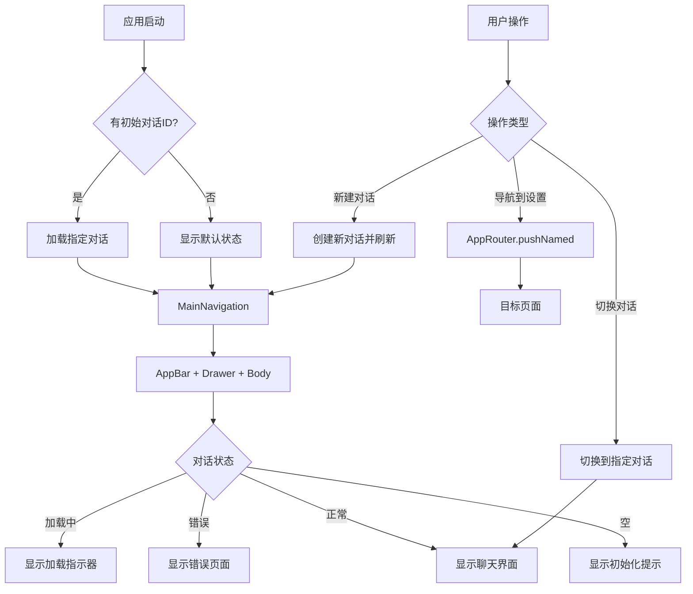

# 🧭 Navigation 层 - 导航和路由管理

YumCha 应用的导航和路由管理层，负责处理应用内的页面导航、路由配置和界面结构。提供统一的导航体验和灵活的路由管理。

## 🏗️ 架构概述

Navigation 层是应用的导航基础，提供：
- 🗺️ **路由管理**: 统一管理应用中所有页面的路由配置
- 🧭 **导航控制**: 提供便捷的页面导航和跳转方法
- 📱 **界面结构**: 定义应用的主要界面结构和布局
- 🔗 **深度链接**: 支持通过 URL 直接访问特定页面
- 🔄 **状态管理**: 集成 Riverpod 进行导航状态管理

## 📁 目录结构

```
lib/navigation/
├── app_router.dart        # 🧭 应用路由管理器
└── main_navigation.dart   # 🏠 主导航界面
```

## 🎯 核心组件详解

### 1. 🧭 AppRouter (`app_router.dart`)

**核心功能**: 应用的路由管理中心

#### 📋 路由定义
```dart
class AppRouter {
  // 路由名称常量
  static const String home = '/';                    // 主页路由
  static const String chat = '/chat';                // 聊天页面
  static const String config = '/config';            // 配置管理
  static const String providers = '/providers';      // AI 提供商管理
  static const String assistants = '/assistants';    // AI 助手管理
  static const String settings = '/settings';        // 应用设置
  // ... 更多路由
}
```

#### 🔄 路由生成
- **动态路由生成**: 根据路由名称动态创建页面
- **参数传递**: 支持复杂的页面参数传递
- **类型安全**: 使用泛型确保参数类型安全
- **错误处理**: 提供统一的 404 错误页面

#### 🚀 导航方法
```dart
// 基本导航
AppRouter.pushNamed(context, AppRouter.settings);

// 带参数导航
AppRouter.pushNamed(context, AppRouter.providerEdit, 
  arguments: {'provider': provider});

// 替换当前页面
AppRouter.pushReplacementNamed(context, AppRouter.home);

// 清空栈并导航
AppRouter.pushNamedAndRemoveUntil(context, AppRouter.home);
```

#### 📝 支持的路由类型

| 路由名称 | 路径 | 功能描述 | 参数类型 |
|---------|------|----------|----------|
| `home` | `/` | 应用主界面 | `conversationId`, `messageId` |
| `chat` | `/chat` | 独立聊天界面 | `ConversationUiState` |
| `config` | `/config` | 配置管理中心 | 无 |
| `providers` | `/providers` | AI 提供商管理 | 无 |
| `providerEdit` | `/provider-edit` | 提供商编辑 | `AiProvider` |
| `assistants` | `/assistants` | AI 助手管理 | 无 |
| `assistantEdit` | `/assistant-edit` | 助手编辑 | `AiAssistant`, `List<AiProvider>` |
| `settings` | `/settings` | 应用设置 | 无 |
| `chatStyleSettings` | `/chat-style-settings` | 聊天样式设置 | 无 |

### 2. 🏠 MainNavigation (`main_navigation.dart`)

**核心功能**: 应用的主要界面容器

#### 🎯 主要特性
- **界面容器**: 作为应用的主要界面结构
- **侧边栏集成**: 集成 AppDrawer 提供导航功能
- **聊天界面**: 嵌入 ChatScreen 提供聊天功能
- **深度链接**: 支持直接打开特定对话
- **状态管理**: 管理对话状态和界面状态

#### 📱 界面结构
```dart
Scaffold(
  appBar: AppBar(
    title: Text(_getAppBarTitle(conversationState)),
    actions: [
      IconButton(icon: Icon(Icons.add), onPressed: _createNewChat),
    ],
  ),
  drawer: AppDrawer(
    onChatClicked: (chatId) => _switchToConversation(chatId),
  ),
  body: _getCurrentScreen(conversationState, notifier),
)
```

#### 🔄 状态处理
- **加载状态**: 显示加载指示器
- **错误状态**: 显示错误信息和重试按钮
- **正常状态**: 显示聊天界面
- **空状态**: 显示初始化提示

#### 🔗 深度链接支持
```dart
MainNavigation(
  initialConversationId: 'conversation-123',  // 直接打开指定对话
  initialMessageId: 'message-456',           // 定位到指定消息
)
```

## 🔄 导航流程图



## 🛠️ 使用指南

### 1. 基本导航操作

#### 页面跳转
```dart
// 跳转到设置页面
AppRouter.pushNamed(context, AppRouter.settings);

// 跳转到提供商编辑页面（带参数）
AppRouter.pushNamed(
  context, 
  AppRouter.providerEdit,
  arguments: {'provider': selectedProvider},
);
```

#### 页面替换
```dart
// 替换当前页面（用户无法返回）
AppRouter.pushReplacementNamed(context, AppRouter.home);

// 清空导航栈并跳转
AppRouter.pushNamedAndRemoveUntil(context, AppRouter.home);
```

#### 页面返回
```dart
// 简单返回
AppRouter.pop(context);

// 带结果返回
AppRouter.pop(context, {'success': true, 'data': result});

// 检查是否可以返回
if (AppRouter.canPop(context)) {
  AppRouter.pop(context);
}
```

### 2. 参数传递

#### 发送参数
```dart
AppRouter.pushNamed(
  context,
  AppRouter.assistantEdit,
  arguments: {
    'assistant': selectedAssistant,
    'providers': availableProviders,
  },
);
```

#### 接收参数
```dart
class AssistantEditScreen extends StatelessWidget {
  @override
  Widget build(BuildContext context) {
    final args = ModalRoute.of(context)?.settings.arguments as Map<String, dynamic>?;
    final assistant = args?['assistant'] as AiAssistant?;
    final providers = args?['providers'] as List<AiProvider>? ?? [];
    
    return Scaffold(/* ... */);
  }
}
```

### 3. 深度链接处理

#### URL 格式
```
yumcha://chat/conversation-123/message-456
```

#### 处理逻辑
```dart
// 解析 URL 参数
final conversationId = extractConversationId(url);
final messageId = extractMessageId(url);

// 导航到主页面并传递参数
AppRouter.pushNamedAndRemoveUntil(
  context,
  AppRouter.home,
  arguments: {
    'conversationId': conversationId,
    'messageId': messageId,
  },
);
```

## 🚀 最佳实践

### 1. 路由管理
- ✅ **使用常量**: 使用 AppRouter 中定义的路由常量，避免硬编码
- ✅ **参数验证**: 在目标页面验证传递的参数类型和有效性
- ✅ **错误处理**: 提供合适的错误页面和用户反馈
- ✅ **日志记录**: 记录重要的导航操作，便于调试

### 2. 状态管理
- 🔄 **状态同步**: 确保导航状态与应用状态同步
- 🔄 **生命周期**: 正确处理页面的生命周期和资源释放
- 🔄 **异步操作**: 在异步操作后检查 context.mounted
- 🔄 **状态恢复**: 支持应用重启后的状态恢复

### 3. 用户体验
- 💫 **流畅动画**: 使用适当的页面转场动画
- ⚡ **快速响应**: 优化导航操作的响应速度
- 🔄 **状态保持**: 保持用户的导航状态和位置
- 📱 **适配性**: 适配不同设备和屏幕尺寸

### 4. 性能优化
- 🎯 **懒加载**: 对复杂页面使用懒加载
- 📊 **缓存策略**: 合理缓存页面状态和数据
- 🧹 **内存管理**: 及时释放不需要的资源
- 🔄 **状态重用**: 重用相同类型的页面状态

## 🔮 扩展功能

### 1. 高级路由功能
```dart
// 条件导航
if (user.isLoggedIn) {
  AppRouter.pushNamed(context, AppRouter.home);
} else {
  AppRouter.pushNamed(context, AppRouter.login);
}

// 嵌套路由
AppRouter.pushNamed(context, '/settings/theme');

// 路由守卫
class AuthGuard {
  static bool canActivate(String routeName) {
    return UserService.isAuthenticated();
  }
}
```

### 2. 动画和转场
```dart
// 自定义页面转场动画
PageRouteBuilder(
  pageBuilder: (context, animation, secondaryAnimation) => TargetPage(),
  transitionsBuilder: (context, animation, secondaryAnimation, child) {
    return SlideTransition(
      position: animation.drive(
        Tween(begin: Offset(1.0, 0.0), end: Offset.zero),
      ),
      child: child,
    );
  },
)
```

### 3. 路由中间件
```dart
class RouteMiddleware {
  static Route<dynamic> handleRoute(RouteSettings settings) {
    // 路由前置处理
    _logNavigation(settings);
    _checkPermissions(settings);
    
    // 生成路由
    return AppRouter.generateRoute(settings);
  }
}
```

## 🔧 调试和测试

### 1. 路由调试
```dart
// 启用路由日志
class DebugAppRouter extends AppRouter {
  static Route<dynamic> generateRoute(RouteSettings settings) {
    print('Navigating to: ${settings.name}');
    print('Arguments: ${settings.arguments}');
    return AppRouter.generateRoute(settings);
  }
}
```

### 2. 导航测试
```dart
testWidgets('should navigate to settings page', (tester) async {
  await tester.pumpWidget(MyApp());
  
  // 点击设置按钮
  await tester.tap(find.byIcon(Icons.settings));
  await tester.pumpAndSettle();
  
  // 验证导航结果
  expect(find.byType(SettingsScreen), findsOneWidget);
});
```

---

> 💡 **提示**: 这个 README 为 YumCha 应用的导航系统提供了完整的指南。Navigation 层是用户体验的关键部分，确保所有导航操作都是流畅、直观和可靠的。在添加新路由或修改导航逻辑时，请遵循现有的设计模式和最佳实践。
