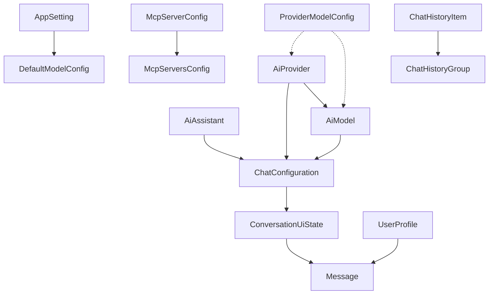

# 📊 Models 层 - 数据模型定义

YumCha 应用的数据模型层，定义了应用中所有的数据结构和业务实体。这些模型是应用数据流的基础，确保类型安全和数据一致性。

## 🏗️ 架构概述

Models 层是应用的数据基础，提供：
- 📊 **数据结构定义**: 定义应用中所有的数据实体
- 🔒 **类型安全**: 使用 Dart 的强类型系统确保数据安全
- 🔄 **序列化支持**: 支持 JSON 序列化和反序列化
- ✅ **数据验证**: 内置数据验证和约束检查
- 🎯 **业务逻辑**: 封装与数据相关的业务逻辑

## 📁 目录结构

```
lib/models/
├── ai_assistant.dart           # 🤖 AI助手数据模型
├── ai_model.dart              # 🧠 AI模型数据模型
├── ai_provider.dart           # 🔌 AI提供商数据模型
├── app_setting.dart           # ⚙️ 应用设置数据模型
├── chat_bubble_style.dart     # 🎨 聊天样式枚举
├── chat_configuration.dart    # 💬 聊天配置数据模型
├── chat_history.dart          # 📚 聊天历史数据模型
├── conversation_ui_state.dart # 💬 对话UI状态模型
├── mcp_server_config.dart     # 🔌 MCP服务器配置模型
├── message.dart               # 📝 消息数据模型
├── provider_model_config.dart # 📋 提供商标准配置模型
└── user_profile.dart          # 👤 用户档案数据模型
```

## 🎯 核心业务模型

### 1. 🤖 AI 助手模型 (`ai_assistant.dart`)
**核心实体**: 用户创建的个性化 AI 助手

**关键特性**:
- 🎭 **个性化配置**: 独特的系统提示词和 AI 参数
- 🔧 **灵活参数**: 温度、Top-P、最大 token 等可调节参数
- 🛠️ **功能开关**: 代码执行、图像生成、工具调用等功能控制
- 🎯 **独立性**: 不绑定特定提供商或模型，可灵活切换
- ✅ **参数验证**: 内置参数范围验证功能

**业务逻辑**:
- 用户可以创建多个助手，每个助手代表不同的聊天角色
- 助手配置包括基本信息、AI 参数、功能设置等
- 在聊天时选择助手，然后可以切换不同的提供商模型组合

### 2. 🔌 AI 提供商模型 (`ai_provider.dart`)
**核心实体**: AI 服务提供商配置

**关键特性**:
- 🔌 **多提供商支持**: 支持主流 AI 服务提供商
- 🔑 **安全配置**: 安全存储 API 密钥和连接信息
- 🧠 **模型管理**: 每个提供商可配置多个 AI 模型
- 🌐 **自定义 URL**: 支持自定义 Base URL（OpenAI 兼容接口）
- ⚙️ **启用控制**: 可以启用或禁用特定提供商

**支持的提供商类型**:
- **OpenAI**: GPT 系列模型
- **Anthropic**: Claude 系列模型
- **Google**: Gemini 系列模型
- **Ollama**: 本地部署的开源模型
- **Custom**: 用户自定义的 API 接口

### 3. 🧠 AI 模型模型 (`ai_model.dart`)
**核心实体**: 具体的 AI 模型配置

**关键特性**:
- 🏷️ **模型标识**: 唯一的 ID 和名称标识
- 🎯 **能力定义**: 明确标识模型支持的功能（视觉、推理、工具等）
- 📊 **元数据存储**: 灵活存储模型的额外信息
- 🔄 **序列化支持**: 支持 JSON 序列化和反序列化

**模型能力类型**:
- **Vision**: 视觉理解能力
- **Embedding**: 向量嵌入能力
- **Reasoning**: 推理能力（如 OpenAI o1 系列）
- **Tools**: 工具调用能力

### 4. 💬 聊天配置模型 (`chat_configuration.dart`)
**核心实体**: 聊天的完整配置

**关键特性**:
- 🤖 **助手配置**: 包含 AI 助手的个性化设置
- 🔌 **提供商配置**: 包含 AI 服务提供商的连接信息
- 🧠 **模型配置**: 包含具体的 AI 模型信息
- ✅ **完整性保证**: 确保聊天配置的完整性

**业务逻辑**:
- 用户首先选择 AI 助手（定义角色和参数）
- 然后选择提供商和模型的组合（定义 AI 服务）
- 三者组合形成完整的聊天配置

## 📝 消息和对话模型

### 5. 📝 消息模型 (`message.dart`)
**核心实体**: 聊天对话中的单条消息

**关键特性**:
- 💬 **消息内容**: 支持文本和图像内容
- 👤 **作者标识**: 区分用户和 AI 助手
- ⏰ **时间戳**: 记录消息的创建时间
- 🖼️ **多媒体支持**: 支持图像 URL 和头像 URL
- 🔄 **不可变性**: 使用 @immutable 确保数据不可变

### 6. 💬 对话状态模型 (`conversation_ui_state.dart`)
**核心实体**: 对话的完整状态

**关键特性**:
- 💬 **对话信息**: 对话 ID、名称、成员数等基本信息
- 📝 **消息管理**: 包含完整的消息历史列表
- 🤖 **助手配置**: 关联的 AI 助手 ID
- 🔌 **提供商配置**: 当前选择的提供商和模型

### 7. 📚 聊天历史模型 (`chat_history.dart`)
**核心实体**: 聊天历史和分组

**包含模型**:
- **ChatHistoryItem**: 单个对话项的基本信息和预览
- **ChatHistoryGroup**: 按时间或类型分组的对话列表
- **AssistantType**: 助手类型的分类定义

## ⚙️ 配置和设置模型

### 8. ⚙️ 应用设置模型 (`app_setting.dart`)
**核心实体**: 应用的配置设置

**关键特性**:
- 🔑 **键值存储**: 基于键值对的设置存储
- 🎯 **类型安全**: 支持多种数据类型的类型安全操作
- 🔄 **动态更新**: 支持设置值的动态更新
- 📊 **类型推断**: 自动推断设置值的数据类型

**支持的数据类型**:
- String、bool、int、double、JSON

**预定义设置分类**:
- 主题设置、聊天设置、默认模型、MCP 设置、最后使用配置

### 9. 🔌 MCP 服务器配置模型 (`mcp_server_config.dart`)
**核心实体**: MCP 协议服务器配置

**关键特性**:
- 🔌 **多协议支持**: 支持 STDIO、HTTP、SSE 连接类型
- ⚙️ **命令配置**: 支持自定义启动命令和参数
- 🌐 **环境变量**: 支持自定义环境变量配置
- 📱 **平台适配**: 根据平台能力自动适配连接方式

**连接类型**:
- **STDIO**: 本地进程通信（桌面平台）
- **HTTP**: HTTP API 连接（所有平台）
- **SSE**: 服务器发送事件（所有平台）

### 10. 🎨 界面配置模型

#### 聊天样式 (`chat_bubble_style.dart`)
**枚举类型**: 聊天消息显示样式
- **Bubble**: 聊天气泡样式（有背景色和圆角）
- **List**: 列表样式（无背景色，占满宽度）

#### 用户档案 (`user_profile.dart`)
**核心实体**: 用户个人信息
- 👤 身份信息、📊 状态信息、🖼️ 头像支持、🌐 社交信息

## 📋 标准配置模型

### 11. 📋 提供商标准配置 (`provider_model_config.dart`)
**核心实体**: 知名提供商的标准模型配置

**关键特性**:
- 📋 **标准配置**: 提供 OpenAI 等知名提供商的标准模型配置
- 🧠 **能力定义**: 详细定义模型支持的各种 AI 能力
- 💰 **定价信息**: 包含模型的标准定价和成本信息
- 🔧 **参数配置**: 定义模型的技术参数和限制

**重要说明**:
- 这些配置不能直接应用到用户的 AiModel
- 仅用于提供参考信息和能力检测
- 需要根据实际提供商来判断是否适用

## 🔄 数据关系图



## 🛠️ 使用指南

### 1. 创建数据模型实例
```dart
// 创建 AI 助手
final assistant = AiAssistant(
  id: 'assistant-1',
  name: '编程助手',
  description: '专业的编程和技术支持助手',
  systemPrompt: '你是一个专业的编程助手...',
  temperature: 0.7,
  createdAt: DateTime.now(),
  updatedAt: DateTime.now(),
);

// 创建聊天配置
final config = ChatConfiguration(
  assistant: assistant,
  provider: provider,
  model: model,
);
```

### 2. 数据验证
```dart
// 验证助手参数
if (assistant.isValid) {
  print('助手参数配置正确');
} else {
  print('助手参数配置有误');
}

// 检查配置完整性
if (defaultModelConfig.isConfigured) {
  print('默认模型配置完整');
}
```

### 3. 序列化操作
```dart
// JSON 序列化
final json = model.toJson();
final jsonString = jsonEncode(json);

// JSON 反序列化
final modelFromJson = AiModel.fromJson(jsonDecode(jsonString));
```

## 🚀 最佳实践

### 1. 数据模型设计原则
- ✅ **不可变性**: 使用 @immutable 和 final 字段
- ✅ **类型安全**: 充分利用 Dart 的类型系统
- ✅ **验证逻辑**: 在模型中包含数据验证逻辑
- ✅ **序列化支持**: 提供 JSON 序列化方法

### 2. 业务逻辑封装
- 🎯 **计算属性**: 使用 getter 封装计算逻辑
- 🔄 **状态转换**: 提供状态转换的便捷方法
- ✅ **验证方法**: 封装复杂的验证逻辑
- 📝 **描述方法**: 提供人性化的描述信息

### 3. 性能优化
- 🔄 **copyWith 模式**: 使用 copyWith 进行不可变更新
- 📊 **延迟计算**: 对复杂计算使用延迟加载
- 🧹 **内存管理**: 避免循环引用和内存泄漏
- 🎯 **精确比较**: 实现高效的 == 和 hashCode

## 🔮 未来扩展

随着应用功能的扩展，Models 层可能会增加：
- 🎵 **多媒体模型**: 音频、视频消息的数据模型
- 🔄 **同步模型**: 多设备数据同步的模型
- 📊 **统计模型**: 使用统计和分析的数据模型
- 🔐 **安全模型**: 加密和权限相关的数据模型
- 🌐 **国际化模型**: 多语言和本地化的数据模型

---

> 💡 **提示**: 这个 README 为 YumCha 应用的数据模型提供了完整的指南。Models 层是应用的数据基础，确保所有数据操作都是类型安全和一致的。在添加新模型时，请遵循现有的设计模式和最佳实践。
