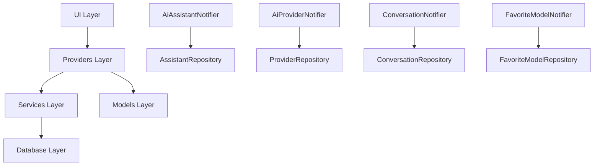

# 📱 Providers 层 - Riverpod 状态管理

YumCha 应用的状态管理层，基于 Riverpod 架构实现。负责管理应用的全局状态、业务逻辑和数据流。

## 🏗️ 架构概述

Providers 层是应用的状态管理核心，采用 Riverpod 状态管理模式，提供：
- 🔄 **响应式状态管理**: 自动响应数据变化并更新 UI
- 📊 **异步数据处理**: 使用 AsyncValue 优雅处理加载状态和错误
- 🎯 **业务逻辑封装**: 将复杂的业务逻辑从 UI 层分离
- 🔗 **依赖注入**: 通过 Riverpod 实现清晰的依赖关系
- 💾 **数据持久化**: 与数据库服务层无缝集成

## 📁 目录结构

```
lib/providers/
├── ai_assistant_notifier.dart      # 🤖 AI助手状态管理
├── ai_provider_notifier.dart       # 🔌 AI提供商状态管理
├── chat_configuration_notifier.dart # ⚙️ 聊天配置状态管理
├── chat_notifier.dart              # 💬 聊天状态管理（旧版）
├── conversation_notifier.dart      # 💬 对话状态管理（主要）
└── favorite_model_notifier.dart    # ⭐ 收藏模型状态管理
```

## 🎯 核心业务逻辑

### 用户配置流程
1. **提供商配置**: 用户配置多个 AI 提供商（OpenAI、DeepSeek、Anthropic、Google、Ollama 等）
2. **模型配置**: 为每个提供商配置不同的 API 密钥和多个模型
3. **助手创建**: 用户创建多个 AI 助手，设置个性化的系统提示词和 AI 参数
4. **聊天流程**: 通过 AI 助手创建聊天，在聊天过程中可切换不同的提供商模型

### 数据关系
- **AI 助手** ↔ **聊天对话**: 一对多关系，一个助手可以创建多个对话
- **AI 提供商** ↔ **AI 模型**: 一对多关系，一个提供商可以配置多个模型
- **聊天对话** ↔ **提供商模型**: 多对多关系，对话中可以切换不同的提供商模型组合
- **用户** ↔ **收藏模型**: 多对多关系，用户可以收藏多个模型以便快速访问

## 🔧 状态管理器详解

### 1. 🤖 AI 助手管理 (`ai_assistant_notifier.dart`)
**职责**: 管理所有 AI 助手的状态和操作

**核心特性**:
- 🎭 **个性化配置**: 每个助手可设置独特的系统提示词和 AI 参数
- 🔄 **状态同步**: 实时同步助手数据变化
- 🎯 **独立性**: 助手不绑定特定的提供商或模型，可灵活切换
- ⚙️ **启用控制**: 可以启用或禁用特定助手

**业务逻辑**:
- 用户可以创建多个 AI 助手，每个助手代表不同的聊天角色
- 助手配置包括名称、描述、系统提示词、温度、最大 token 等参数
- 只有启用的助手才能用于聊天
- 在聊天过程中，用户可以选择不同的助手来获得不同的对话体验

### 2. 🔌 AI 提供商管理 (`ai_provider_notifier.dart`)
**职责**: 管理所有 AI 提供商的配置和状态

**核心特性**:
- 🔌 **多提供商支持**: 支持 OpenAI、DeepSeek、Anthropic、Google、Ollama 等
- 🔑 **密钥管理**: 为每个提供商配置独立的 API 密钥和 Base URL
- 🧠 **模型管理**: 每个提供商可配置多个 AI 模型
- ⚙️ **启用控制**: 可以启用或禁用特定提供商

**配置结构**:
- 提供商基本信息：名称、类型、描述
- 连接配置：API 密钥、Base URL、超时设置
- 模型列表：每个模型的详细配置和能力

### 3. ⚙️ 聊天配置管理 (`chat_configuration_notifier.dart`)
**职责**: 管理聊天界面的配置状态

**核心功能**:
- 🔄 **配置恢复**: 启动时自动恢复用户上次使用的配置
- 🎯 **智能选择**: 自动选择可用的助手、提供商和模型
- 💾 **状态持久化**: 保存用户的选择偏好
- ✅ **完整性检查**: 验证配置的完整性和有效性

**业务逻辑**:
- 用户必须选择助手、提供商、模型才能开始聊天
- 系统会记住用户的上次选择，下次启动时自动恢复
- 如果上次的配置不可用，会自动选择第一个可用的配置

### 4. 💬 对话管理 (`conversation_notifier.dart`)
**职责**: 管理当前活跃对话的状态和操作（主要对话管理器）

**核心功能**:
- 💬 **对话管理**: 创建新对话、加载现有对话、切换对话
- 🏷️ **智能标题**: 自动生成对话标题，支持手动重新生成
- 💾 **配置恢复**: 恢复用户上次使用的助手和模型配置
- 🛡️ **防抖机制**: 防止重复创建对话的操作
- 📊 **持久化**: 自动保存对话到数据库

**标题生成策略**:
- 对话至少有2条消息（用户+AI回复）时触发
- 只对默认标题"新对话"进行自动更新
- 支持使用默认标题生成模型或当前对话模型
- 防止重复生成和并发冲突

### 5. 💬 聊天管理 (`chat_notifier.dart`)
**职责**: 较旧的聊天状态管理器，主要用于向后兼容

**核心功能**:
- 💬 **消息管理**: 管理聊天消息的发送、接收和显示
- 📡 **流式聊天**: 支持实时流式 AI 响应
- ⚙️ **自动配置**: 自动选择可用的模型配置
- 🛡️ **错误处理**: 处理聊天过程中的各种错误情况

**注意**: 建议新功能使用 `ConversationNotifier`

### 6. ⭐ 收藏模型管理 (`favorite_model_notifier.dart`)
**职责**: 管理用户收藏的 AI 模型状态

**核心功能**:
- ⭐ **收藏管理**: 添加、移除、切换模型收藏状态
- 📋 **列表管理**: 获取所有收藏模型或按提供商筛选
- 🔍 **状态查询**: 检查特定模型是否已被收藏
- 🏷️ **分类查询**: 按提供商查询收藏的模型

**业务逻辑**:
- 收藏基于 providerId + modelName 的组合唯一性
- 收藏的模型会在模型选择界面优先显示
- 支持按提供商分类查看收藏的模型

## 🔄 状态管理模式

### AsyncValue 模式
大部分 Notifier 使用 `AsyncValue<T>` 来管理异步状态：
```dart
// 加载状态
AsyncValue.loading()

// 成功状态
AsyncValue.data(data)

// 错误状态
AsyncValue.error(error, stackTrace)
```

### StateNotifier 模式
使用 `StateNotifier<T>` 管理复杂的状态变化：
```dart
class MyNotifier extends StateNotifier<MyState> {
  MyNotifier() : super(initialState);
  
  void updateState() {
    state = state.copyWith(newValue: value);
  }
}
```

## 🔗 依赖关系



## 📋 使用指南

### 1. 在 Widget 中使用 Provider
```dart
class MyWidget extends ConsumerWidget {
  @override
  Widget build(BuildContext context, WidgetRef ref) {
    final assistants = ref.watch(aiAssistantNotifierProvider);
    
    return assistants.when(
      loading: () => CircularProgressIndicator(),
      error: (error, stack) => Text('Error: $error'),
      data: (assistants) => ListView.builder(
        itemCount: assistants.length,
        itemBuilder: (context, index) => ListTile(
          title: Text(assistants[index].name),
        ),
      ),
    );
  }
}
```

### 2. 调用 Notifier 方法
```dart
// 添加新助手
ref.read(aiAssistantNotifierProvider.notifier).addAssistant(assistant);

// 切换收藏状态
ref.read(favoriteModelNotifierProvider.notifier)
   .toggleFavoriteModel(providerId, modelName);

// 创建新对话
ref.read(currentConversationProvider.notifier).createNewConversation();
```

### 3. 监听状态变化
```dart
ref.listen<AsyncValue<List<AiAssistant>>>(
  aiAssistantNotifierProvider,
  (previous, next) {
    next.whenOrNull(
      error: (error, stack) => showErrorSnackBar(error.toString()),
    );
  },
);
```

## 🚀 最佳实践

### 1. 状态管理原则
- ✅ **单一数据源**: 每个状态只有一个权威来源
- ✅ **不可变状态**: 使用 `copyWith` 创建新状态
- ✅ **异步处理**: 使用 `AsyncValue` 处理异步操作
- ✅ **错误处理**: 妥善处理和展示错误状态

### 2. 性能优化
- 🎯 **精确监听**: 只监听需要的状态变化
- 🔄 **避免重复计算**: 使用 `select` 选择特定字段
- 📊 **懒加载**: 按需加载数据
- 🧹 **及时清理**: 适当清理不需要的状态

### 3. 代码组织
- 📁 **职责分离**: 每个 Notifier 只负责特定领域
- 🔗 **依赖注入**: 通过 Riverpod 管理依赖关系
- 📝 **文档完善**: 为复杂逻辑添加详细注释
- 🧪 **测试覆盖**: 为关键业务逻辑编写测试

## 🔄 Provider 生命周期

### 初始化顺序
1. **DatabaseService**: 数据库连接初始化
2. **Repository 层**: 数据访问层初始化
3. **Provider 层**: 状态管理器初始化
4. **UI 层**: 界面组件订阅状态

### 状态同步机制
- **自动刷新**: 数据变化时自动更新相关状态
- **跨 Provider 通信**: 通过 Ref 实现 Provider 间的依赖和通信
- **持久化同步**: 状态变化自动同步到数据库
- **错误恢复**: 自动处理网络错误和数据不一致

## 🛠️ 调试和监控

### 状态调试
```dart
// 启用 Riverpod 日志
ProviderContainer(
  observers: [
    if (kDebugMode) LoggerProviderObserver(),
  ],
);
```

### 常见问题排查
1. **状态不更新**: 检查是否正确使用 `ref.watch`
2. **内存泄漏**: 确保及时释放不需要的 Provider
3. **循环依赖**: 避免 Provider 间的循环引用
4. **异步竞态**: 使用防抖机制避免并发问题

## 📊 性能监控

### 关键指标
- **状态更新频率**: 监控状态变化的频率
- **内存使用**: 跟踪 Provider 的内存占用
- **响应时间**: 测量状态更新到 UI 刷新的延迟
- **错误率**: 监控异步操作的失败率

### 优化建议
- 使用 `select` 减少不必要的重建
- 合理使用 `autoDispose` 自动清理
- 避免在 `build` 方法中进行重计算
- 使用 `family` 参数化 Provider

## 🔮 未来扩展

随着应用功能的扩展，Providers 层可能会增加：
- 🎨 **主题管理**: 主题和外观设置的状态管理
- 🔔 **通知管理**: 应用内通知的状态管理
- 🌐 **网络状态**: 网络连接状态的监控
- 📊 **统计分析**: 使用统计和分析数据的管理
- 🔐 **权限管理**: 应用权限状态的管理
- 🔄 **同步管理**: 多设备数据同步的状态管理
- 🎯 **个性化**: 用户偏好和个性化设置的管理

## 📚 相关文档

- [Riverpod 官方文档](https://riverpod.dev/)
- [Flutter 状态管理指南](https://flutter.dev/docs/development/data-and-backend/state-mgmt)
- [YumCha Services 层文档](../services/README.md)
- [YumCha Models 层文档](../models/README.md)

## 🤝 贡献指南

### 添加新的 Provider
1. 创建对应的状态模型类
2. 实现 StateNotifier 或 AsyncNotifier
3. 添加完整的文档注释
4. 编写单元测试
5. 更新此 README 文档

### 代码规范
- 使用中文注释说明业务逻辑
- 遵循 Dart 命名规范
- 添加适当的 emoji 图标
- 保持代码的可读性和可维护性

---

> 💡 **提示**: 这个 README 为 YumCha 应用的状态管理提供了完整的指南。如果你是新开发者，建议先从 `ConversationNotifier` 开始了解，它包含了最核心的业务逻辑。对于复杂的状态管理场景，请参考现有的实现模式并保持一致性。
