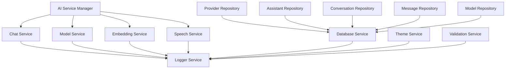

# 📁 Services 目录详细介绍

Services目录是整个应用的业务逻辑和数据处理中心，包含了所有核心服务的实现。

## 🏗️ 目录结构概览

```
lib/services/
├── ai/                          # 🤖 AI服务模块（重构后的新架构）
│   ├── ai_service_manager.dart  # AI服务管理器（核心入口）
│   ├── core/                    # 核心基础设施
│   ├── chat/                    # 聊天服务
│   ├── capabilities/            # AI能力服务
│   └── providers/               # Riverpod状态管理
├── ai_dart_service.dart         # 🔄 AI Dart库适配服务
├── ai_request_service.dart      # 🔄 旧版AI服务（待废弃）
├── ai_service.dart              # 🔄 旧版AI服务（待废弃）
├── ai_service_new.dart          # 🔄 新版AI服务（兼容层）
├── database_service.dart        # 💾 数据库服务
├── favorite_model_repository.dart # ⭐ 收藏模型数据仓库
├── logger_service.dart          # 📝 日志记录服务
├── mcp_service.dart             # 🔌 MCP协议服务
├── model_management_service.dart # 🧠 模型管理服务
├── notification_service.dart    # 📢 通知服务
├── preference_service.dart      # ⚙️ 用户偏好设置服务
├── provider_config_service.dart # 📋 提供商配置服务
├── provider_repository.dart     # 🔌 AI提供商数据仓库
├── assistant_repository.dart    # 🤖 AI助手数据仓库
├── conversation_repository.dart # 💬 对话数据仓库
├── message_repository.dart      # 📨 消息数据仓库
├── theme_service.dart           # 🎨 主题管理服务
└── validation_service.dart      # ✅ 数据验证服务
```

## 🎯 核心服务分类

### 1. 🤖 AI服务层 (ai/)
**新架构的AI功能实现，推荐使用**

#### 核心管理器
- **`ai_service_manager.dart`** - AI服务的统一管理器
  - 🎯 **作用**: 统一管理所有AI相关服务
  - 🔧 **功能**: 服务注册、初始化、健康检查、统计监控
  - 👥 **用户**: 应用启动时初始化，其他服务通过它访问AI功能

#### 基础设施 (core/)
- **`ai_service_base.dart`** - AI服务基类和能力定义
- **`ai_response_models.dart`** - AI响应数据模型
- **`ai_provider_adapter.dart`** - AI提供商适配器

#### 具体服务 (chat/, capabilities/)
- **`chat_service.dart`** - 聊天对话服务
- **`model_service.dart`** - 模型管理服务
- **`embedding_service.dart`** - 向量嵌入服务
- **`speech_service.dart`** - 语音处理服务

#### 状态管理 (providers/)
- **`ai_service_provider.dart`** - Riverpod状态管理提供者

### 2. 💾 数据持久化层
**负责数据的存储和检索**

#### 数据库核心
- **`database_service.dart`** - 数据库连接和管理
  - 🎯 **作用**: SQLite数据库的初始化、连接管理、迁移
  - 🔧 **功能**: 数据库创建、表结构管理、事务处理
  - 👥 **用户**: 所有Repository类的底层依赖

#### 数据仓库 (Repository Pattern)
- **`provider_repository.dart`** - AI提供商数据管理
  - 🎯 **作用**: 管理AI提供商的CRUD操作
  - 🔧 **功能**: 提供商的增删改查、配置管理
  
- **`assistant_repository.dart`** - AI助手数据管理
  - 🎯 **作用**: 管理AI助手的配置和参数
  - 🔧 **功能**: 助手的创建、编辑、删除、查询
  
- **`conversation_repository.dart`** - 对话数据管理
  - 🎯 **作用**: 管理聊天对话的元数据
  - 🔧 **功能**: 对话的创建、列表、删除、搜索
  
- **`message_repository.dart`** - 消息数据管理
  - 🎯 **作用**: 管理具体的聊天消息
  - 🔧 **功能**: 消息的存储、检索、分页、搜索
  
- **`model_repository.dart`** - AI模型数据管理
  - 🎯 **作用**: 管理AI模型的配置信息
  - 🔧 **功能**: 模型的注册、查询、能力管理

### 3. 🛠️ 基础设施服务
**提供应用运行的基础支持**

#### 日志系统
- **`logger_service.dart`** - 统一日志记录服务
  - 🎯 **作用**: 提供全应用的日志记录功能
  - 🔧 **功能**: 分级日志、美观输出、AI专用日志、性能监控
  - 👥 **用户**: 所有其他服务都依赖它进行日志记录

#### 主题系统
- **`theme_service.dart`** - 应用主题管理服务
  - 🎯 **作用**: 管理应用的主题和外观设置
  - 🔧 **功能**: 主题切换、颜色管理、用户偏好存储
  - 👥 **用户**: UI层通过它获取主题配置

### 4. � 扩展服务层
**提供专门功能和扩展能力的服务**

#### AI 适配服务
- **`ai_dart_service.dart`** - AI Dart库适配服务
  - 🎯 **作用**: 新 ai_dart 库与现有架构的适配层
  - 🔧 **功能**: 模型转换、提供商适配、推理支持、工具调用
  - 👥 **用户**: 替代旧版AI服务，提供更好的功能支持

#### 模型管理服务
- **`model_management_service.dart`** - 模型管理服务
  - 🎯 **作用**: 从提供商API动态获取和管理模型列表
  - 🔧 **功能**: 模型获取、能力检测、错误处理、认证验证
  - 👥 **用户**: 提供商配置界面、模型选择功能

- **`favorite_model_repository.dart`** - 收藏模型数据仓库
  - 🎯 **作用**: 管理用户收藏的AI模型
  - 🔧 **功能**: 收藏管理、状态检查、切换操作、分类查询
  - 👥 **用户**: 模型选择界面、快速访问功能

#### 通知和偏好服务
- **`notification_service.dart`** - 通知服务
  - 🎯 **作用**: 统一的用户通知功能
  - 🔧 **功能**: SnackBar通知、确认对话框、主题适配、自定义操作
  - 👥 **用户**: 全应用的用户反馈和通知显示

- **`preference_service.dart`** - 用户偏好设置服务
  - 🎯 **作用**: 管理用户偏好设置和应用状态持久化
  - 🔧 **功能**: 模型偏好、助手偏好、界面偏好、调试设置
  - 👥 **用户**: 应用启动恢复、个性化体验

#### 配置和验证服务
- **`provider_config_service.dart`** - 提供商配置服务
  - 🎯 **作用**: 提供知名AI提供商的标准配置信息
  - 🔧 **功能**: 标准配置、能力识别、定价信息、模型筛选
  - 👥 **用户**: 模型能力检测、配置建议、信息展示

- **`validation_service.dart`** - 数据验证服务
  - 🎯 **作用**: 统一的数据验证功能
  - 🔧 **功能**: 提供商验证、助手验证、消息验证、参数验证
  - 👥 **用户**: 用户输入验证、配置检查、系统健康检查

#### MCP 协议服务
- **`mcp_service.dart`** - MCP协议服务
  - 🎯 **作用**: 管理MCP服务器连接和工具调用
  - 🔧 **功能**: 服务器管理、工具调用、多协议支持、平台适配
  - 👥 **用户**: AI工具扩展、外部服务集成

### 5. 🔄 遗留服务 (待废弃)
**重构前的旧版AI服务，逐步迁移中**

- **`ai_request_service.dart`** - 旧版AI请求服务
- **`ai_service.dart`** - 旧版AI服务主类
- **`ai_service_new.dart`** - 新版AI服务兼容层

## 📋 详细服务介绍

### 🤖 AI服务层详解

#### `ai_service_manager.dart` - AI服务管理器
**作用**: 统一管理所有AI相关服务的核心入口
- 🎯 **服务注册**: 注册ChatService、ModelService等子服务
- 🔄 **生命周期**: 管理服务的初始化、健康检查、资源清理
- 📊 **统计监控**: 收集AI服务的使用统计和性能数据
- 🎛️ **统一接口**: 为上层提供简化的AI功能访问接口

**使用场景**: 应用启动时初始化，其他模块通过它访问AI功能

#### `chat_service.dart` - 聊天服务
**作用**: 处理AI对话的核心业务逻辑
- 💬 **单次聊天**: 发送消息并等待完整响应
- ⚡ **流式聊天**: 实时接收AI响应流
- 🔧 **工具调用**: 支持AI调用外部工具和函数
- 🧠 **推理思考**: 显示AI的思考过程（如o1模型）
- 👁️ **视觉理解**: 处理包含图像的多模态对话

**使用场景**: 聊天界面、AI助手对话、内容生成

#### `model_service.dart` - 模型管理服务
**作用**: 管理AI模型的信息和能力
- 📋 **模型列表**: 从提供商获取可用模型列表
- 🏷️ **能力检测**: 检测模型支持的AI能力（视觉、工具等）
- 💾 **智能缓存**: 缓存模型信息以提升性能
- 🔄 **自动刷新**: 定期更新模型列表

**使用场景**: 模型选择界面、能力检测、配置验证

### 💾 数据持久化层详解

#### `database_service.dart` - 数据库服务
**作用**: 应用数据存储的统一访问入口
- 🏗️ **连接管理**: 管理SQLite数据库连接
- 🔄 **实例控制**: 确保全应用使用同一数据库实例
- 💾 **资源管理**: 负责数据库资源的正确释放

**技术栈**: Drift ORM + SQLite
**数据库文件**: `yumcha.db`
**当前版本**: 2

#### Repository层 - 数据访问对象
**设计模式**: Repository Pattern
**作用**: 为不同业务实体提供统一的数据访问接口

##### `provider_repository.dart` - AI提供商仓库
- 🔌 **提供商管理**: OpenAI、Anthropic、Google等提供商的CRUD
- ✅ **数据验证**: 确保提供商配置的完整性
- 🎛️ **状态管理**: 启用/禁用提供商
- 📝 **操作日志**: 记录所有数据操作

##### `assistant_repository.dart` - AI助手仓库
- 🤖 **助手配置**: 管理AI助手的系统提示和参数
- 🎨 **个性化**: 支持自定义助手头像和描述
- ⚙️ **AI参数**: 温度、top-p、最大token等参数管理
- 🔧 **功能开关**: 工具调用、视觉理解等能力开关

##### `conversation_repository.dart` - 对话仓库
- 💬 **对话管理**: 聊天对话的元数据管理
- 📊 **分页查询**: 支持大量对话的分页加载
- 🔍 **搜索功能**: 按标题搜索对话
- 📈 **统计信息**: 对话数量统计

##### `message_repository.dart` - 消息仓库
- 📨 **消息存储**: 聊天消息的详细内容存储
- 🔍 **全文搜索**: 支持消息内容的全文搜索
- 📄 **分页加载**: 高效的消息分页加载
- 🖼️ **多媒体**: 支持图像和附件消息

### 🛠️ 基础设施服务详解

#### `logger_service.dart` - 日志服务
**作用**: 统一的应用日志记录系统
- 📝 **分级日志**: Debug、Info、Warning、Error、Fatal五个级别
- 🎨 **美观输出**: 彩色、结构化的控制台输出
- 🔧 **环境适配**: 开发和生产环境的不同策略
- 🤖 **AI专用**: 针对AI功能的专门日志方法

**特性**:
- 单例模式确保全局一致
- 自动调用栈跟踪
- 性能优化的输出过滤
- 支持附加数据记录

#### `theme_service.dart` - 主题服务
**作用**: 应用外观和主题的管理中心
- 🎨 **多主题**: 标准、中对比、高对比、活力四种主题
- 🌓 **明暗模式**: 浅色、深色、跟随系统三种模式
- 🎯 **动态颜色**: Android 12+ Material You动态颜色支持
- ♿ **可访问性**: 高对比度主题支持视觉障碍用户
- 💾 **持久化**: 用户偏好自动保存和恢复

**技术特性**:
- ChangeNotifier实现响应式更新
- SharedPreferences持久化存储
- 动态颜色自动检测和降级
- 实时主题切换无需重启

### 🔧 扩展服务层详解

#### `ai_dart_service.dart` - AI Dart库适配服务
**作用**: 新 ai_dart 库与现有服务架构的适配层

- 🔄 **模型转换**: 将应用模型转换为 ai_dart 库模型
- 🤖 **提供商适配**: 支持 OpenAI、Anthropic、Google 等多种提供商
- 💬 **聊天功能**: 提供单次和流式聊天接口
- 🧠 **推理支持**: 支持 AI 推理思考过程显示（如 o1 模型）
- 🔧 **工具调用**: 支持 AI 工具和函数调用
- 🧪 **连接测试**: 提供提供商连接测试功能

**技术特性**:
- 单例模式确保全局一致
- 详细的错误处理和日志记录
- 支持最新的 AI 功能特性
- 自动适配不同提供商的 API 差异

#### `model_management_service.dart` - 模型管理服务
**作用**: 从 AI 提供商动态获取和管理模型列表

- 📋 **动态获取**: 从提供商 API 实时获取可用模型列表
- 🔍 **能力检测**: 检测提供商是否支持模型列表 API
- 🛡️ **错误处理**: 提供详细的错误信息和处理建议
- 🔑 **认证验证**: 验证 API 密钥的有效性
- 🌐 **网络检测**: 检测网络连接和 Base URL 配置

**设计理念**:
- 不提供硬编码的回退模型列表
- 鼓励用户手动添加模型以确保准确性
- 提供清晰的错误信息指导用户解决问题

#### `notification_service.dart` - 通知服务
**作用**: 统一的用户通知功能

- 📢 **SnackBar 通知**: 底部浮动通知，支持自动关闭
- 🎨 **主题适配**: 自动适配 Material 3 主题颜色
- 🔔 **多种类型**: 成功、错误、警告、信息四种通知类型
- 💬 **确认对话框**: 支持用户确认操作的对话框
- 📋 **底部通知卡片**: 更丰富的通知展示方式
- ⚙️ **自定义操作**: 支持自定义操作按钮和回调

**设计特点**:
- 使用 Material 3 设计规范
- 支持动态颜色和主题切换
- 提供一致的用户体验

#### `mcp_service.dart` - MCP协议服务
**作用**: 管理 MCP 服务器连接和工具调用功能

- 🔌 **服务器管理**: 连接和管理多个 MCP 服务器
- 🛠️ **工具调用**: 调用 MCP 服务器提供的工具
- 🌐 **多协议支持**: 支持 STDIO、HTTP、SSE 连接类型
- 📱 **平台适配**: 根据平台能力自动适配连接方式
- 🔍 **状态监控**: 实时监控服务器连接状态
- ⚙️ **配置验证**: 验证服务器配置的有效性

**支持的连接类型**:
- **STDIO**: 本地进程通信（桌面平台）
- **HTTP**: HTTP API 连接（所有平台）
- **SSE**: 服务器发送事件（所有平台）

## 🔄 服务依赖关系



## 🚀 使用指南

### 🎯 新用户推荐路径

#### 1. AI功能开发
```dart
// 使用新的AI服务架构
final manager = ref.read(aiServiceManagerProvider);
await ref.read(initializeAiServicesProvider.future);

// 发送聊天消息
final response = await ref.read(smartChatProvider(
  SmartChatParams(
    chatHistory: messages,
    userMessage: userInput,
  ),
).future);
```

#### 2. 数据操作
```dart
// 使用Repository进行数据操作
final dbService = DatabaseService.instance;
final providerRepo = ProviderRepository(dbService.database);

// 获取所有提供商
final providers = await providerRepo.getAllProviders();
```

#### 3. 日志记录
```dart
// 使用LoggerService进行调试
final logger = LoggerService();
logger.info('操作成功');
logger.error('发生错误', error, stackTrace);
```

#### 4. 主题管理
```dart
// 使用ThemeService管理外观
final themeService = ThemeService();
await themeService.setColorMode(ColorMode.dark);
await themeService.setAppThemeType(AppThemeType.vibrant);
```

### ⚠️ 开发者注意事项

#### ✅ 推荐做法
- **使用新架构**: 优先使用 `ai/` 目录下的新AI服务
- **Repository模式**: 通过Repository类进行数据操作
- **统一日志**: 所有服务都使用 `LoggerService`
- **响应式主题**: 使用 `ThemeService` 的ChangeNotifier特性

#### ❌ 避免做法
- **直接数据库访问**: 避免绕过Repository直接操作数据库
- **旧版AI服务**: 避免使用 `ai_service.dart` 等旧版文件
- **硬编码主题**: 避免在UI中硬编码颜色和主题

#### 🔄 迁移策略
1. **逐步迁移**: 将旧代码逐步迁移到新架构
2. **测试覆盖**: 确保迁移过程中的功能完整性
3. **性能监控**: 关注迁移后的性能表现
4. **用户体验**: 保证迁移过程中用户体验的连续性

## 📊 性能优化建议

### 数据库优化
- 使用Repository的缓存机制
- 合理使用分页查询
- 避免频繁的数据库连接

### AI服务优化
- 复用AiServiceManager实例
- 使用流式响应提升用户体验
- 合理配置模型参数

### 主题服务优化
- 监听主题变化而非轮询
- 缓存颜色方案避免重复计算
- 使用动态颜色时注意兼容性
